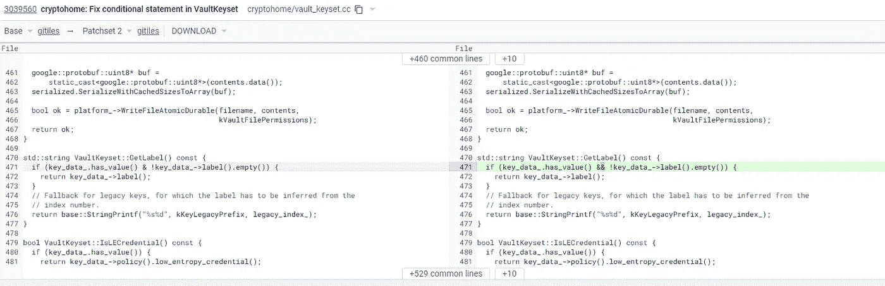
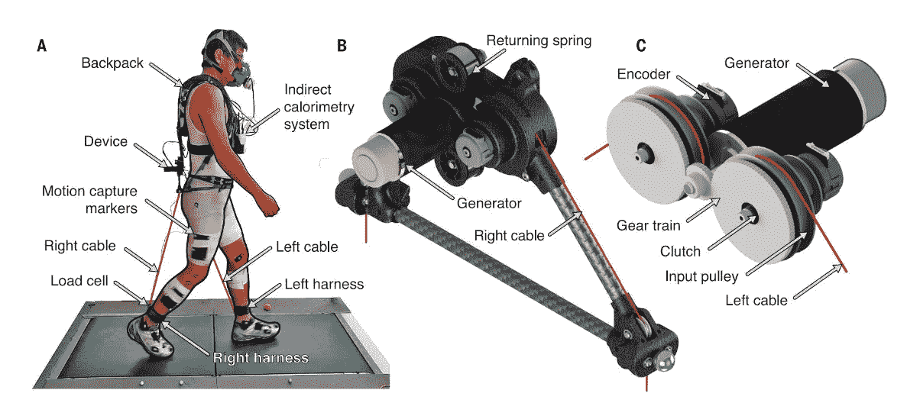

# 跑得比地铁还快，建造了“月球网关”，用一个错别字砌成了 ChromeOS

> 原文：<https://medium.com/geekculture/outrunning-the-subway-building-the-lunar-gateway-and-bricking-chromeos-with-a-single-character-ead0457574c?source=collection_archive---------15----------------------->

## 我帮你拖延本周阅读材料的“链接节”

今天是星期一；是时候拖延了！

*我为你而来，这是本周的“链接节”——用我能找到的最好的材料塞满了椽子…*

## 1) 🏃田径明星‍♂️跑过纽约地铁

乔恩·迪亚兹是[NYU](https://gonyuathletics.com/sports/mens-track-field/roster/jon-diaz/12328)的田径明星；显然他也像地铁列车一样快。在上面的视频中，他在钱伯斯街站跳出 2/3 列车，跑到下一站——公园广场——赶上了同一辆列车。

他的总比赛时间是 1 分 35 秒，看起来令人毛骨悚然:看看吧！

作为一个乘坐纽约地铁的人，看到我认同的他的种族的一部分是很有趣的。当他沿着人行道飞奔时，那是异常的部分；纽约人走路很快，但一般不会在人行道上全速奔跑。但是当迪亚兹惊慌失措地在地铁楼梯上跑来跑去，拼命想赶上火车的时候？现在*那个*感觉很熟悉。

## 2) 🧱一款单字错别字砖 Chrome OS 设备

谷歌推出了 Chrome 操作系统设备的更新，然后，嘣，它把它们封了，把用户锁在他们的设备之外。哪里出了问题？

一名谷歌程序员犯了一个单字错别字。有一个条件“if”语句检查两件事是否为真——如果这个*和*为真。你这样做的方式是用两个&符号:“& &”，有点像“这件事& &那件事是真的吗”。

但是开发人员在更新时犯了错误，只使用了一个符号。

当我在写我上一本书《程序员》的时候，我从程序员那里听到了大量类似的错误故事——难以置信的小错误让大型企业嘎然而止。正如开发者 Rob Spectre 告诉我的那样…

> “编程看起来像天才和看起来像白痴的距离？它有一个字符宽。”

## 3) 🎨包豪斯艺术生成器

这是一个包豪斯艺术生成器[,它使用著名的艺术运动的原则——大胆的形状，鲜艳的颜色，几何色情——自动生成小小的包豪斯卡片。你可以选择不同大小的卡片，然后一遍又一遍地点击“生成”,直到你找到你想要的。我在雾霾中失去了大约 10 分钟，现在可能要用这些照片淹没我的 Instagram 订阅了…](https://tool.graphics/bauhaus)

## 4) 🧮旧版 Excel 让 16000 个新冠肺炎病例化为乌有

英国有一个新冠肺炎病例的接触追踪系统，它依赖于一个巨大的 Excel 电子表格。他们最近发现，哎呀，16000 个病例消失了。这里发生了什么事*？*

他们在 Excel 中使用了一种过时的文件格式。Excel 文件格式的最新版本 XLSX 可以处理 1，048，576 行，即 2 的 20 次方。

但是老版本的 XLS 只能处理 2 的 16 次方——或者说， *65，536。*因此，英国当局显然将一个太大的数据集塞进了更老、更小的文件格式中，它溢出了允许的行数。大约 16，000 例接触者追踪病例被放弃，这是一件严重的事情:[正如蒂姆·哈特福德指出的，这可能导致了多达 125，000 例新冠肺炎感染病例。](https://timharford.com/2021/07/the-tyranny-of-spreadsheets/)

伙计们，2 的幂是很严肃的事情。

## 5) 🚶🏿‍♀️An 外骨骼从你的步幅中收集能量，同时让行走更容易

这太疯狂了:研究人员创造了一种轻型外骨骼，将绳索连接到你的腿上，并从你的步幅中移除能量。奇怪的是，它们消除了步幅中涉及使用肌肉重新平衡的部分的能量——所以它们实际上使行走变得更容易，而不是更难。当他们测量背着背包的人的新陈代谢活动时，新陈代谢活动下降了 0.8%。

不多！但是，正如他们在这篇新闻报道中建议的那样，这种设备的改进版本可以让人们更容易长时间行走。此外，他们可以从你的步幅中获取能量，并将其储存在电池中——能量不多，但充电量很低。

从你的步幅中获取能量，同时让走路变得更容易，这听起来几乎像是你在 Outbrain clickbait 的 bug-eyed 专区看到的一些疯狂的免费能源设备广告，所以我想看到这种复制，呵呵。但是做这项工作的实验室看起来很合法。

## 6) 🎣最后，突然死亡的拖延材料！

📣使用[表情符号作为密码](https://identiji.com/)。📣[黑掉一张立式办公桌](/@davidkongfilm/how-i-hacked-my-standing-desk-with-a-raspberry-pi-a50ed14c7f6f)，这样它就能按照时间表升降。📣[当地生产的太阳能电池板](https://www.dw.com/en/high-tech-photovoltaics-solar-panels-produced-at-home/a-58239791)。📣他们正在建造月球入口，这是一个将漂浮到月球中途的空间站。📣[树冠和收入](https://flowingdata.com/2021/07/07/tree-canopy-and-income/)。📣一台被[设计用于维修的笔记本电脑](https://frame.work/ca/en/blog/the-framework-laptop-is-now-shipping-and-press-reviews)。📣为什么[眼睛看不太清蓝色](https://calebkruse.com/10-projects/seeing-blue/)。📣橡木制成的威士忌酒杯。📣可定制的[环境声音，让您在办公桌旁放松心情](https://mynoise.net)。📣低代码工具被认为是超自动化。📣华丽的实物艺术品，这让我想起了詹姆斯·布勒德的[“新美学”](http://booktwo.org/notebook/sxaesthetic/)。📣中国禁止超高层建筑。📣一项研究表明，有影响力的人擅长传播简单的想法，但不擅长传播复杂的想法。📣这部小说的厨房出现了警告[“提前促销副本:请勿阅读】](https://www.newyorker.com/books/page-turner/on-the-trail-of-a-mysterious-pseudonymous-author)。

Clive Thompson 是《纽约时报杂志》的特约撰稿人，《连线》和《史密森尼》杂志的专栏作家，也是《琼斯母亲》的定期撰稿人。他是《编码者:一个新部落的形成和世界的重建》和《比你想象的更聪明:技术如何改变我们的想法》的作者。他在推特上的[*@ pomeranian 99*](https://twitter.com/pomeranian99)*和*[*insta gram*](https://www.instagram.com/pomeranian99/)