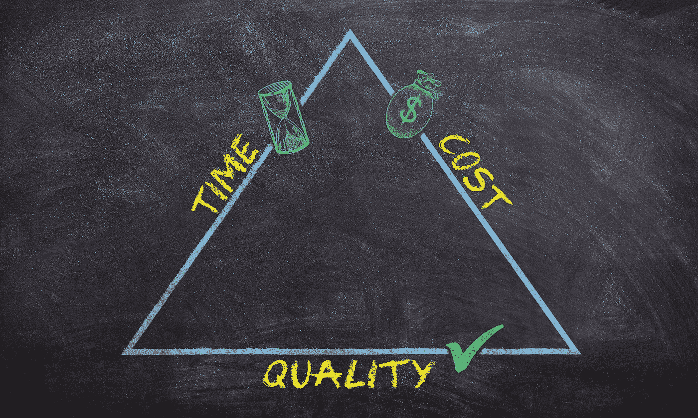
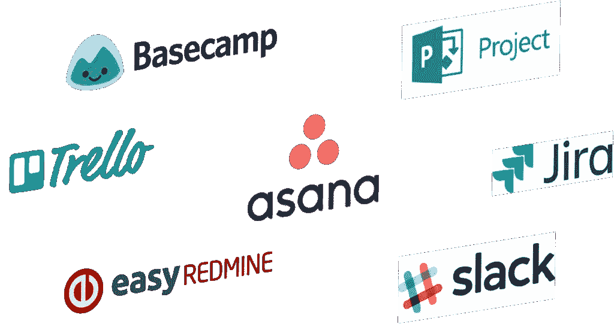

# 外包 UX 设计？做好这件事的 5 个技巧

> 原文：<https://medium.com/geekculture/outsourcing-ux-design-5-tips-to-do-it-right-176d2547c297?source=collection_archive---------19----------------------->

这么说，你在寻求外包 UX 的设计？

这是一个很大的问题，主要是因为你的公司正朝着正确的方向前进，希望增强你的产品的用户体验。这表明你已经认识到 UX 设计对你公司命运的影响——无论是在客户方面还是员工方面。

现在，开始解决手头的实际问题——你如何处理用户体验设计外包，并确保你选择了正确的团队？经过初步的网上搜索，可能会出现数百个结果，这里有 5 个实用技巧，帮助你评估提供 UX 设计服务的机构的专业知识。

1.  **节省成本&学习曲线上的时间—** *查看相关经验*

选择一个有相关行业经验的团队可能是显而易见的，但背后的原因可能并不明显。这是最有意义的，因为它可以防止你承担额外的学习成本来让他们跟上速度。

例如，在 Koru，我们跨行业的专业企业 UX 经验为我们带来了解决复杂问题的丰富知识。从设计集成的 EHR 到为保险支付创建一个包罗万象的支付门户，我们的优势在于与复杂的软件和技术公司合作。

也就是说，我们确保每个项目都遵循适当的流程，而不是依赖直觉和假设。相反，我们使用真实数据为我们的决策提供信息，为用户打造最佳体验。

一个没有经验的 UX 团队需要时间来理解你的行业的运作，这是因为 UX 的设计过程是全面的，并且考虑了所有的参数。虽然结果可能仍然很棒，但不可否认的是，它可能会让你在时间和金钱上付出更多。

**2。确保你正在做一个有意识的选择** — *寻找解决的类似问题*

无论你何时进行任何形式的投资，只有做出正确的选择才是公平的。如果你已经圈出了几个有行业经验的 UX 承包商，是时候深入挖掘并锁定合适的团队了。要求查看他们解决了类似问题的案例研究，或者在他们的投资组合中寻找与你手头的项目相近的项目。

如果你现有的应用程序已经过时，或者软件是基于陈旧的技术构建的，需要不断进行昂贵的更新，那么就去看看他们是如何改造遗留系统的。

如果你的软件有一些功能需要花费无穷无尽的步骤来完成，让你的用户感到困惑和沮丧——问问他们是如何优化功能的流程和 UI 设计的。

如果你只有一个关于门户网站、网络应用程序或移动应用程序的想法，问问他们以前是如何帮助客户将想法概念化并将其转化为实际应用程序设计的。

这会给你信心，让你相信他们能提供你一直在寻找的结果。

**3。物有所值**——*将投资回报参数设置到位。*

客户-机构伙伴关系的一个重要部分是确定进展和成功的参数。对可交付成果和依赖关系有一个清晰的理解，并为每个交付成果和依赖关系制定一个时间表和目标日期是至关重要的。进度参数很重要，因为它们不会让您猜测事情的进展情况，或者在没有明确的周转时间的情况下不得不等待可交付成果。清楚地了解每个人在项目的每个阶段需要做什么，有助于您的团队和代理机构共同努力，取得成功。

现在谈谈成功的参数——当然，这些参数根据你的项目的性质而有所不同。例如，如果问题与减少完成任务的点击次数有关，或者解决票据花费的时间有关，则解决方案必须显示数字以表示成功。

还可能有难以量化的成功度量，可以随着时间的推移进行观察，特别是在正在进行的项目中，如遗留现代化。生产率的提高、减员的减少、培训成本的降低等等。可能是这些项目的成果。无论成功的参数是什么，都必须在项目开始时根据其类型来设定。

**4。查看评论网站，确保选择正确** — *寻求参考。*

评估 UX 设计机构的能力和技巧的一个有效途径是询问他们从其他客户那里得到的反馈。一家代理机构可能会给你一份他们合作过的公司名单，但这并不意味着合作成功。

或者，你可以看看他们是否列在代理平台上，并在那里寻找[评级和评论](https://clutch.co/profile/koru-ux-design)。不能或不愿意提供证明人可能是一个危险信号，这是你在正式确定关系之前要考虑的一点。

**5。确保流畅的沟通和协作** — *建立有效的渠道。*

顺畅的沟通是任何项目成功的关键因素。如果你把 UX 的设计外包给了一个不同时区的机构，沟通可能会延迟，尤其是如果你只依靠电子邮件作为一种手段的话。因此，为了不间断和及时的沟通，建议使用项目管理工具，如 Basecamp、Asana、Trello 等。这些工具帮助团队在设计和开发阶段尽可能无缝地合作。同样理想的是，这些工具可以无缝地嵌入到您公司的现有流程中。适应您当前的系统、工具和流程有助于简化协作。

[合适的 UX 设计公司](https://www.koruux.com/blog/ultimate-guide-successful-design-team/)可以成为您转变业务的合作伙伴——无论是通过精心设计有意义和有帮助的用户旅程来挤掉竞争对手，还是通过简化的用户界面导航来取悦您的客户。例如，我们的[客户故事](https://www.koruux.com/case-studies/)见证了我们 Koru 是如何成功交付卓越成果的。因此，建议您对您的选择进行彻底的演练，并选择一个可以成为您转型工作的可靠合作伙伴而不仅仅是外包资源的团队。