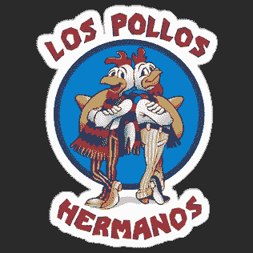

# 在一次 Nespresso 咖啡运送中发现了超过 500 公斤的可卡因

> 原文：<https://medium.com/geekculture/over-500-kilos-of-cocaine-was-discovered-in-a-nespresso-coffee-delivery-98b29ded48?source=collection_archive---------21----------------------->

## 在 Nespresso 工厂的咖啡中发现了价值 5000 万美元的可卡因

Breaking Bad, Netflix

超过 500 公斤(1102 磅)的可卡因价值超过 5000 万瑞士法郎(5065 万美元)，被发现在一个集装箱的咖啡豆袋雀巢公司(NESN。s)位于西部罗蒙的 Nespresso 工厂…