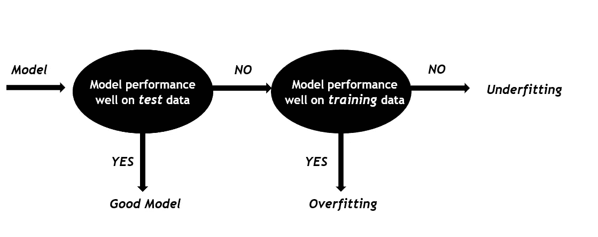
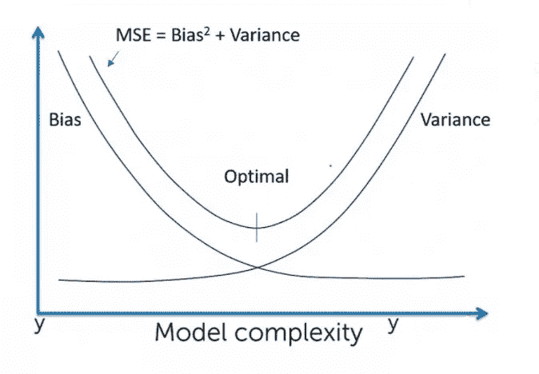
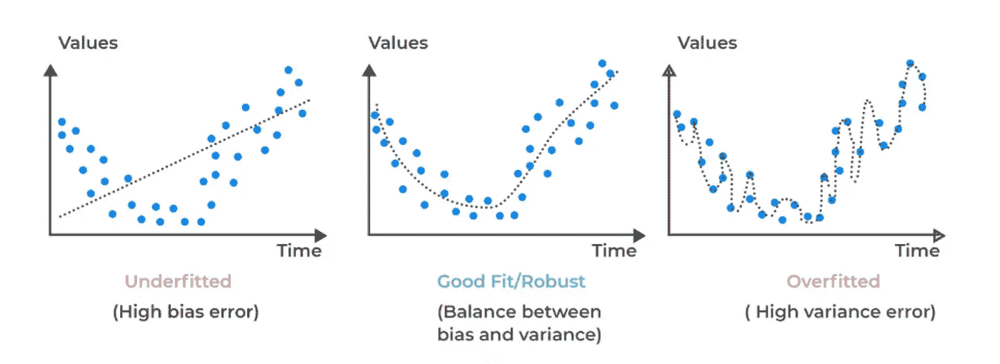

# 过度拟合、欠拟合和偏差-方差权衡

> 原文：<https://medium.com/geekculture/overfitting-underfitting-and-bias-variance-tradeoff-9e83f4a147c?source=collection_archive---------5----------------------->

## 机器学习模型中的偏差-方差权衡

## 理解机器学习模型中欠适应和过适应情况下偏差-方差权衡背后的基本概念

Photo by [Markus Winkler](https://unsplash.com/@markuswinkler?utm_source=unsplash&utm_medium=referral&utm_content=creditCopyText) on [Unsplash](https://unsplash.com/s/photos/machine-learning?utm_source=unsplash&utm_medium=referral&utm_content=creditCopyText)

假设我们已经从训练数据集上的一个机器学习模型开始。最大似然模型的主要目的是泛化，即模型对新的未知数据的性能。在现实生活中，这些数据有一些异常值和噪声，以及模型试图捕捉的潜在模式。在训练期间，模型将捕获数据中的趋势/模式，但同时它也捕获数据中的噪声，这导致欠拟合和过拟合情况。这两个条件是 ML 模型性能下降的最大原因。让我们了解它们是什么，

1.  **欠拟合:**模型未能捕捉到训练数据中的相关趋势/模式，最终导致其对训练数据本身的预测出现较大误差。因此，测试数据误差也很大。这种情况被称为*欠拟合，因为模型欠拟合了数据。既没有用训练数据建模，也没有概括测试数据。*总结一下，对于欠拟合，`***Training error is high . Test error is also high .***`

例如:当线性回归模型的直线最佳拟合线试图用多项式特征拟合数据时，可能是 4 次多项式，那么将会出现拟合不足的情况。

2.**过拟合:**当模型试图捕捉训练数据集中的每个细节和噪声时，就会发生过拟合。由于模型正在捕获训练数据集中的每个点和波动，因此它会在训练数据集中产生很小的误差，但模型在不可见或测试数据集中的表现不会很好，这会影响模型的泛化能力。总结一下，对于过拟合，`***Training error will be small and Model’s accuracy will be high. Test error will be high****.*`

例如:在决策树算法中，模型试图捕获所有产生高方差的数据点(低偏差)。集成技术用于减少这些差异(将在后续文章中讨论)。

*最后，好模型或最佳拟合模型是那些在看不见的数据集上表现良好的模型*。下面的工作流程是明确解释这三个。

现在，既然我们清楚了欠拟合和过拟合，让我们深入到偏差-方差权衡。让我们看看它们是什么，以及为什么需要对它们进行权衡。

**偏差:**训练数据集上模型的预测值与实际值之间的差异所给出的训练数据的误差。

**方差:**方差是由于测试数据集中的预测值和实际值之间的差异而产生的误差，即当模型不能概括时，方差很高。

因此，为了找到欠拟合和过拟合之间的平衡，以便我们可以有一个具有良好准确性的良好的通用模型，需要在偏差和方差之间进行权衡。随着我们增加模型的复杂性，它将开始从数据中捕获更多的信息，误差将开始减少，拟合不足的问题也将减少。但是在达到某一点后，模型将开始捕捉更多的细节和噪声，导致过度拟合。因此，在这种欠拟合和过拟合情况之间具有最小误差的模型将是最通用和最佳的模型。

所以总结所有

**欠拟合条件:高偏差、高方差**

**过拟合条件:低偏差、高方差**

**对于好的概化模型:低偏差，低方差。**

在接下来的文章中，我们将看到如何通过使用不同的技术来克服欠拟合和过拟合的问题。

快乐学习！！