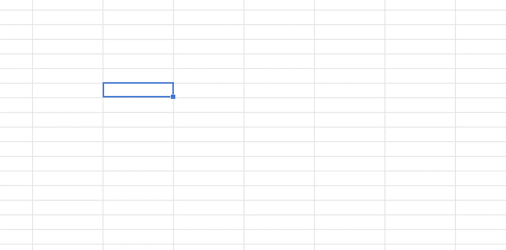

# 重叠子问题—列表

> 原文：<https://medium.com/geekculture/overlapping-sub-problems-tabulation-3facae1bc68b?source=collection_archive---------45----------------------->

在本文中，我们将学习动态编程(DP)最基本的技术，称为**制表或自下而上的方法。**

任何大型计算机科学问题都可以分解成更小的子问题。这些子问题可以独立解决，然后组合得到主问题的解决方案。