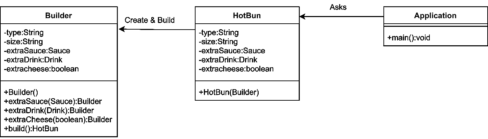

# 生成器设计模式概述

> 原文：<https://medium.com/geekculture/overview-of-builder-design-pattern-60f38b56c86e?source=collection_archive---------22----------------------->


Image from — [google](https://www.google.com/search?q=building+blocks+hd&tbm=isch&ved=2ahUKEwjZx9DHjOfwAhVst2MGHe6pCEIQ2-cCegQIABAA&oq=buil&gs_lcp=CgNpbWcQARgAMgQIIxAnMgQIIxAnMgQIABBDMgcIABCxAxBDMgQIABBDMgQIABBDMgQIABBDMgQIABBDMgQIABBDMgQIABBDOggIABCxAxCDAToFCAAQsQNQjRRY4hpg0SZoAHAAeACAAYADiAGFCpIBBTItMi4ymAEAoAEBqgELZ3dzLXdpei1pbWfAAQE&sclient=img&ei=dB2uYNm9I-zujuMP7tOikAQ&bih=568&biw=1366#imgrc=pGwdckE0hth_8M)

# 什么是生成器设计模式？

构建器是一种设计模式，它允许我们以一种**的方式**从简单对象构建一个**复杂对象**。构建器设计模式被归类为**创造模式**。

# 为什么要使用 Builder 设计模式？

让我们看看下面的例子来寻找上述问题的答案。

假设一家商店向顾客出售热面包。热面包可以是鸡肉面包也可以是牛肉面包。有三种尺寸可供选择:小号、中号和大号。当点热面包时，顾客也可以要求额外的调味汁、奶酪或冷饮。然而，这些额外的项目是可选的。只有当顾客特别要求时，商店才会提供。

> 例如，如果一个顾客点了一个多加奶酪的小鸡肉包，他将不会得到任何额外的调味汁或冷饮。有了那个热面包，他只会得到额外的奶酪。

那么，我们如何在编程语言中实现它呢？。让我们用 JAVA 编码。如果我们以传统方式实现它，我们有两个选择，

1.  使用 setters。
2.  使用多个构造函数。

然而，这两种方法都有许多缺点。

## 使用 Setters 的问题

Code snippet of using setters

Code snippet for Drinks class

Code snippet for Sauce class

看看上面的代码。我们可以使用 setter，如图所示，但问题是如果我们使用 setter，我们不能保证对象的不变性。换句话说，如果我们使用 setters，我们就不能创建不可变的对象。

> **什么是不可变对象？**
> 
> 如果一个对象的**状态在被创建**后不能被修改，那么这个对象被认为是不可变对象。它将在其整个生命周期中以相同的方式运行。

如果我们像上面演示的那样使用 setter，那么在我们创建对象之后，任何人都可以使用相同的 setter 来更改变量的值。

因此，这种方法不适合创建不可变的对象。

## 使用多个构造函数的问题

尽管我们可以通过利用构造函数而不实现 setters 来创建不可变的对象，但是仍然有缺点。参见下面的代码，

A constructor with multiple parameter

如果您使用上面的构造函数，如果客户没有请求任何额外的项目，您应该在参数中传递 3 'null'。假设我们的类有超过 10 个可选变量，如果我们的客户没有订购任何额外的商品，我们应该传递一串“空值”对吗？

将大量“null”值作为参数传递给构造函数不是一种好的做法。它使我们的代码变得复杂，并且很难处理。

为了防止传递一堆空值，我们可以使用多个构造函数，每个组合一个。然而，构造函数的数量再次出现问题。只要数一数我们拥有的组合的数量，以及我们需要构建的构造函数的数量。

```
extra cheese|extra sauce|cool drink|   conxtructor
     no     |     no    |   no  ---> Hotbun();
     no     |     no    |   yes ---> Hotbun(extraDrink);
     no     |     yes   |   no  ---> Hotbun(extraSauce)
     no     |     yes   |   yes ---> Hotbun(extraSauce,extraDrink);
     yes    |     no    |   no  ---> Hotbun(extraCheese);
     yes    |     no    |   yes ---> Hotbun(extraCheese,extraDrink);
     yes    |     yes   |   no  ---> Hotbun(extraCheese,extraSauce);
     yes    |     yes   |   yes --->
                          Hotbun(extraCheese,extraSauce,extraDrink);
```

因为我们有 3 个可选变量，所以我们有 2 =8 个构造函数。假设我们的类中有 10 个可选变量，我们将有 2 个⁰=1024 构造函数😄。

因此，拥有太多的构造函数也是一个糟糕的设计。

因此，为了解决这些问题，引入了**生成器设计模式**。我们可以使用构建器设计模式创建没有很多参数的**不可变的复杂对象**。此外，我们可以只向**传递所需的值，而不是向 parameter 发送一堆“null”。**

# 生成器设计模式的实现



class Diagram of Builder Design Pattern

让我们看看下面的代码，

Code snippet for builder design pattern

Code snippet for object creation

请参见上面的 main 方法，没有传递“null”值。我们可以动态地设置所需的可选变量的值，而不是使用固定的构造函数来创建实例。

# 要记住的事情

*   为了确保**的不变性**，HotBun 类**不应该包含 setter**。在上面的实现中，我们将 HotBun 类的所有属性设为**‘final’**。因此，它们在对象创建后不能更改。这确保了不变性。
*   HotBun 类应该包含一个**内部静态类，它是构建器类**。
*   内部类(构建器类)应该包含外部类包含的所有属性。
*   内部类应该为每个属性设置一个方法，该方法设置属性的值并返回内部类的同一个实例。
*   内部类应该包含一个 build()方法，该方法通过调用外部类的构造函数返回外部类的实例。
*   外部类应该有一个构造函数，它将内部类(构建器类)的实例作为参数。

**迷茫？别担心，你会明白的，再看代码😜。**

# 何时使用生成器设计模式？

*   当我们需要创建一个复杂的对象时。
*   当创建一个对象需要大量参数或构造函数时。
*   当我们想要创建不可变的对象时。

# 生成器设计模式的优势

*   构造函数的参数减少了，并以可读性很强的方法给出。
*   对于可选参数，不需要将“null”传递给构造函数。
*   我们可以定制一个复杂的对象。
*   可以构建不可变的对象。

# 限制

唯一的主要缺点是开发人员必须在整个实现过程中编写大量代码😢。然而，一旦开发出来，它具有难以置信的灵活性。

# 继续学习❤️

参考

[](https://www.geeksforgeeks.org/builder-design-pattern/) [## 构建器设计模式- GeeksforGeeks

### 构建器模式旨在“将复杂对象的构建与它的表示分离开来，以便相同的……

www.geeksforgeeks.org](https://www.geeksforgeeks.org/builder-design-pattern/)