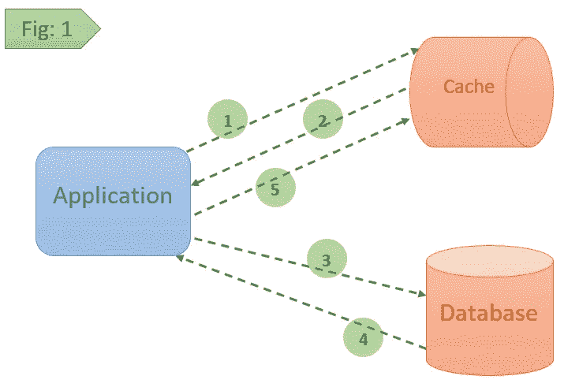
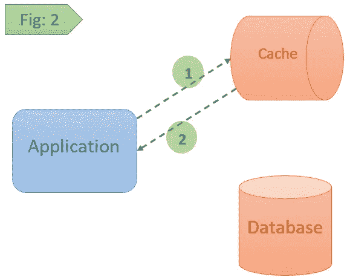
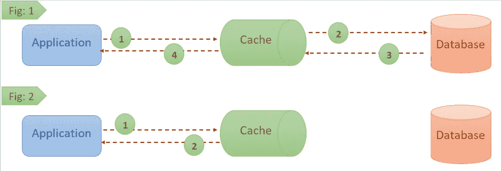
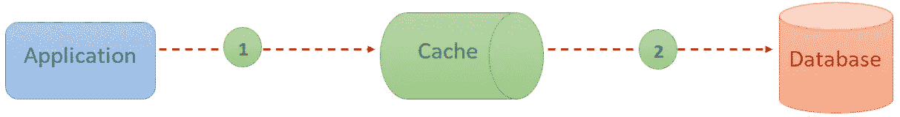
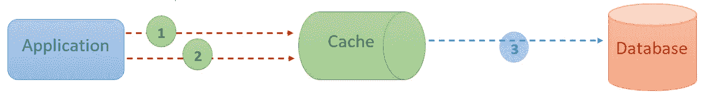
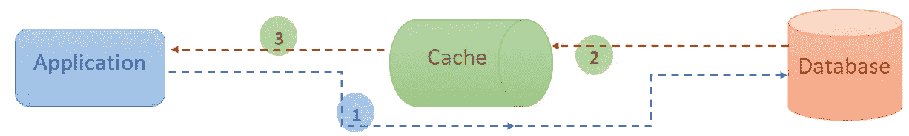
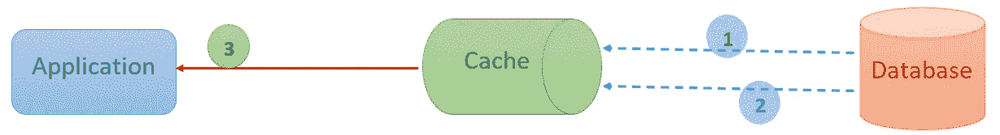

# 缓存、分布式缓存、缓存模式和技术概述

> 原文：<https://medium.com/geekculture/overview-of-caching-distributed-cache-caching-patterns-techniques-6130a116820?source=collection_archive---------2----------------------->

大家好，在本文中，我们将了解什么是缓存及其优势，什么是分布式缓存及其优势，各种缓存模式或策略，缓存回收(清理)算法或技术，以及缓存的常见使用案例。

Photo by [Sigmund](https://unsplash.com/@sigmund?utm_source=medium&utm_medium=referral) on [Unsplash](https://unsplash.com?utm_source=medium&utm_medium=referral)

> **什么是缓存？**

简而言之，缓存是一个数据存储层，用于存储频繁访问的数据，并帮助快速满足未来对相同数据的请求，而不是从其主要存储位置访问数据。

缓存允许我们有效地重用先前检索/计算的数据，而不是花费时间多次访问/计算相同的数据。

我将在下一篇文章中用一个简单的例子介绍缓存实现。

> ***缓存如何帮助(或)优势缓存***

*1。应用性能
2。后端加载
3。吞吐量
4。可预测的性能
5。数据库成本*

*   **应用性能:**

当我们从内存缓存中读取频繁检索/计算的数据时，数据检索将会非常快，从而提高应用程序的整体性能。

*   **后端加载:**

由于我们将负载转移到内存缓存，而不是从主位置(数据库)调用，这可能有助于减少后端负载并提高性能。这也有助于避免高峰期间的崩溃。

*   **吞吐量**:

与实际数据库相比，内存系统通过每秒处理越来越多的请求，提供了更低的延迟和更高的请求处理速率(每秒输入/输出操作数)。

*   **可预测的性能:**

有时，我们可能需要处理应用程序使用量的峰值，尤其是在电子商务网站上的特殊活动或节日优惠时，随着数据库负载的增加，应用程序性能可能会受到影响，这可能会导致更高的延迟。缓存可以缓解这种情况。

*   **数据库成本:**

数据库成本将会降低，因为取代数据库实例的单个高速缓存实例可以每秒执行大量输入/输出操作。

> **什么是分布式缓存？**

分布式缓存是一种缓存技术，其中缓存分布在多台机器上、多个节点上、分布在群集上，有时分布在全球的数据中心上。

分布式缓存主要用于

*   ***高可用性****——顾名思义，将缓存分布在多台机器上有助于我们提高缓存可用性。如果其中一个实例由于某种原因关闭，我们仍然可以从其他分担负载的机器那里获得支持。我们还可以为每个实例创建一个备份，以便总是使用保留的被动实例来维护特定数量的实例。*
*   ****可扩展性*** —可轻松扩展，因为数据将存储在多个位置，这使得缓存保持较轻的重量和较小的大小，从而有助于以良好的速度执行搜索操作。*

> ***缓存模式/策略:***

*下面是一些常用的缓存模式。*

**1。缓存备用
2。通读
3。直写式
4。回写/后置
5。改写
6。提前刷新**

*   ***缓存搁置—***

*在这种模式中，缓存与数据库一起工作，数据将被*延迟加载*到缓存中。它最适合读取大量数据(这意味着数据不会频繁更新)。*

**

*在 ***图:1*** —当我们请求一个特定的数据时，那么应用首先在缓存中寻找它(操作-1)。当应用程序无法在缓存中找到匹配的数据时，它会退回(操作 2)并从数据库中检索相同的数据(如操作 3 & 4 所示),相同的数据会更新到缓存中以备将来检索，并将数据返回给用户。*

**

*在 ***图:2*** —当我们请求一个特定的数据时，应用程序首先在缓存中寻找它(操作-1)，如果在缓存中找到匹配的数据，则返回相同的数据(操作-2)。*

*   ***通读—***

*顾名思义，它试图从缓存中读取数据，缓存在延迟加载的基础上与数据库通信。*

**

*在 ***图:1*** —当高速缓存被请求与特定关键字相关联的数据时(操作-1)，如果该数据不存在(操作-2)，则高速缓存从数据存储中检索数据，并将其放入高速缓存中以供将来检索(操作-3)，最后它将该值返回给调用者。*

*在 ***图 2*** 中—当向缓存请求与特定关键字相关联的数据(操作-1)时，如果该数据存在(操作-2)，则将该数据返回给调用者。*

*   ***写通—***

*在这种技术中，我们通过缓存将数据写入数据存储区，这意味着数据将首先被插入/更新到缓存中，然后是数据存储区(如操作 1 和 2 中所示)，这有助于保持数据的一致性，最适合写负载要求。*

**

*   ***回写—***

*在这种技术中，我们将多个数据条目直接放入缓存(操作 1 和操作 2)，而不是同时放入数据存储(操作 3)。相反，我们将应该插入/更新到缓存中的数据排队，并在稍后阶段将排队的数据复制到数据存储中。*

*由于与缓存相比，将最新数据更新到数据库中存在延迟，因此如果缓存由于某种原因出现故障，就有可能丢失数据。*

**

**由于与缓存相比，将最新数据更新到数据库存在延迟，因此如果缓存由于某种原因失败，则有可能丢失数据(应结合其他模式解决)。**

*   ***四处写写——***

*在这种模式中，数据将直接写入数据存储，而不写入缓存(operation-1)。在对数据存储区进行读取操作时，数据存储区将被放入缓存中(如操作-2 和 3 所示)。*

*最适合不经常将最近写入的数据重新读入数据存储的应用程序。*

**

*   ***提前刷新** —*

*在这种模式中，缓存的数据在过期之前被刷新(操作-1 和 2)。这有助于减少延迟，因为数据在使用之前就被更新了。后面的阶段与操作-3 中的获取过程中使用的相同。*

**

> ***缓存驱逐(清理)技术/算法***

*下面是一些常用的缓存回收(清理)技术，当缓存达到最大限制时会用到这些技术。*

*   ***最近最少使用(LRU)——**根据缓存可用性，使用缓存顶部最近访问过的项目更新缓存。当缓存达到限制时，我们从缓存中删除最近最少访问的项目。*
*   ***最不常用的** **(LFU) —** 我们基本上每次从缓存中访问数据时都会递增该值，在这种情况下，计数最低的项目将首先被逐出(移除)。*
*   ***先入先出(FIFO)——**顾名思义，我们先驱逐被访问的第一个项目，而不考虑它在过去被访问的频率或次数。*
*   ***后进先出(LIFO)——**顾名思义，它会清除最近使用过的项目，而不考虑它过去被访问的次数或频率。*
*   ***最近使用的(MRU)——**当旧物品更有可能被使用时，这实际上是有帮助的。我们实际上是先删除最近访问过的条目。*

> ***用例:**一些常见的用例*

*1.数据库缓存 2。网络缓存。云
4。DNS —域名系统
5。CDN —内容交付网络
6。会话管理
7。API —应用程序编程接口*

*我希望这篇文章有助于理解缓存概述、缓存如何有助于构建复杂的应用程序及其优点、分布式缓存概述及其优点、常用的缓存模式或策略以及缓存回收技术或算法。*

> ***参考文献**:*

* [## 缓存替换策略-维基百科

### 在计算中，缓存算法(也经常被称为缓存替换算法或缓存替换策略)是…

en.wikipedia.org](https://en.wikipedia.org/wiki/Cache_replacement_policies)  [## 通读、直写、后写和提前刷新缓存

### Coherence 支持任何数据源的透明读/写缓存，包括数据库、web 服务、打包的…

docs.oracle.com](https://docs.oracle.com/cd/E15357_01/coh.360/e15723/cache_rtwtwbra.htm#COHDG198)*