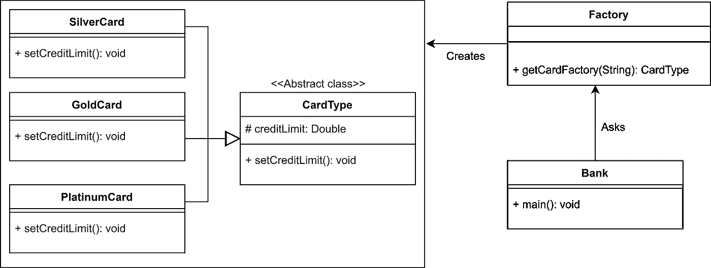
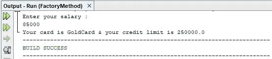
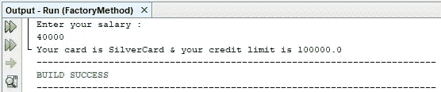
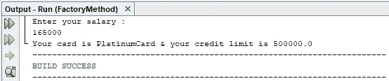

# 工厂方法设计模式概述

> 原文：<https://medium.com/geekculture/overview-of-factory-method-design-pattern-d3a6fe908ea4?source=collection_archive---------7----------------------->

Image by — [google](https://www.google.com/search?q=factory+method+design+pattern&sxsrf=ALeKk00ebwNxZsWuI43t7gNDXQ2w3-HK5g:1621760177551&source=lnms&tbm=isch&sa=X&ved=2ahUKEwimkKy6t9_wAhUe4jgGHf6IAq0Q_AUoAXoECAEQAw&biw=1366&bih=625#imgrc=kkp_5JVD0XeomM&imgdii=uDBNId54pZiP8M)

# 什么是工厂方法设计模式？

工厂方法是一种设计模式，它为创建对象提供了一个接口或抽象类，并允许其子类决定要实例化哪个类。工厂模式被归类为**创意模式**。

> 为了更容易理解，让我们假设一个商店包含各种产品，店主根据我们的要求给我们提供我们需要的东西。同样，工厂模式也是有效的。通常，我们传递参数。我们的工厂方法根据我们传递的参数确定应该实例化哪个类，并创建和提供该特定类的实例。

# 履行

Class diagram of factory method design pattern

## 要记住的事情:

*   所有的子类`Ex: GoldCard, SilverCard etc`应该扩展相同的父类`Ex: CardType`。
*   在工厂类中定义一个工厂方法。方法的返回类型应该是父类`Ex:CardType`。
*   允许子类根据传递给工厂方法的参数创建一个对象。

## 让我们实现代码来看看工厂方法设计模式是如何工作的。

> 假设一家银行向客户提供信用卡。他们提供三种类型的信用卡，如银卡、金卡和白金卡。每种卡都有不同的信用额度`For Ex: credit limit of Silver card is 100,000 LKR, credit limit of gold card is 250,000 LKR and credit limit of Platinum card is 250,000 LKR`。
> 
> 客户收到的卡的类型取决于他或她的月薪。银卡是月薪 5 万以下的人都有的。如果他的月收入低于 100，000LKR，他可以获得金卡。如果他的月薪超过 100，000 冰岛克朗，他就有资格获得白金卡。`For EX: If your salary is 85,000LKR, then you can get a Gold card`

**现在让我们使用工厂方法设计模式对上述场景进行编码。**

Code snippet for parent class of all the subclasses

以上是所有子类的父抽象类。

code snippet of sub-class 1

code snippet of sub-class 2

code snippet of sub-class 3

以上是从同一父类扩展而来的子类。

包含工厂方法的工厂类如下所示，

Code snippet of Factory class

这个工厂方法是**负责决定实例化哪个类**。该方法将基于我们提供给它的参数**创建并返回适当类的实例。**

下面是主类，

上述代码的输出如下:

Output 1

Output 2

Output 3

因此，我们可以使用工厂设计模式根据我们的参数从不同的类中检索不同的对象。工厂模式将决定实例化哪个类，而不向客户端显示实现细节。

# 工厂设计模式的优势

*   工厂方法模式允许子类选择要创建的对象类型。
*   实现只与父抽象类或接口交互。因此，它可以与实现该接口或扩展该抽象类的任何类一起工作。

# 何时使用工厂设计模式

*   当一个类不知道哪个子类应该创建实例时。
*   当一个类希望它的子类应该指定要创建的对象时。
*   当父类选择创建对象到它的子类时。
*   当您想要为您的库的用户提供扩展其内部组件的能力时

# 使用工厂方法设计模式的真实例子

这种设计模式在 JDK 很常用，例如:java.util.Calendar 的 getInstance()方法、NumberFormat 和 ResourceBundle 使用工厂方法设计模式。

# 继续学习❤️

# 参考

 [## Java 中的工厂方法设计模式

### 它是一种创造性的设计模式，谈论的是一个对象的创造。工厂设计模式说…

www.geeksforgeeks.org](https://www.geeksforgeeks.org/factory-method-design-pattern-in-java/)  [## 工厂方法设计模式-Java point

### 工厂模式或工厂方法模式表示只需定义一个接口或抽象类来创建一个对象…

www.javatpoint.com](https://www.javatpoint.com/factory-method-design-pattern)