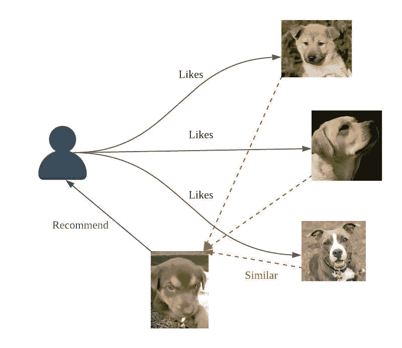
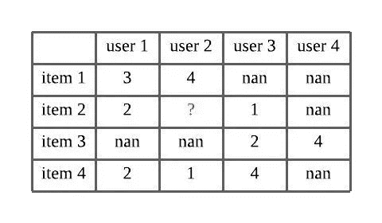
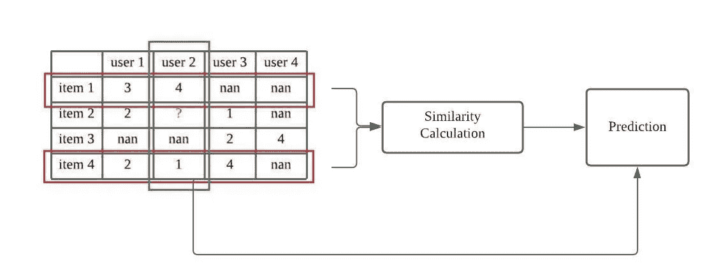
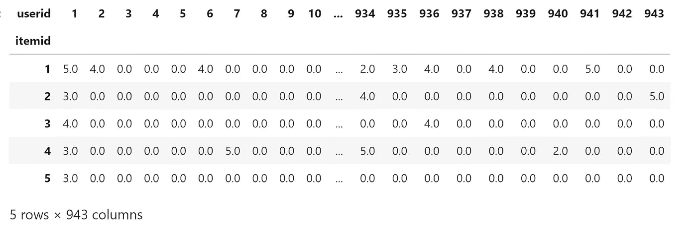
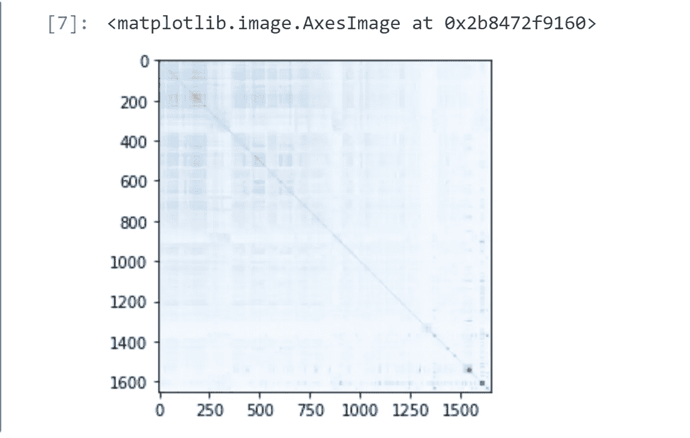

# 项目-项目协同过滤推荐系统综述

> 原文：<https://medium.com/geekculture/overview-of-item-item-collaborative-filtering-recommendation-system-64ee15b24bb8?source=collection_archive---------20----------------------->

**协同过滤**广泛应用于构建推荐系统。基于记忆的模型主要有两种方法，**基于项目的**和**基于用户的**。在实践中，我们通常会有用户多于条目数量的数据，只有一小部分条目得到频繁评级，这种情况被称为**长尾效应。**长尾效应通常意味着高数据稀疏性，稀疏数据会影响我们模型的准确性。

为了解决高稀疏性问题，**基于项目的模型**通常会带来更快的在线学习和更好的推荐。相比之下，基于用户的模型可以更好地检测具有特殊品味的用户。

在这个例子中，我们将使用基于项目的模型构建一个推荐系统。

GitHub 链接:[https://GitHub . com/Chiang 9/re commendation _ system _ py spark/blob/main/Item _ based _ cf/movie len _ Item _ based _ cf . ipynb](https://github.com/chiang9/Recommendation_system_pyspark/blob/main/Item_based_cf/movielen_item_based_cf.ipynb)

# 基于项目的协同过滤

基于项目的协同过滤使用共同评价项目的评价来预测特定项目的评价。



Figure 1\. item-based collaborative filtering Image by author

例如，我们希望预测用户 2 对项目 2 的评分。



为了预测评级，

1.  找到用户 2 的共同评定项目，即项目 1 和项目 4
2.  计算项目 2 和项目 1、4 之间的相似度
3.  基于相似性和共同评级来计算预测，使得


其中 w 是相似度，r 是等级值。



Figure 2\. process of prediction Image by author

# **让我们开始**



接下来，我们计算**相似度**。有很多方法可以计算项目之间的相似度，如 **Jaccard 相似度、Pearson 相关度**…等。

在这个例子中，我们将使用**余弦相似度**。



从热图中我们可以看到，由于数据稀疏，数据相似性很低。

现在，我们将预测用户 2 对项目 3 的评价。

```
3.822284928259705
```

我们可以用 RMSE 来测试我们的模型。

```
RMSE = 1.0452369678411928
```

# 建立推荐系统

为了使基于项目的模型成为推荐系统，我们计算特定用户的所有评分。例如，我们想向用户 2 推荐商品，我们计算所有预测的评分并选择用户 2 可能喜欢的前 n 个商品。

因此，我们将向用户 2 推荐以下 10 个项目，然后是预测评级。

```
[(1398, 4.704560704514258),
 (861, 4.642353328817946),
 (1641, 4.641362312762584),
 (1439, 4.603460311402641),
 (1123, 4.543079741085078),
 (1346, 4.4948279147275025),
 (1560, 4.4948279147275025),
 (1333, 4.45874227212434),
 (774, 4.389151878334362),
 (1530, 4.379045803272321)]
```

# 改进

正如我们从 RMSE 中看到的，1.045 在我们的案例中相对较高，因为评级得分从 1 到 5。在实践中，我们基于项目的模型不足以提供有效的模型。有几种方法可以改进我们的基于项目的模型。

## 默认投票

关注共同评分的项目(而不是全局)，我们可以分析用户的行为来改变投票的权重。举个例子，

1.  减少具有少于 50 个费率历史的用户的权重
2.  使用一小组共同评分项目的平均值作为默认投票，以延长用户的投票历史

## 案例放大

放大每一票的权重。我们放大高相似性并惩罚低相似性评级，这样


## 插补增加了 CF

当我们面对一个**极度稀疏的**数据集时，我们可以使用一些插补技术来填补缺失数据，例如，线性回归、SVM、朴素贝叶斯等。

## **混合动力车型**

我们可以与其他推荐系统模型结合形成一个混合模型，例如我们可以考虑基于用户模型的预测，并给出一个更好的结果。

# 结论

在实践中，仅仅实现基于项目的模型是不够的，我们需要根据数据集结合其他策略。在下一篇文章中，我们将增强基于项目的模型。

祝你有愉快的一天。

**了解更多:**

[](https://neptune.ai/blog/how-to-test-recommender-system) [## 如何测试一个推荐系统——Neptune . ai

### 推荐系统从根本上解决了这个问题——人们想要什么？虽然这是一个广泛的问题，但在…

海王星. ai](https://neptune.ai/blog/how-to-test-recommender-system) [](https://jchiang1225.medium.com/improve-the-item-item-collaborative-filtering-bf74e18fd7d1) [## 改进项目-项目协同过滤

### 改善项目-项目协同过滤的方法…

jchiang1225.medium.com](https://jchiang1225.medium.com/improve-the-item-item-collaborative-filtering-bf74e18fd7d1)