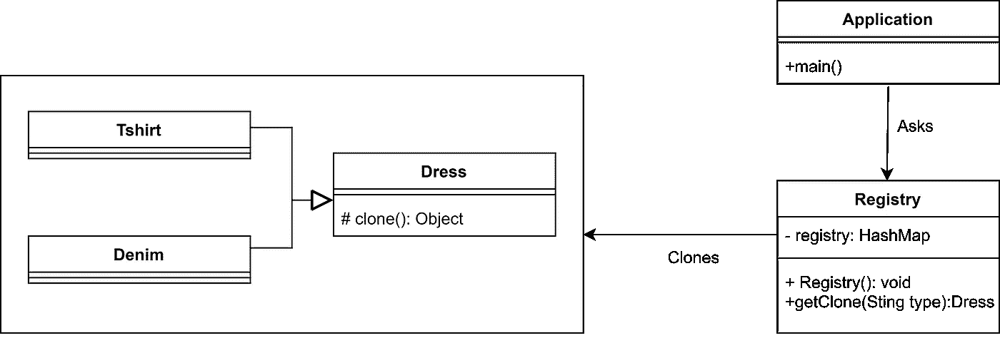
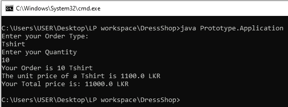
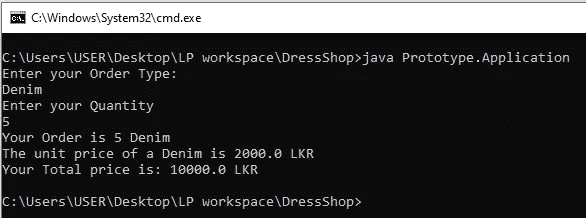
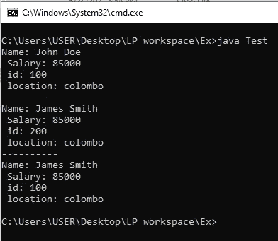

# 原型设计模式概述

> 原文：<https://medium.com/geekculture/overview-of-prototype-desing-pattern-3eafaf006fde?source=collection_archive---------13----------------------->

Image from — [google](https://www.google.com/search?q=cloning+objects&tbm=isch&ved=2ahUKEwiB0ar1veHwAhVCSisKHWCjC7EQ2-cCegQIABAA&oq=cloning+objects&gs_lcp=CgNpbWcQAzIECAAQGDIECAAQGDIECAAQGDIECAAQGDIECAAQGDIECAAQGDIECAAQGDIECAAQGDoECAAQQzoCCAA6BggAEAgQHjoGCAAQBRAeUMmSAljHqQJg4a0CaABwAHgAgAGMA4gBqg6SAQcwLjQuMy4xmAEAoAEBqgELZ3dzLXdpei1pbWfAAQE&sclient=img&ei=5yurYMHBFMKUrQHgxq6ICw&bih=625&biw=1366#imgrc=ozROcpGFh5T6VM)

# 什么是原型设计模式？

原型设计模式允许你通过**克隆**一个现有的对象来创建对象，而不是从头开始创建一个新的对象。当**对象创建的过程代价很高**时，就使用这种模式。克隆时，新复制的对象包含与其源对象相同的特征。克隆后，我们可以根据需要更改新对象的属性值。这种模式属于**创造**模式。

> F 或者更容易理解，假设为了创建一个对象应该完成一个数据库操作。这个数据库调用既费时又费钱。我们需要创建多个对象。因此，当我们创建一个新对象时，每次发生数据库调用，都会导致性能下降，对吗？因此，最初，我们创建一个对象，并在每次需要新对象时克隆它。这将减少每个对象创建的数据库调用。

# 履行

Class Diagram of Prototype Design Pattern

# 要记住的事情:

*   我们试图克隆的对象的类或其父类之一必须实现 **Runnable 接口**，否则将抛出**CloneNotSupportedException**。
*   实现 Runnable 接口的类应该覆盖 clone()方法。clone()方法的主体应该包含`return super.clone()`。
*   应该有一个注册表类包含每个源对象的一个对象。Register 类必须包含一个从源对象克隆新对象并返回该新对象的方法。

# 让我们实现代码，看看原型设计模式是如何工作的。

假设你在一家提供 t 恤和牛仔布的服装店。每次客户下订单时，都应该创建一个新的服装对象。如果每次从头开始创建一个衣服对象太昂贵和耗时，我们可以克隆一个源对象。看看下面的代码。

上面是实现 Runnable 接口和覆盖 clone()方法的父类。

以上是我们之前实现的父类的子类。

上面是 Registry 类，它负责从每个源对象中存储一个对象，并返回新复制的对象。

下面是主类。

以上代码的输出如下所示，

Output 1

Output 2

因此，通过使用原型设计模式，创建一个对象时，我们可以克隆一个源对象，而不是创建一个新的对象。

# 原型模式的优势

*   通过克隆，减少了对象创建的资源消耗。
*   客户端可以获得新的对象，而不知道它属于哪种类型。
*   它允许您在运行时添加或删除对象。
*   它减少了分类的需要。

# 何时使用原型模式

*   当制作一件物品的过程很昂贵或需要很长时间时。
*   当客户端应用程序必须不知道对象的创建时。
*   当您需要将应用程序中的类数量保持在最低水平时。
*   当类在运行时被实例化时。

N 注:

> 在原型设计模式中，由于它使用了克隆方法的**默认实现**，我们得到了源对象的**浅拷贝**。

# 什么是浅抄？

浅层复制意味着，它创建一个新的实例，并将源对象的所有字段复制到该实例中，然后将其作为对象类型返回。

如果源对象包含**引用类型变量**，克隆对象的引用类型变量也引用源对象的引用类型变量所引用的同一对象。**在浅层复制中，仅复制对象引用，不复制被引用的对象。**

因此，更改克隆对象中引用变量的值也有可能影响源对象。参见下面的代码，

输出

the output of the shallow copy

> 我们可以看到，更改“d1”的 id 对“d”没有影响，因为它们是两个独立的对象。但是，如果' d1 '的' e.name '被更改，则' d '的' e.name '也会被更改，因为它们都引用同一个' Employee '对象。因为‘D1’是‘d’的浅拷贝。

我们可以定制一个**深度拷贝**来避免这类问题。

# 什么是深度复制？

当我们需要一个对象的完全**隔离的副本**时，我们称之为深度副本。当我们需要一个对象的深层副本时，我们必须根据我们的需求来实现它。因此，为了执行深度复制，我们必须确保所有的成员类都已经被克隆。

> **注意:如果源对象只包含原语类型字段或者不可变对象，那么 Java 中的浅拷贝和深拷贝是没有区别的。**

# 继续学习❤️

# 参考

 [## 深度，浅层和懒惰复制与 Java 的例子- GeeksforGeeks

### 在面向对象编程中，对象复制是创建一个现有对象的副本，产生的对象称为…

www.geeksforgeeks.org](https://www.geeksforgeeks.org/deep-shallow-lazy-copy-java-examples/)  [## 原型设计模式-Java point

### 原型模式表示克隆一个现有的对象，而不是创建一个新的，也可以根据需要定制

www.javatpoint.com](https://www.javatpoint.com/prototype-design-pattern)  [## 原型设计模式- GeeksforGeeks

### Prototype 允许我们向客户隐藏创建新实例的复杂性。这个概念是复制现有的…

www.geeksforgeeks.org](https://www.geeksforgeeks.org/prototype-design-pattern/)