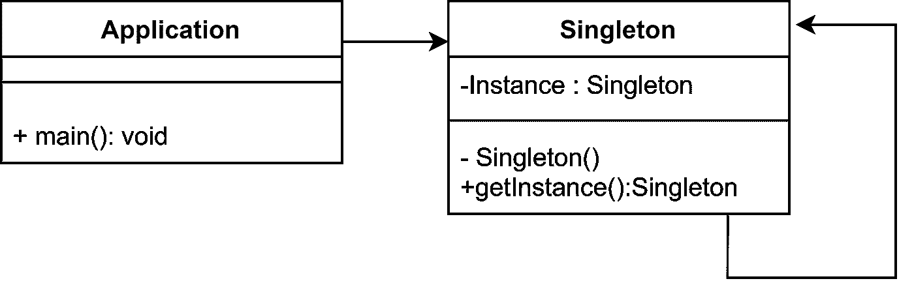
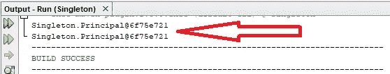
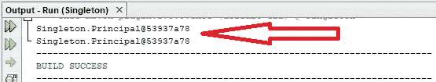

# 单体设计模式概述

> 原文：<https://medium.com/geekculture/overview-of-singleton-design-pattern-10b2b18bfd11?source=collection_archive---------11----------------------->

Image by — [google](https://www.google.com/search?q=singleton+design+pattern&tbm=isch&ved=2ahUKEwjG7pmI193wAhWMYisKHRG4AzcQ2-cCegQIABAA&oq=singleton+design+pattern&gs_lcp=CgNpbWcQAzIECCMQJzICCAAyAggAMgIIADICCAAyAggAMgIIADICCAAyAggAUKt5WKt5YMqEAWgAcAB4AIABqQKIAakCkgEDMi0xmAEAoAEBqgELZ3dzLXdpei1pbWfAAQE&sclient=img&ei=Zi2pYMajM4zFrQGR8I64Aw&bih=625&biw=1366#imgrc=BDQNweFT_MQVYM)

# 什么是 Singleton？

Singleton 是最常用的设计模式之一，它被用来创建一个类，这个类只能有一个实例，这个实例可以被全局访问**。单例被归类为一种创造性的模式。**

> **每个容器只能有一个单一对象。如果您是 JAVA 开发人员，您将在每个 JVM 中获得一个实例。**

# **履行**

****

**Class diagram of Singleton Design pattern**

## **要记住的事情:**

*   **单例类必须有一个私有构造器。**
*   **单例类必须包含自身的静态实例。**
*   **单例类必须有一个静态方法来全局访问它的实例。**

## **单体设计模式有两种形式。他们是，**

*   ****早期实例化:**实例将在加载时创建。**
*   ****惰性实例化:**实例将在需要时创建。**

**让我们来看看每一个，**

# ****早期实例化****

**在这里，Singleton 对象将在类加载时创建，并且每次访问它都将返回相同的对象。**

> **假设我们正在为一所学校开发 Java 应用程序。所以，一个学校只能有一个校长。因此，单例类被用来表示一个主体。**

**code snippet of Singleton class**

**Code snippet of main method**

**以上代码的输出如下:**

****

**Output of the Earlier Instantiation**

**因为它是单例对象，所以每次调用都将返回相同的对象。**

# ****惰性实例化****

**惰性实例化是最受推荐的遵循单例模式的方式。在这里，类的实例是在需要时创建的，每次访问它都返回相同的对象。让我们看看上面同样例子的惰性实例化的代码。**

**Code snippet of Lazy instantiation**

**Code snippet of managing threads**

**以上代码的输出如下:**

****

**Output of the Lazy instantiation**

**这里两个线程得到相同的输出，因为它们访问的是单例对象。**

## **实现惰性实例化的注意事项:**

*   ****在私有构造函数中抛出 RuntimeException** 是一个**好的实践。**因为反射框架可能会通过手动调用构造函数来干预和创建第二个实例。因此，我们可以通过抛出异常来防止这种情况。**
*   **我们必须在 getInstance()方法`Ex:getPrincipal()`中放置一个**同步块**，以确保这段代码是线程安全的。这将在并发访问时为线程设置一个同步锁。**
*   **我们必须在 getInstance()方法中检查**两次**单例对象是否为空。这叫做**复核**。如果我们只检查一次，而一个线程正在创建对象(实际上对象还没有被创建，它正在被创建)，另一个线程可能会在这段时间内被检查，并进入“If 条件块”检查单例对象是否为空。因此，第二个线程可能会在有机会时创建第二个对象。**
*   **将 getInstance()方法更改为 synchronized 方法是一种不好的做法。由于当前线程将阻塞所有其他线程的执行，直到它完成方法中所有行的执行，其他线程可能会等待很长时间。**

> **注意:当我们创建一个单例对象时，不应该使用**参数**。如果需要参数，最好遵循**工厂方法设计模式**而不是单体设计模式。**

# **单一设计模式的优势**

*   **由于不是为每个请求都生成一个对象，因此节省了内存。只是一个实例被反复使用。**

# **使用单例设计模式的实时示例**

*   **记录**
*   **贮藏**
*   **线程池**
*   **配置设置(例如:数据库配置类可以用作单例类)**

# **继续学习❤️**

# **参考**

** [## 单一设计模式-Java point

### 单例模式说只要“定义一个只有一个实例的类，并提供一个全局访问点…

www.javatpoint.com](https://www.javatpoint.com/singleton-design-pattern-in-java)  [## 单例设计模式|实现

### 单例设计模式|实现单例设计模式|简介单例模式是…

www.geeksforgeeks.org](https://www.geeksforgeeks.org/singleton-design-pattern/)**