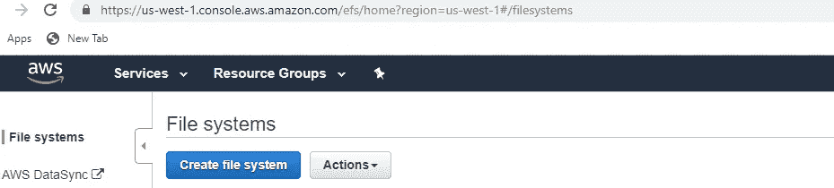
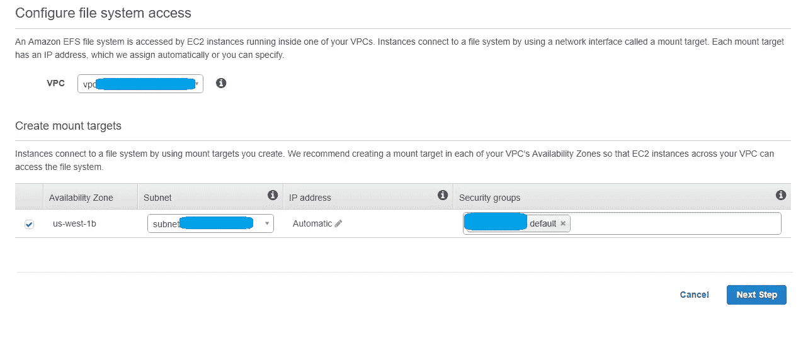
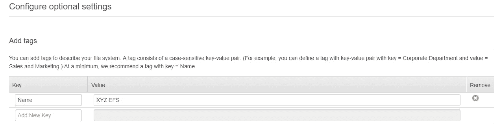
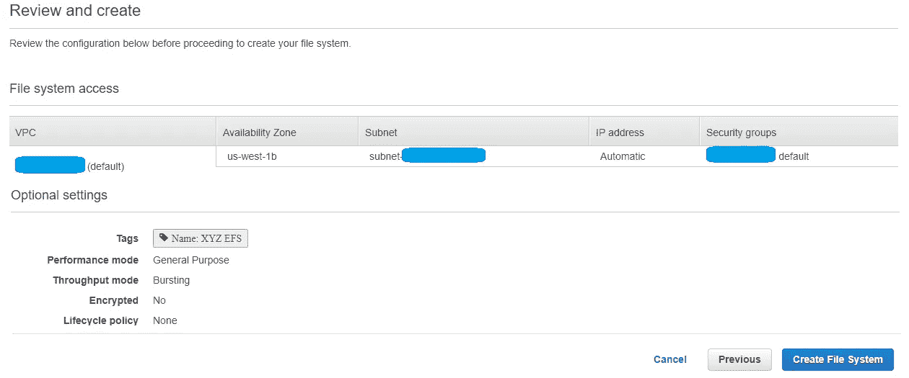
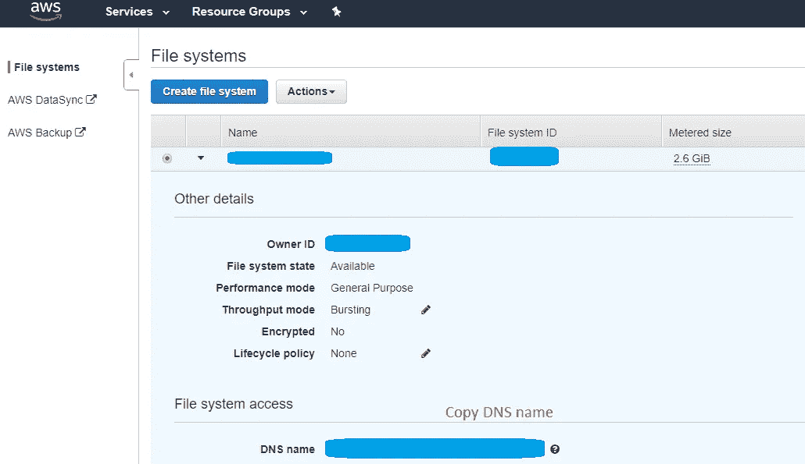
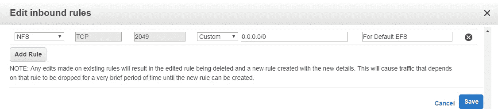

# 安装 Amazon 弹性文件系统(EFS)并挂载到 Ubuntu EC2

> 原文：<https://medium.com/geekculture/ow-to-setup-amazon-elastic-file-system-efs-and-mount-on-to-ubuntu-ec2-b47346427d5?source=collection_archive---------2----------------------->

1)进入 AWS 控制台->服务菜单下的搜索 **EFS** 。

2)点击**创建文件系统**按钮

在 VPC 下选择您的 VPC 和可用性区域。选择 EC2 系统正在使用的安全组(如果不相同，请相应地配置安全组)。

3)点击**下一步**按钮，配置可选设置。您可以保留默认设置。您可以为标签添加名称和值。

4)点击**下一个**按钮进行审核。审查完毕后，点击**创建文件系统**按钮。

5)单击该行以查看已创建的 EFS 的详细信息，并复制 DNS 名称(例如:**fs-xyz.efs.us-west-1.amazonaws.com)**。

6)编辑 EC2 实例安全组，添加一条规则，在**入站**规则中选择 **NFS 端口**(默认 2049)。点击**保存**按钮保存编辑后的安全组。

7)将**EFS**安装到 **EC2** (Ubuntu)上，接入 EC2 端子。

8) **cd /opt** (假设你想挂载在/opt 下)。

9) **sudo mkdir my_efs** (假设文件夹名为 my_efs)。

10)**sudo chmod+XXX/opt/my _ EFS**(通过替换 XXX 给出合适的文件访问权限号)。

11) **sudo apt-get -y 安装 nfs-common**

12)运行命令(使用您的 EFS DNS 名称(在步骤 5 中复制)和挂载文件夹名称):**sudo mount-t NFS 4-o NFS vers = 4.1，rsize=1048576，wsize=1048576，hard，timeo=600，retrans=2，nores port fs-XYZ . EFS . us-west-1 . amazonaws . com:/my _ EFS**

13)完成上述步骤后，安装 EFS。每当我们重新启动 EC2 时，它不会自动挂载。每当我们重新启动 EC2 时，后续步骤会自动将它挂载到 EC2 上。

14)在同一个 EC2 上，运行 **sudo nano /etc/fstab**

15)将下面一行添加到/etc/fstab 文件(**不要更改中间的 nfs** 名称。如果我们用 amazon-efs-utils，那就是 **efs** 。由于我们在步骤 11 中使用的是 nfs-common，所以它应该是 **nfs** (它是一种文件类型，而不是挂载点。挂载点仅是 my_efs)。
**fs-XYZ . EFS . us-west-1 . Amazon AWS . com://opt/my _ EFS NFS defaults，_netdev 0 0**

16)在同一个 EC2 上，运行 **sudo 重启**

您已经成功创建并挂载了 EFS！

# 常见问题

**我正在部署一个新的 EC2 实例。如何配置现有的 EFS？**

请浏览我的文章 [*在 Ubuntu EC2 推出*](/@suryagutta/mount-existing-amazon-elastic-file-system-efs-during-ubuntu-ec2-launch-4dc32d1a617b) 期间挂载现有的亚马逊弹性文件系统(EFS)。

**感谢**的阅读！请👏如果你喜欢这篇文章，请跟我来，因为它鼓励我写更多！