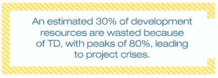
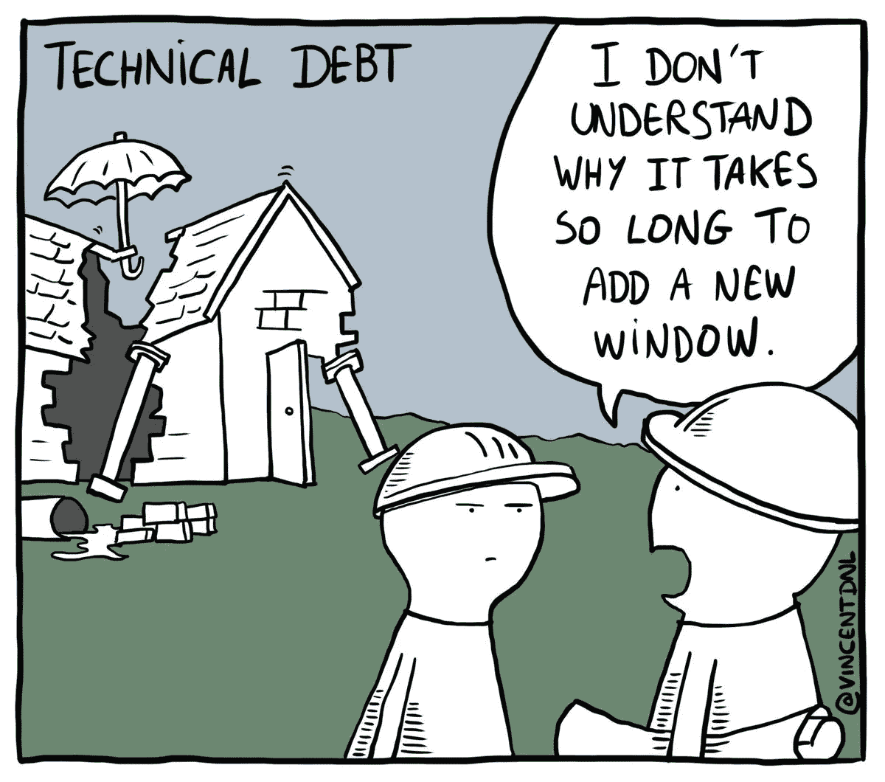

# 拥有你的技术债务

> 原文：<https://medium.com/geekculture/own-your-technical-debt-4822787a9e1d?source=collection_archive---------14----------------------->

## 技术债务

## 为什么他们不让你付钱

Photo by [olieman.eth](https://unsplash.com/@moneyphotos?utm_source=medium&utm_medium=referral) on [Unsplash](https://unsplash.com?utm_source=medium&utm_medium=referral)

## 技术债务

[https://www.sciencedirect.com/science/article/pii/S0167642318301035](https://www.sciencedirect.com/science/article/pii/S0167642318301035)

沃德·坎宁安在 1992 年[【坎宁安，1992】](https://doi.org/10.1145/157709.157715)首次提到了技术债务(TD)这个隐喻。他的定义“不太正确的代码”仍然是最常被引用的。尽管如此，它已经被扩展到指那些选择延迟的内部软件开发任务，但是如果最终没有完成，会有导致未来问题的风险。因此，它描述了当开发团队选择一个简单或快速的方法来在短期内实现时所招致的债务，但是具有更大的负面长期影响的可能性。

> *债务可以指软件的任何方面，我们知道它是不合适的，但目前没有时间去修复，比如过时的/缺失的文档，没有执行的计划测试，需要重构或重构的过于复杂的代码，以及仍然没有纠正的已知缺陷。*

这些不成熟的工件导致在进行必要的修改时出现意外的延迟，并且难以满足项目的既定质量标准[【spínola 等人，2013】](https://doi.org/10.1109/MTD.2013.6608671)[【zazwork a 等人，2013】](https://doi.org/10.1145/2460999.2461005)。

## 为什么要积累 TD？

Photo by [Towfiqu barbhuiya](https://unsplash.com/@towfiqu999999?utm_source=medium&utm_medium=referral) on [Unsplash](https://unsplash.com?utm_source=medium&utm_medium=referral)

作为软件工程师，我们没有被要求做半生不熟的事情。我们被要求做正常工作的事情。通常，当业务和产品领域要求我们妥协时，他们同意在我们对质量妥协之前缩小范围以适应预算或进度。

这意味着*先验*，没有理由收购 TD。我职业生涯中见过的大多数 TD 收购都是完全可以避免的。它被收购是因为它是最容易的选择。

不幸的是，很容易选择这个选项，因为非工程师不理解其负面后果。这听起来显而易见，但事实并非如此。通过给出这个选项，你基本上是在要求别人在你负责的两个主要问题上为你做出决定。下一节将详细介绍它们。

在我谈论他们之前，让我与你分享一个 2:30 分钟的视频。这是从一篇精彩论文的演示文稿中剪下来的，这篇论文大谈安全技术债务:

“[A Passion for Security: Intervening to Help Software Developers.](https://doi.org/10.1109/ICSE-SEIP52600.2021.00011)” 43rd International Conference on Software Engineering (ICSE 2021)

本质上，他们没有心智模型来理解 TD 积累对组织的危害，因为这样做不是他们的责任。所以…

> 不要要求别人授权去做你工作的一部分。

作为工程师，我们要对质量和生产率负责。

## 工程责任(其中一部分)

**质量**

TD 的累积通常会导致回归问题。你改变了一个与另一个高度耦合的东西，当它不应该的时候，另一个坏掉了。或者你做了一个期望得到某种结果的改变，但是你得到了意想不到的结果，因为你不能理解代码。

**生产率**

涉众会期望你的团队的生产力保持不变(如果没有提高的话)。在某些时候，他们会抱怨拖延和事情需要时间来完成或解决。

TD 的积累与此背道而驰，会阻碍你的团队的表现。我亲眼见过这种情况。没错，我见过一个团队完全停止了与特定组件相关的生产，因为没有办法保证它在更多的变化后还能工作，这是 20 年累积 TD 的结果。

作为工程师，我们对质量和生产率负责。更有甚者，如果你是工程经理，像我一样。

因此，保留必要的努力，使生产力和质量达到预期的水平，并至少保持稳定。剩下的工作可以直接投入到生产中。一旦稳定在团队要求的水平，您就可以将更多的精力投入到生产中。

换句话说，每次你提出收购技术债务，实际上，你就辜负了你作为一个工程师对组织的责任。

## 如何以及何时妥协

Photo by [Sebastian Herrmann](https://unsplash.com/@officestock?utm_source=medium&utm_medium=referral) on [Unsplash](https://unsplash.com?utm_source=medium&utm_medium=referral)

当然，我承认可能会有双输的情况，企业必须做它必须做的事情才能繁荣。这意味着你将不得不对商业期限做出让步。

好消息是截止日期已经过了，所以当你面临这种情况时，你必须准备好与业务和产品领域达成协议，这笔债务必须支付，因为它干扰了你的团队完成工作的能力。

## 但是，如果你已经有了 TD，并想开始支付它，检查这另一个职位！

 [## 你有多少技术债务？

### 识别并分类你的技术债务

blog.pplupo.com](https://blog.pplupo.com/how-much-technical-debt-do-you-own-92c52f30d454) 

干杯！:-)

> 如果你喜欢这个故事，在结尾击掌，这样我就知道你想读什么了。
> 
> ***我用博客赚不了一毛钱。如果您想支持更多内容的创作，请与您的同事分享博客，并关注它以获得新故事的通知。***