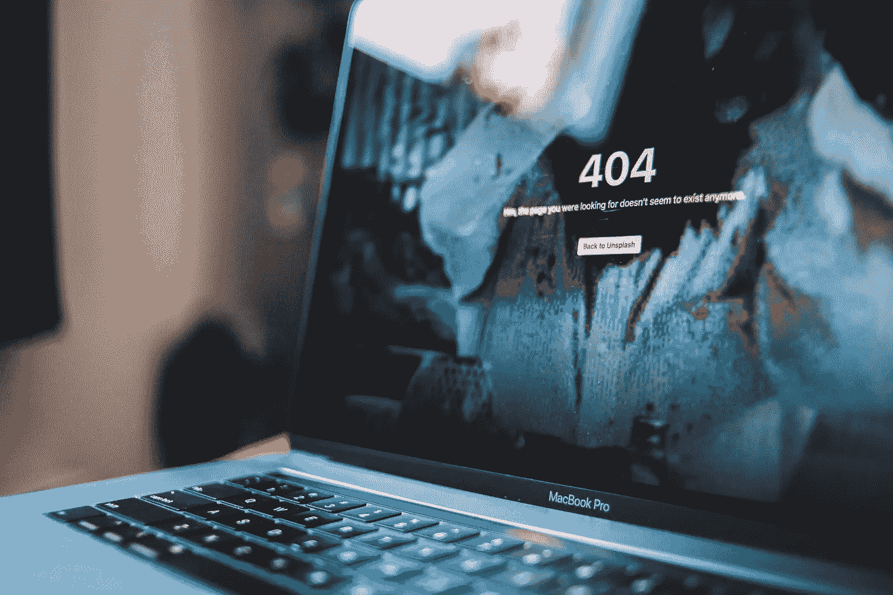

# 拥有你的网站——只有你能控制它。

> 原文：<https://medium.com/geekculture/own-your-website-where-only-you-have-control-over-it-b271d80374a6?source=collection_archive---------1----------------------->

一个完全分散的网站使用区块链域名和分散托管。

Photo by [Erik Mclean](https://unsplash.com/@introspectivedsgn?utm_source=unsplash&utm_medium=referral&utm_content=creditCopyText) on [Unsplash](https://unsplash.com/s/photos/not-available?utm_source=unsplash&utm_medium=referral&utm_content=creditCopyText)

区块链技术的引入实际上允许任何应用被分散化。下一步是分散网站。带回没有审查的自由开放的互联网。让我们弄清楚区块链是如何允许创建一个完全去中心化的网站的。

# 一个网站需要什么

## Web 文件:内容

这是您的 HTML、CSS 和 JavaScript 文件。你网站的组成部分。你网站的内容。

## 虚拟主机:存储

虚拟主机是你储存网站的地方。它是你的网络文件所在的地方。对于网站的在线访问，网站需要托管在服务器上。

## 域名:途径

域名是你网站的地址。当有人输入域名时，它会 pings 网络服务器的 IP 地址。而不是输入 192.217.10.13。我们可以输入 examplename.com。更容易记住，并且有一条清晰的路径通向包含我们网站的主机。

分散式网站托管在具有分散式域名的分散式服务器上。它的建立是为了让任何人都不能拿走你网站的路径，也不能破坏存储。

# 区块链域

## 为什么要有一个分散的域呢？

在一个正常的网站中，域名是由域名注册服务商如 Namecheap 提供的。这些域名需要在 DNS 网络中注册。这让我们知道哪个域名被占用了，哪个是可用的。必须有人将网络同步在一起并监督它们，他们就是互联网名称与数字地址分配机构(ICANN)。

当局可以轻易地关闭你的网站。他们只需要使用 [ICANN 查找](https://lookup.icann.org/)来找到域名注册商。域名注册商可以停用您的域名，因为他们对您的域名拥有完全控制权。把你的域名拿走，你的网站就无法访问了。

## **什么是区块链域？**

区块链域名是不可替代的令牌(NFT)。NFT 是生活在区块链的象征，是资产所有权的象征。这些域名存储在一个公开的区块链中。任何人都可以查看域的详细信息，但只有钱包所有者可以修改详细信息。

当局没有办法关闭区块链域名。他们知道关于域的信息，因为每个人都可以看到区块链，但是他们无权更改域。如果他们想关闭一个域，他们有两个选择——没收加密钱包或关闭参与区块链的计算机。

搜寻每一台对区块链有贡献的计算机是极其耗时的。最终结果很可能是徒劳的，因为新的计算机可以随时加入网络。相比之下，这只是要求域名注册商拿掉你的域名。区块链域名的去中心化性质使它们能够抵制审查。

让我们来研究另一种方法来关闭区块链域——夺取保存它的加密钱包。假设区块链的钱包域名没有经过任何“了解你的客户”( KYC)的识别，没有人知道谁拥有这个域名。人们可以创建网站，而不需要绑定他们的真实身份。当当局不知道谁拥有这个域名时，他们很难关闭它！

> 你拥有这个领域，没有人能把它从你身边夺走。

Photo by [K8](https://unsplash.com/@k8_iv?utm_source=unsplash&utm_medium=referral&utm_content=creditCopyText) on [Unsplash](https://unsplash.com/s/photos/onions?utm_source=unsplash&utm_medium=referral&utm_content=creditCopyText)

# 与...的比较。洋葱

为什么有所有的麻烦购买区块链域名，如果有。洋葱网站？

## 仅可通过 Tor 浏览器访问

。洋葱网站只能通过 Tor 网络访问。Android 中的 Tor 应用。然而，iOs Tor 应用程序经常基于[一些评论](https://apps.apple.com/us/app/onion-browser/id519296448#see-all/reviews)而崩溃。我试图在我的 iPhone 上使用洋葱浏览器应用程序，它只是滞后，不能加载任何东西。苹果手机用户数量在[15 亿](https://www.thestrategywatch.com/target-market-analysis-of-apple-inc/)左右。此外，移动网络流量超过[全球网络流量的 52.6%。](https://www.oberlo.com/blog/mobile-usage-statistics)通过限制 Tor 网络内的网站，限制了潜在流量。

几乎每个人都可以使用 clearnet。Clearnet 是一个公众可访问的网络，不包括 deep web 和 dark web。区块链领域在 clearnet 中。允许普通人无需通过 Tor 即可轻松访问。

## 没有被 Google、DuckduckGo、Bing 等搜索引擎收录。

没有搜索引擎索引，很难分发内容。网站所有者必须提供直接链接来访问他们的。洋葱网站。搜索引擎有利于用户搜索他们的查询。没有搜索引擎索引，很难获得流量。使用可信的搜索引擎获取网站内容对于网站的可发现性和可信度至关重要。Tor 社区提供了一个列表。洋葱网站。

## **。洋葱网站的长度必须精确到 16 个字符。**

这 16 个字符是随机生成的。它是基于公钥的。洋葱是创造出来的。这使得。洋葱网站很难被网站访问者记住。例如，纽约时报。洋葱网站地址是[https://www . nytimes 3 xbfgragh . onion](https://www.nytimes3xbfgragh.onion/)，唯一可读的部分是 nytimes。网站访问者必须自己记录网站地址。

# 为什么我需要为分散托管而烦恼？

## **抵制审查**

好吧，你得到了你的区块链域名。准备拥有自己的网站，这是审查阻力。请注意，区块链对所有人都是公开可见的。任何人都可以公开查看您的域名服务器等信息，这些信息揭示了您的网站位于何处。当局只需联系你的主机服务提供商，关闭你的网页文件或停止提供他们的服务。如果使用自己的服务器呢？拥有足够人力的政府可以追踪你的服务器位置，然后[占领它。](https://abcnews.go.com/Business/wireStory/germany-seizes-server-hosting-pilfered-us-police-files-71688490)

## **单点故障**

中央主机提供商有能力操纵你的网络文件。一旦恶意行为者控制了包含您网站的服务器之一，就会造成损害。一个黑暗的虚拟主机提供商被黑客攻击，导致超过 6500 个网站关闭。

当使用托管提供商时，您信任他们的安全基础设施。此外，他们的员工有适当的网络安全意识。社会工程被证明是非常有效的。

集中式主机会为您的网站带来单点故障。

# 分散式虚拟主机——星际文件系统(IPFS)

[IPFS](https://raw.githubusercontent.com/ipfs/papers/master/ipfs-cap2pfs/ipfs-p2p-file-system.pdf) 是一个对等分布式文件系统。它使用相同的系统文件连接所有参与的计算机设备。IPFS 也是访问连接到 NFT 的数字文件的协议。Web 文件版本与全球各地的计算机同步。每一台下载了 IPFS 软件的电脑都是他们网站的主机，并参与了分销网络！即使你自己的装有 IPFS 的电脑被关闭了，其他参与的电脑还保存着你网站的一个版本。

## **IPFS 的速度优势**

我们不必为内容分发网络(CDN)掏钱。想象一下。如果你在美国，你想访问一个在澳大利亚的网站。海底的网络电缆必须走很远。使得网站加载速度变慢。CDN 通过在他们的服务器上托管你的网页内容来帮助你。你可以在美国和澳大利亚都有你的网站，允许更快的网站加载速度。然而，CDNs 是要花钱的，你实际上是在另一个国家租用另一台服务器来托管你的网站。对于预算有限的网站所有者或非营利组织来说，CDNs 可能不是一个可行的选择。

IPFS 的设计允许网站访问者 ping 最近的加入 IPFS 网络的计算机。没有昂贵的 cdn 加速网站。

# 结论

我们有基础设施来创建一个完全分散的网站。区块链域名和 IPFS 允许审查-阻力网站存在于 clearnet。拥有你的网站。只有你们有权决定是否要拆除它。

想更多地了解区块链吗？每周日，我都会在 comprehend.substack.com*分享关于区块链的基础知识或项目*