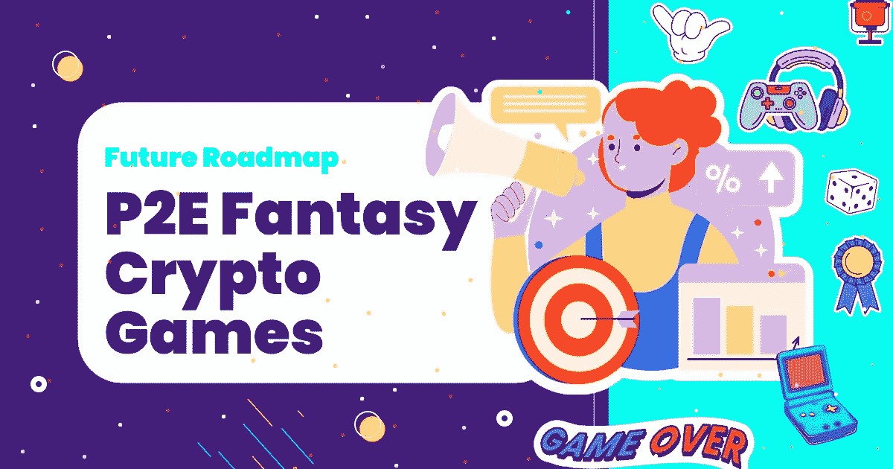

# P2E 奇幻加密游戏:未来路线图— 2023 年

> 原文：<https://medium.com/geekculture/p2e-fantasy-crypto-games-future-roadmap-2023-a96b3131438c?source=collection_archive---------6----------------------->

## 加密游戏生态系统价值数十亿美元，这是由于区块链技术实现了真正的银行可担保的真实世界的 NFT 交易。甚至有数字生态系统只为你的游戏付钱！

赚取游戏或 P2E 游戏的特点是加密游戏，使玩家能够享受它们，如领导战斗，培育他们的游戏角色，并完成任务。因此，他们可以获得某种游戏内现金，这些现金稍后可以用来购买 NFT，或者直接转移到加密钱包中，出售或交易代币或货币标准。

玩家通过玩这些加密游戏获得报酬，这是玩家在这些游戏中有效连接的主要激励之一。这就是为什么**‘玩赚’**游戏的普及程度如此之高。考虑到所有的事情，我们将检查一部分的顶级加密游戏交换大量的美元尊重一致。

[**幻想交易游戏**](https://coinfantasy.io/?utm_source=Medium&utm_medium=Post&utm_campaign=Narmatha) 是一款出色的学习和重演游戏，让你熟悉外汇、金融交易、加密货币项目和 ETF 交易的世界。对于 noobs 来说，这是一个免费的、易于参与的学习应用程序！

## **热门 P2E 密码游戏**

*   [RobotEra](https://cryptonews.com/ext/robotera/en) —游戏支持 P2E/PVP 元宇宙游戏
*   [帛(STT)](https://www.silks.io/?utm_source=cn) —区块链上的 P2E 赛马与育种
*   元宇宙和区块链游戏创新者
*   沙盒(沙)——赚取密码的游戏生态系统
*   ApeCoin(猿)——为元宇宙的另一边提供动力
*   星际图集(图集)——太空探索遇上 P2E 密码游戏
*   axie Infinity(AXS)——有史以来最大的区块链游戏
*   tezotopia(UNO)——Tezos 上的新 P2E 区块链游戏
*   [coin Fantasy](https://coinfantasy.io/?utm_source=Medium&utm_medium=Post&utm_campaign=Narmatha)(CFT)——即将推出的 P2E 奇幻加密交易游戏

## 游戏是大众接受的引爆点

我们都爱游戏！

我们都有，对吧？

而说到玩 2 赚游戏，我们都变得超级疯狂，对不对？

游戏行业正在将区块链技术集成到他们的系统中，以促进点对点交易，并使玩家能够在游戏中交易虚拟资产。

公司和去伪存真项目正在接受这一巨大的范式转变。

> 最近，微软宣布了将区块链并入 Xbox 的计划，这让我们兴奋不已

网络游戏中最大的挑战是信任和盈利能力，对吗？

你猜怎么着？区块链解决了这个！**由于区块链游戏化是加密的，信任是去中心化的，允许所有权不能被破坏**。

现在你不仅玩游戏。

而且，拥有游戏的一部分，并获得同样的报酬。

这对于游戏来说确实是一件大事。自 2019 年以来，NFT 贸易额同比增长 3000%。区块链博彩业在过去一年增长了 2000 %,吸引了超过 25 亿美元的投资。

web3 的最终目标是让所有的利益相关者，尤其是游戏玩家获得双赢，从而激励他们做出长期贡献。理想情况下，这种区块链游戏最好的部分是这些游戏**允许玩家购买、出售或与其他玩家交易游戏中的物品**，游戏所有者从交易中提成。

因此，整个生态系统是相连的，所有人都很高兴！

## **玩奇幻交易游戏的好处**

*   P2E 游戏让你更擅长团队建设
*   这让你更擅长做决策
*   它有助于改善时间管理
*   它能更好地将数据转化为见解
*   幻想运动让你更擅长计划
*   P2E 游戏主要有助于关注结果

## **探索区块链博彩的无限可能！**

传统上来说，电子游戏一直是一种脱离现实世界的模式。

> 就像玩游戏一样，感觉自己很强大，与现实生活中的所有问题脱节，对吗？

视频游戏已经证明，虚拟现实实际上可以让你感觉良好，玩得开心，而不用担心实际的现实。

**然而，视频游戏一直遵循着“付费玩”的理念，而不是“为了赚钱而玩”。**那是直到现在。整个世界现在都站起来承认新时代视频游戏的到来，这些游戏利用下一代区块链技术，如 NFTs，以他们喜欢的加密货币奖励游戏玩家。

> 可能性是无限的。但如果计划不周，它可能会事与愿违。
> 
> 印度在 P2E 领先，但它能保住自己的宝座吗？

印度的游戏行业正在见证众多媒体子行业的急剧崛起，如 OTT、电视和主要的社交媒体平台。

IPL 和板球锦标赛是印度 P2E 游戏市场的最初火花。根据 BCG-Sequoia India 发布的报告，尽管印度博彩业目前规模小于美国和中国，但其在全球博彩业市场中的份额超过 1%。这意味着这里有足够多的有利可图的机会，可以挤压成一个重要的商业机会。

随着印度成为一个拥有大量 z 世代手机游戏玩家的国家，区块链游戏的出现很容易取代玩家的经济比率。根据德勤发布的最新报告，印度的在线游戏行业预计将以 40%的 CAGR 增长，到 2022-23 年将超过 28 亿美元。据进一步预测，到 2025 年，印度移动游戏行业的资本支出将轻松突破 50 亿美元。

## **游戏赚钱的未来**

尽管总部位于区块链的 NFT 产业仍处于早期阶段，但游戏业务已专注于最终目标，并期望无限制地巩固这一模式。

说真的，这种融合可以成为**[**【P2E 游戏】**](https://play.coinfantasy.io/?utm_source=Medium&utm_medium=Post&utm_campaign=Narmatha#/dashboard) 的一项不可或缺的资产，因为它致力于一个可互操作的世界，并且 NFTs 允许游戏中的东西在元宇宙阶段之间导航。最后，P2E 游戏的能力是巨大的和改变游戏规则的，因为它可以让每个人都有赚钱的机会。**

**他们应该只是玩游戏和做实验。**

**所有人的双赢！**