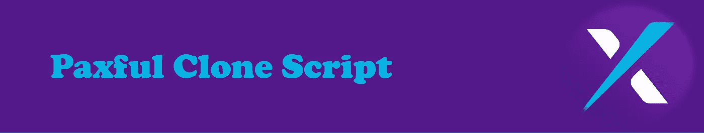

# P2P 加密交换克隆脚本(简介+角色模型)

> 原文：<https://medium.com/geekculture/p2p-crypto-exchange-clone-script-introduction-role-models-1dfbb0336724?source=collection_archive---------13----------------------->

世界各地的人们都可以注意到拥有加密货币交易所的需求，事实上，几十年来它一直是人们关注的焦点。人们需要拥有数字资产和货币，并且能够从中获益。世界各地的人们都试图了解这个数字世界，他们都在寻找一种方式来融入这个巨大的世界，因此，为了成为其中的一部分，人们需要知道如何开始加密货币交易。这将是本文的主要观点，但首先，我们需要稍微谈谈加密货币交易所。为了简化主题，它实际上是一种平台，其中不同加密货币的交易和交易的过程是可能的，来自世界各地的不同人找到彼此来做交易，但什么是 P2P 加密货币交易所？在这种类型的交易中，具有相同需求和兴趣的人找到彼此，然后进行交易，而不是与银行进行交易，因此，这对双方都更容易和有益。人们可以拥有 P2P 加密货币交易所的一种方式是购买一个 [**P2P 加密货币交易所脚本**](https://radindev.com/p2p-crypto-exchange-script/) ，这个大解决方案有很多好处和功能可以提供，例如。托管服务。敬请关注。

# **P2P 加密交换**

传统的点对点服务是由比特币的发明者中本聪引入的。对等交易现在只作为交易所支持的服务存在，正如前面提到的，它消除了对第三方的需要。现在，世界各地的人们都在要求它，这种交换的受欢迎程度也在不断增长，但没有足够的供应来满足这种要求，因此，机构和企业家正在尽最大努力成为这种独特的交换方式的一部分。为了能够拥有这些 P2P 平台，人们需要 P2P 加密克隆脚本。

# **P2P 加密交换克隆脚本**

提到的克隆脚本是一个现成的软件，它允许用户启动一个具有所有好处和功能的 P2P 加密货币平台。事实上，它是经过测试的，在这个软件中不会有错误，此外，有一个像这样的克隆脚本，可能会帮助您防止浪费时间，精力和金钱。请记住，从头开始创建一个全新的 p2p 加密交换平台是一个势不可挡的行为，它可以花费大约十万美元，这是我们推荐克隆脚本的原因之一。除了上面提到的特性，P2P 加密交换克隆脚本还有其他特性，我将详细介绍。

无错误加密交换

精确和私密的交易

多语言支持

趋势市场价值

顶级匹配引擎

即时 KYC 和配置文件验证

多种付款方式

快速交易方式

用户界面

托管服务

自动化交易

多因素身份认证(MFA)

## **无漏洞加密交换**

加密交换是非常有用的功能之一，因为寻找和处理第三方需要如此多的利润和时间，所以有了这个功能，用户可以放心地进行交易。交易过程是完全安全的，没有欺诈和黑客线程。

## **精准而私密的交易**

为用户提供了精确和私密的交易，这意味着他们可以很容易地从这个克隆脚本上提供的大量加密订单中找到并交易他们想要的订单。

## **多语言支持**

拥有来自世界各地的用户是大多数用户梦寐以求的功能，但是拥有他们也是一件棘手的事情。但有了这个功能，你就可以轻松地用不同的加密货币为来自世界各地的客户服务。

## **趋势市值**

知道每种加密货币的确切价值可能是很多人关心的问题。p2p 交换脚本的设计方式显示了易变的加密货币价值。

## **顶级匹配引擎**

匹配双方的引擎应该非常先进和强大，因此，在这个克隆脚本中，匹配引擎是以一种不浪费时间的方式来匹配双方的。

## **即时 KYC &剖面验证**

找出用户的身份是拥有加密货币交易所的一个方面，因此，必须有一个可以验证未授权用户的系统，因此，克隆脚本中包含了这个功能来帮助管理员。

## **多种支付方式**

用户可以选择他们想要的货币，并且可以通过多种支付方式进行交易。

## **快速交易方式**

交易引擎是允许交易过程发生的东西，专业的交易引擎使交易过程更容易、更快、更安全。

## **用户界面**

克隆脚本允许用户轻松地进行登录过程和交易过程，换句话说，克隆脚本是用户友好的。

## **托管服务**

P2P 加密交易所提供安全可信的基于智能合约的托管系统燃料，以实现平台用户之间的成功交易。

## **自动化交易**

不再需要第三方，用户可以通过自动加密交易轻松完成交易。

## **多因素认证(MFA)**

为了您的平台的安全性，P2P 加密交换克隆脚本提供了多因素身份验证功能，如管理员和用户都可以使用的电子邮件身份验证或 Google 2FA。

满足这一需求的另一种选择是使用 Whitelabel P2P 加密脚本，这使得该过程比以前更容易。许多公司和机构都提供他们自己的 whitelebel 克隆脚本，其中每一个都可能有一套独特的功能和优势，但你需要知道选择哪一家公司，因为你肯定有几个选择。

不同的克隆脚本现在出现在这个数字世界中，如币安、本地比特币、Wazirx 等，它们中的每一个都有自己独特的功能。在文章的这一部分，我将提到一些已经摆在桌面上的克隆脚本，同时决定你应该为你自己的克隆脚本遵循哪个角色模型。

# **币安 P2P 克隆脚本**

我们要介绍的第一个克隆脚本是[币安 P2P](https://p2p.binance.com/en) 克隆脚本。任何对加密货币了解最少的人都至少听过这个名字。他们有大约 150 万活跃用户，这是他们受欢迎的证明，此外，该公司的交易额约为 5000 万美元。显而易见，使用这个平台的用户数量表明，它有巨大的用户空间。值得一提的是，该平台是该领域最安全的平台之一，由于使用了智能合同，黑客和诈骗的威胁已降至最低。

以下是该平台的功能列表

双因素认证

托管绑定应用程序

多签名钱包集成

安全数据加密

反拒绝服务(DoS)

无法破解的交易平台

用户认证

监狱登录系统

HTTPs 身份验证

内容安全政策

# **本地比特币克隆脚本**

LocalBitcoins 实际上并不是一个严格集中的平台，它实际上是一个基于点对点广告的加密交易接口。本地比特币是世界上最伟大的模式之一，它在芬兰受到监管，其年交易量约为 23 亿美元，这是一个巨大的数字。他们拥有来自 190 个国家的 800 万用户，支持 150 多种货币。

这个平台的用户可以将当地货币兑换成比特币，他们还可以制作广告，可以选择支付方式和汇率，与其他当地比特币用户进行交易。当广告得到回复时，会打开一个交易聊天，并自动激活托管保护，通过保护比特币的安全来保护买方和卖方，直到支付完成，卖方将比特币交给买方。下面我列出了一些特性

托管证券

集成聊天机器人

快速买卖期权

点对点交易选项。

臭虫奖励计划。

令牌列表

加盟计划

没有篡改

押注加密货币

# **Wazirx 克隆脚本**

这是人们在选择他们想要追随的榜样时可能会考虑的下一个榜样。这是最大的平台之一，他们认为他们正在建立一个吸引人们注意力的交易所，让他们对加密货币感兴趣，即使是那些没有该领域背景的人。他们的应用程序已经被下载了 1000 万次，他们的每周访问量是 503，018，他们支持大约 232 枚硬币，这使他们成为一个伟大的榜样。Wazirx 克隆脚本几乎拥有 Wazirx 本身以及许多公司提供的所有特性。以下是这些功能的列表:

场外交易

IEO/发射台

原子交换

托管集成

集成交易机器人

加密货币赌注

奖金/推荐计划

# **Paxful 克隆人脚本**

该平台成立于 2015 年，吸引了众多用户。P2P 交易所可以支持大量的加密货币。他们声称他们有超过 350 种交易货币的方法。现在他们有超过 12000 个活跃的报价和超过 12000 个经过验证的卖家。这个平台的用户数是 600 万。这就是这个平台成为一个好榜样的原因。这对管理员和用户都有好处。

用户利益

多种加密货币支持

多重加密支持

免费钱包集成

购买/销售广告显示

场外交易

比特币价格计算器

奖励计划

交易程序

同伴计划(MLM)

加盟计划

管理优势:

带托管的交易

客户争议解决方案

对等市场价格 API

比特币 ATM 地图 API

流动性设置

350 种支付方式

交易商品

包含礼品卡

用户论坛

# **雷米塔诺克隆剧本**

在 remitano 中，你可以轻松地全天候买卖数字货币，但你需要记住，它不是一个去中心化的平台。这是一个 P2P 交易所，拥有比大多数交易所更多的加密货币选择。例如，它提供 Swing 功能，这意味着用户可以投资加密货币，而无需实际购买。目前，该公司已在许多国家提供服务，包括澳大利亚，马来西亚，尼日利亚，越南，柬埔寨，中国，它是随着时间的推移而增长。以下是它必须提供的功能列表:

托管交易

高度安全

现代化的工具

用户仪表板

KYC 验证

多语言系统

管理佣金设置

设备管理