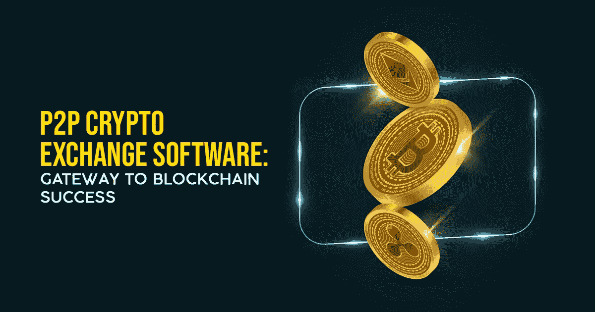

# P2P 加密货币交易—消除加密交易过程中的中介介入

> 原文：<https://medium.com/geekculture/p2p-cryptocurrency-exchange-eliminate-intermediary-involvement-during-crypto-transactions-c2bd34e50cd5?source=collection_archive---------21----------------------->

**P2P Crypto Exchange**

# **为什么 P2P 加密交换会成为趋势？**

随着 P2P 加密交换的出现，加密市场正在经历巨大的轰动。P2P(点对点)加密货币交易所为交易者提供了对其加密货币资产的完全控制，并在加密交易期间提供了改进的安全性和匿名性。

这些交易所在加密领域蓬勃发展，因为它们不再需要一个中央机构来监管加密货币交易。

知道它在加密爱好者中的广泛接受，许多老牌企业和企业家认为这是一种通过 P2P 加密货币交易所发展来增加收入的可靠方法。

# **它是如何工作的？**

这些平台直接联系买家和卖家，所有交易都通过托管机制进行，以确保双方履行义务，没有任何麻烦。

因为所有加密货币交易都是直接的，所以交易中没有单点故障，也不用担心因欺诈活动而损失金钱。

# **P2P 加密货币兑换好处**

*   P2P 加密货币交易所为全球买家和卖家提供了无障碍连接。
*   这些 [**P2P 加密货币交易所**](https://www.infiniteblocktech.com/p2p-cryptocurrency-exchange?utm_source=medium&utm_medium=guestblog&utm_campaign=vigneshraju) 提供比传统集中交易平台大幅降低的交易费用。
*   如果你使用 P2P 加密交换，就不必担心你的个人信息被窃取。

# **P2P 加密交换的诱人特性**

*   原子交换
*   托管系统
*   有效匹配引擎
*   管理面板
*   支持多种语言
*   强大的安全层

# **如何开发 P2P 密码交换？**

**Develop Your P2P Exchanges**

经过广泛的研究，人们可能会选择顶级加密交易所开发公司的白标解决方案，而不是从头开始构建 P2P 加密货币交易所。

开发一个 P2P 加密货币交换软件的实际价格和持续时间取决于某些因素，包括安全层、您希望在平台中包含的功能数量等等。

**在尾注上**

如果你是一个雄心勃勃的加密货币企业家，正在等待开发功能丰富的 P2P 加密货币交换软件的理想时机，现在就是时候了。

一个顶级的加密交换开发公司提供最好的和最可靠的解决方案，既符合成本效益，又符合您的业务需求和预算。

该公司有能力的开发团队在开发 P2P 加密货币交换平台方面拥有丰富的经验和专业知识，这些平台具有为您的业务需求量身定制的尖端功能。

由于市场上有许多密码交易所开发商，你需要花一些时间来研究这些公司。通过这样做，你可以很容易地找到你想要的[**加密货币兑换软件**](https://www.infiniteblocktech.com/cryptocurrency-exchange-software?utm_source=medium&utm_medium=guestblog&utm_campaign=vigneshraju) 的开发者。