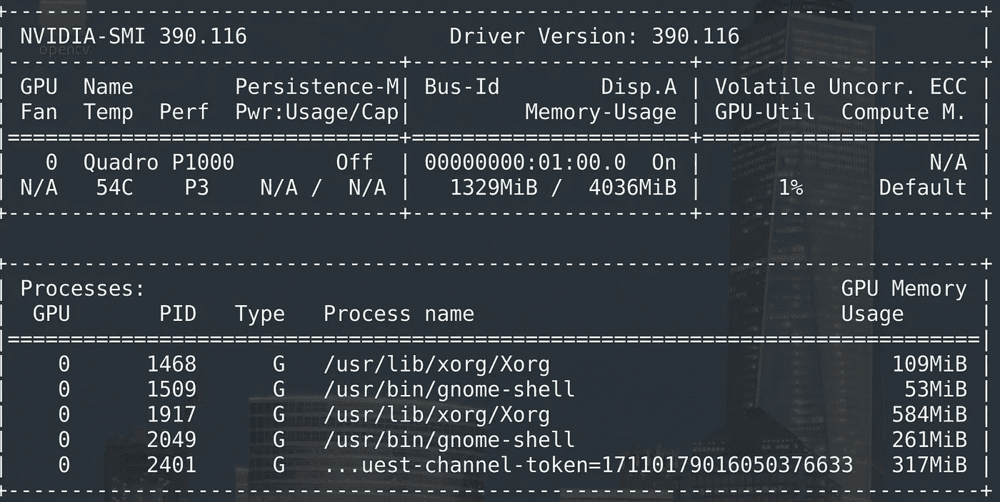

# Ubuntu 18.04 上的无痛 GPU 和 tensorflow/PyTorch 集成

> 原文：<https://medium.com/geekculture/painless-gpu-and-tensorflow-pytorch-integration-on-ubuntu-18-04-48006b49bcb5?source=collection_archive---------0----------------------->

互联网上有很多关于设置 GPU 的帖子。我试图按照他们中的许多人来设置我的机器，但不知何故不能这样做。在这个过程中有如此多的变量，从 nvidia 驱动程序版本，cuda 工具包版本，CUDnn 版本，python 版本，tensorflow 版本等。这样的例子不胜枚举。在这里看看你的 GPU 是否支持 CUDA 集成[也是一个好主意。](https://developer.nvidia.com/cuda-gpus)


Photo by [Christian Erfurt](https://unsplash.com/@christnerfurt?utm_source=medium&utm_medium=referral) on [Unsplash](https://unsplash.com?utm_source=medium&utm_medium=referral)

我假设如下:

1.  机器上没有以前的 nvidia 驱动程序。如果有，我建议先卸载它们，否则按照我的指示可能会或可能不会工作。
2.  Python 已经安装在机器上。我推荐使用 anaconda，因为它使得跟踪库版本和虚拟环境的工作变得非常容易。

我是这样做的:

## **1。通过 ubuntu 库安装 NVIDIA 驱动程序**

打开终端并运行以下命令。

```
$ sudo add-apt-repository ppa:graphics-drivers/ppa 
$ sudo apt update 
$ sudo apt install nvidia-390 
$ sudo reboot 
$ nvidia-smi
```

如果一切按计划进行，您将能够在屏幕上看到类似的输出。



## 2.安装 CUDA 工具包(9.0)

点击[这里](https://developer.nvidia.com/cuda-90-download-archive)下载适用于 linux、x86_64、ubuntu、17.04、deb 的工具包。

下载完成后，在基本安装程序的目录中打开一个终端，并运行以下命令:

```
$ sudo dpkg -i cuda-repo-ubuntu1704-9-0-local_9.0.176-1_amd64.deb
$ sudo apt-key add /var/cuda-repo-9-0-local/7fa2af80.pub
$ sudo apt-get update 
$ sudo apt-get install cuda 
```

也下载并安装一些补丁(可选)，这些补丁是对 cuBLAS 的一些改进。

## 3.更新路径变量

将这两行添加到。bashrc 文件位于主目录中

```
export PATH=/usr/local/cuda-9.0/bin${PATH:+:${PATH}}$export LD_LIBRARY_PATH=/usr/local/cuda- 9.0/lib64${LD_LIBRARY_PATH:+${LD_LIBRARY_PATH}}
```

不要忘记获取。bashrc 文件中进行更改后。

## 4.安装 CUDNN 7.0.5

去[这里](https://developer.nvidia.com/cudnn)选择 cud nn 7 . 0 . 5(2017 年 12 月 5 日)为 CUDA 9.0。如果您还没有帐户，您需要在此处创建一个帐户。下载 tar 文件，并通过终端导航到它所在的位置。然后键入以下命令。

```
$ tar -xzvf cuda-9.0-linux-x64-v7.tgz
$ sudo cp cuda/include/cudnn.h /ur/local/cuda/include
$ sudo cp cuda cuda/lib64/libcudnn* /usr/local/cuda/lib64
$ sudo chmod a+r /usr/local/cuda/include/cudnn.h /usr/local/cuda/lib64/libcudnn* 
```

## 5.安装 Tensorflow GPU

我假设您的系统上已经安装了 anaconda。不幸的是，最新的 python 3.7 版本与 cuda 集成有一些兼容性问题。为了绕过这一点，我创建了一个新的 python 3.6 环境。

```
$ conda create -n tfgpu python=3.6 
$ conda activate tfgpu 
```

要摆脱这种环境，只需输入 conda deactivate。

现在是安装 tensorflow GPU 版本的最后一部分。

```
$ conda install tensorflow-gpu==1.12 cudatoolkit==9.0 cudnn==7.1.2 h5py
```

安装此安装附带的所有依赖项。如果一切顺利，基本上我们就完成了！该检查安装了。

```
$ python
>>> import tensorflow as tf 
>>> sess = tf.Session(config=tf.ConfigProto(log_device_placement=True))
2019-04-24 21:57:54.300645: I tensorflow/core/platform/cpu_feature_guard.cc:141] Your CPU supports instructions that this TensorFlow binary was not compiled to use: SSE4.1 SSE4.2 AVX AVX2 FMA
2019-04-24 21:57:54.516014: I tensorflow/stream_executor/cuda/cuda_gpu_executor.cc:964] successful NUMA node read from SysFS had negative value (-1), but there must be at least one NUMA node, so returning NUMA node zero
2019-04-24 21:57:54.516685: I tensorflow/core/common_runtime/gpu/gpu_device.cc:1432] Found device 0 with properties: 
name: Quadro P1000 major: 6 minor: 1 memoryClockRate(GHz): 1.5185
pciBusID: 0000:01:00.0
totalMemory: 3.94GiB freeMemory: 2.67GiB
2019-04-24 21:57:54.516704: I tensorflow/core/common_runtime/gpu/gpu_device.cc:1511] Adding visible gpu devices: 0
2019-04-24 21:57:56.372624: I tensorflow/core/common_runtime/gpu/gpu_device.cc:982] Device interconnect StreamExecutor with strength 1 edge matrix:
2019-04-24 21:57:56.372706: I tensorflow/core/common_runtime/gpu/gpu_device.cc:988]      0 
2019-04-24 21:57:56.372732: I tensorflow/core/common_runtime/gpu/gpu_device.cc:1001] 0:   N 
2019-04-24 21:57:56.373124: I tensorflow/core/common_runtime/gpu/gpu_device.cc:1115] Created TensorFlow device (/job:localhost/replica:0/task:0/device:GPU:0 with 2370 MB memory) -> physical GPU (device: 0, name: Quadro P1000, pci bus id: 0000:01:00.0, compute capability: 6.1)
Device mapping:
/job:localhost/replica:0/task:0/device:XLA_CPU:0 -> device: XLA_CPU device
/job:localhost/replica:0/task:0/device:XLA_GPU:0 -> device: XLA_GPU device
/job:localhost/replica:0/task:0/device:GPU:0 -> device: 0, name: Quadro P1000, pci bus id: 0000:01:00.0, compute capability: 6.1
2019-04-24 21:57:56.376584: I tensorflow/core/common_runtime/direct_session.cc:307] Device mapping:
/job:localhost/replica:0/task:0/device:XLA_CPU:0 -> device: XLA_CPU device
/job:localhost/replica:0/task:0/device:XLA_GPU:0 -> device: XLA_GPU device
/job:localhost/replica:0/task:0/device:GPU:0 -> device: 0, name: Quadro P1000, pci bus id: 0000:01:00.0, compute capability: 6.1
```

## 6.使用 GPU 支持安装 PyTorch

由于我们已经通过安装 cuda toolkit、CUDNN 和 python 的互兼容版本完成了繁重的工作，安装 PyTorch 就变成了一行任务。

```
$ conda install pytorch torchvision cuda90 -c pytorch
$ python 
>>> import torch 
>>> torch.cuda.get_device_name(0)
'Quadro P1000'
>>> torch.cuda.is_available()
True
>>> torch.cuda.device_count()
1
>>>
```