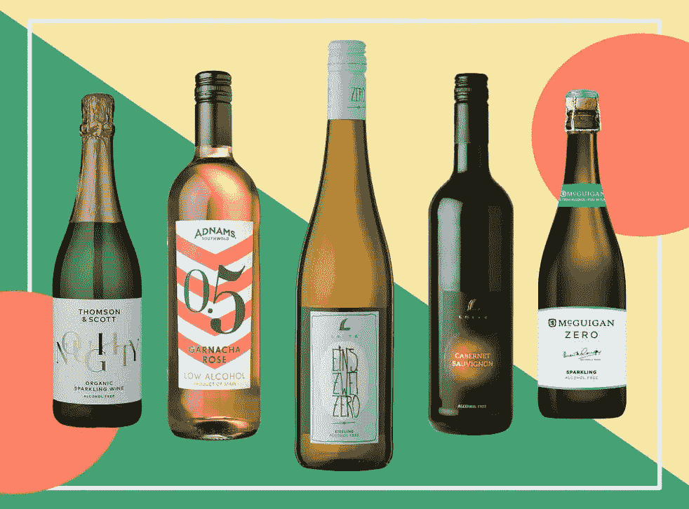
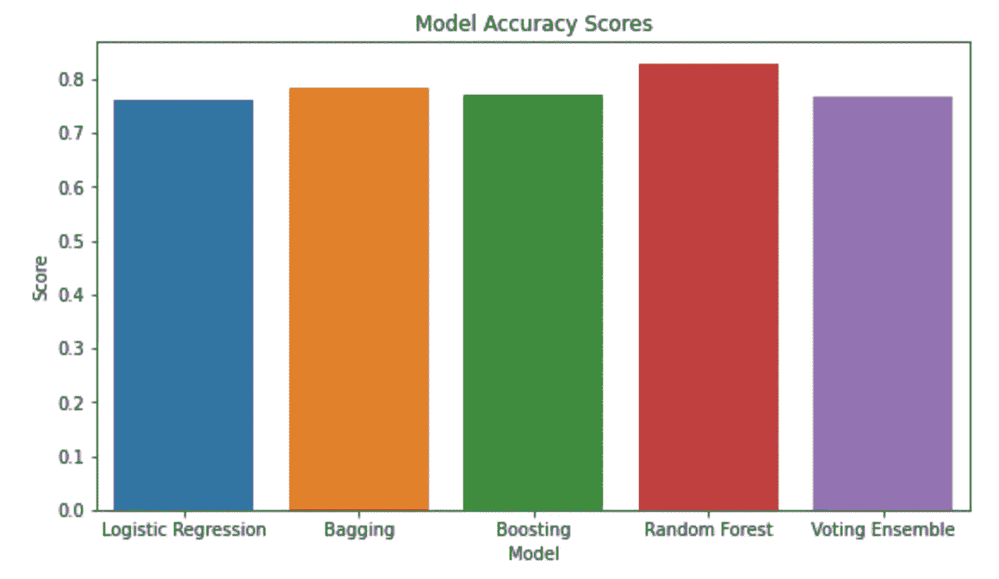
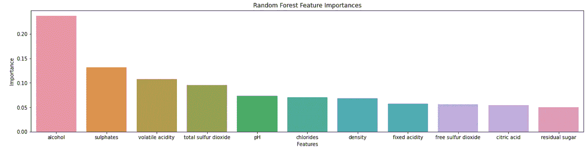

# 将葡萄酒与机器学习配对

> 原文：<https://medium.com/geekculture/pairing-wine-with-machine-learning-5e58a12eea0b?source=collection_archive---------32----------------------->

建立一系列 ML 模型来确定什么决定了最高品质的葡萄酒

Image Source: [https://www.independent.co.uk/extras/indybest/food-drink/wine/best-non-alcoholic-wine-low-alcohol-b1780023.html](https://www.independent.co.uk/extras/indybest/food-drink/wine/best-non-alcoholic-wine-low-alcohol-b1780023.html)

我永远不会忘记我第一次在餐馆点酒的情景。

我刚满 21 岁，很兴奋终于可以在和父母吃饭时点一杯饮料了。当我向服务员推荐葡萄酒时，她翻过来问我，我想在葡萄酒中寻找什么。我完全不知道该说什么(或者这个问题到底是什么意思)，在承认我的无知之前，我沉默地坐在那里一秒钟——这让我觉得很愚蠢！

那天晚上回家后，我花了几分钟在谷歌上找了一些葡萄酒词汇，放在我的后兜里。虽然这些都很有帮助，但事实是我仍然不知道什么是“好”的葡萄酒。

所以为了回答这个问题(并避免再次点葡萄酒时感到哑口无言)，我决定建立一系列的[机器学习模型](https://github.com/johnpauv/Pairing-Wine-with-Machine-Learning)来根据葡萄酒的特性预测其质量。

在本文中，我将向您介绍构建模型的过程，并讨论我的发现。

# 数据概述

我使用的[数据集](https://archive.ics.uci.edu/ml/datasets/wine+quality)包含 1600 种葡萄酒，每种葡萄酒都有以下[特征](https://www.kaggle.com/uciml/red-wine-quality-cortez-et-al-2009)的信息:

*   **固定酸度**:促成酸味
*   **挥发性酸度**:高含量会产生不好的醋味
*   **柠檬酸**:有助于‘鲜’味
*   **残糖:**使葡萄酒醇香可口
*   **氯化物:**咸味
*   游离二氧化硫:保护葡萄酒不变质
*   **总二氧化硫:**也能防止腐败
*   **密度:**与高品质和葡萄酒“腿”相关
*   **pH:** 酸度
*   **硫酸盐:**防腐剂
*   **酒精**

数据集中的每种葡萄酒都有 1-10 分的质量等级。因此，建立模型的目标是基于上述特征的水平来尝试和预测葡萄酒的质量。

# 构建模型

在机器学习中，重要的是对数据进行一些预处理，以获得尽可能好的模型性能，并避免过拟合等问题。

我做的第一件事是处理原始数据，使“质量”变量从 1-10 分变为选择一个任意的分界点，这样它就变成了葡萄酒“好”或“坏”的二进制值。通过简化数据和创建一个真正的分类问题，每个模型的准确性显著提高。在那之后，我使用了一个[工具](https://scikit-learn.org/stable/modules/generated/sklearn.preprocessing.MinMaxScaler.html)来标准化特征的范围。

接下来，任何机器学习问题的关键步骤是将数据分成训练集和测试集。这些模型通过学习训练数据中的趋势来工作，因为训练数据包含“答案”(在这种情况下，是葡萄酒质量)。测试集是删除了“答案”的相同数据的新片段。通过将测试集输入到模型中，使其能够进行预测，我们能够获得准确性分数，以查看模型在新数据上的工作情况。

我建立了五种不同类型的模型，以找出哪一种表现最好:[逻辑回归](https://www.statisticssolutions.com/what-is-logistic-regression/)、[装袋](https://corporatefinanceinstitute.com/resources/knowledge/other/bagging-bootstrap-aggregation/)、[助推](https://www.geeksforgeeks.org/boosting-in-machine-learning-boosting-and-adaboost/)、[随机森林](https://builtin.com/data-science/random-forest-algorithm)和[投票组合](https://www.toptal.com/machine-learning/ensemble-methods-machine-learning)。

Figure 1

# 主要发现

如图 1 所示，所有五个模型的表现都很好。随机森林模型表现最好，总体准确率为 83%。这意味着，如果你给这个模型提供 100 种不同葡萄酒的信息，它将能够准确预测葡萄酒的好坏 83 次。

随机森林的工作原理是制作一堆[决策树](https://www.xoriant.com/blog/product-engineering/decision-trees-machine-learning-algorithm.html)并将它们连接在一起以创建最准确的结果。这种结构特别有用，因为它提供了对数据中哪些特征对预测最重要的经验洞察。

Figure 2

根据兰登森林的数据，对于我们的葡萄酒问题，酒精含量显然是最重要的特征。硫酸盐、挥发性酸度和总二氧化硫也是决定葡萄酒质量的重要因素。

这些发现对酿酒师很有用，因为它提供了一个框架，让他们在生产过程中关注葡萄酒的哪些特性，以生产出最高品质的葡萄酒。

也许更重要的是，我可以利用这些发现回到我点第一杯酒的那家餐馆，而不会感到愚蠢。当女服务员问我在寻找什么时，我会看一眼我的特征重要性图表，并高兴地告诉她我在寻找酒精、硫酸盐和挥发性酸度的平衡。