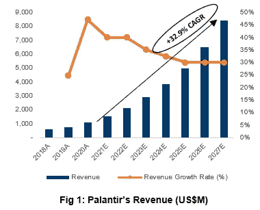
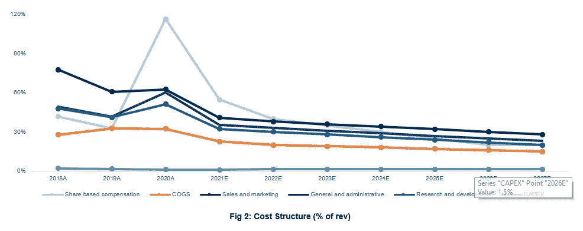
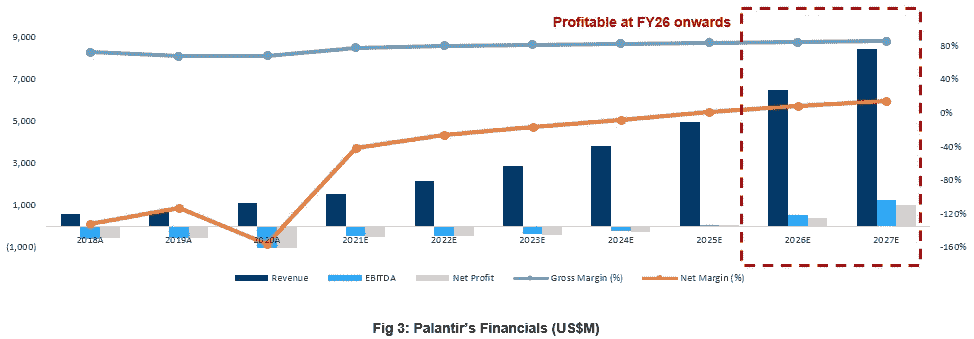
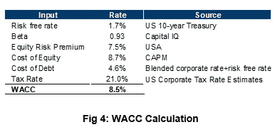
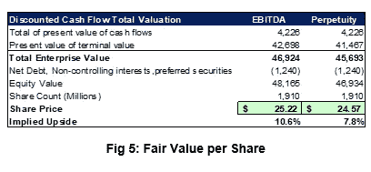
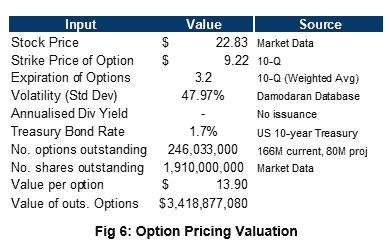
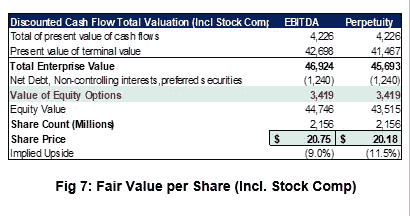
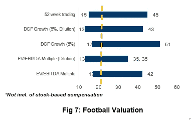
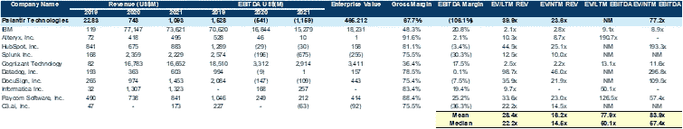

# palantir——了解高增长公司的运营结构

> 原文：<https://medium.com/geekculture/palantir-nyse-pltr-primer-report-48a717c98b8c?source=collection_archive---------11----------------------->

Palantir (NYSE:PLTR)

本文附有一份关于 Palantir(纽约证券交易所:PLTR)的初步报告，该报告旨在纳入基于股票的薪酬，以确定公司的“真实”公允价值，因为科技股/高增长公司经常通过发行限制性股票单位(rsu)和股票期权来扩大其现金头寸。但是，这些期权最终会被行使，稀释现有的股东结构，降低未来的股价。

在这份报告中，我包括:

1.  2011 财年第三季度财务概况
2.  财务分析
3.  估价
4.  通过股票补偿进行稀释
5.  可能的牛市收入增长
6.  财务模型

免责声明:本初始报告仅为初级版本，并未对软件基础设施技术细分市场进行深入研究，而是纳入了管理层的总体指导并分析了公司的运营结构，以确定公司的公允价值。

随后的修订版将包括商业和行业概述、Palantir 的竞争定位和潜在投资风险。

# **1。2011 财年第三季度概述**

Palantir 公布了 2011 财年第三季度的财务业绩，包括以下内容:

(1)第 3 季度新增 34 家客户，完成 54 笔 100 万美元以上的交易，33 笔 500 万美元以上的交易，18 笔 1000 万美元以上的交易

(2)2011 财年第三季度总收入同比增长 36%，达到 3.92 亿美元

(3)1.19 亿美元的正自由现金流，代表 30%的利润率

此外，首席执行官 Alex Karp 预计 2011 财年的收入将增长 40%,到 2015 财年，同比增长率将持续保持在 30%。再加上股票薪酬占收入的百分比不断下降，利润率不断提高，以实现盈利，Palantir 的增长故事似乎已经到位，股票将升至更高的水平。

然而，股票市场似乎没有对这样的好消息做出回应，相反，截至 2021 年 11 月 15 日，Palantir 从 26.75 美元下跌至 22.83 美元，跌幅约为 15%。这就提出了一个问题；是市场对 Palantir 的增长故事进行了错误定价，还是市场已经对 Palantir 的其他挫折进行了定价，例如 Palantir 基于股票的薪酬的巨大稀释，在公司寻求扩大和增加顶线收入增长时抑制其利润率的可能性很低，以及最重要的是，无法持续达到其 30%的同比收入增长目标？

在本报告中，我们试图揭示 Palantir 的财务增长故事，并假设同比增长 30%，以确定预测是否可行，那么 Palantir 确实被错误定价，目前被低估。此外，我们还考虑了 Palantir 的租赁负债和基于股票的补偿，这可能会稀释当前股东的地位，从而导致其股价进一步下跌。

# 2.财务分析

根据管理层的预测，我们预计到 2025 财年，Palantir 的顶线收入将平均同比增长 30%，然后在 2025 财年后收入将逐渐减少(图 1)。此外，Palantir 的成本结构也将反映成本占收入百分比的下降，如 COGS、S&M、G&A、R&D 和基于股票的薪酬(图 2)，这与 Palantir 的增长故事相吻合，因为该公司希望变得更具成本效益，并在 25-27 财年实现盈利。

接下来，我们可以确定 Palantir 将以 32.9%的 CAGR 增长，从 2011 财年的 15 亿美元增长到 2017 财年的 84 亿美元(也达到 2015 财年 50 亿美元的目标)。该公司将在 26 财年实现盈利，并将在 26 财年和 27 财年开始改善利润率(EBITDA 和净利润率)(图 3)。

从 Palantir 当前的财务状况及其对 2011 财年的预测，我们可以得出结论，该公司未来 3-6 个月的增长故事对于决定股票价格是否会飙升至关重要，因为其当前的运营结构在 2011 财年相对于其顶线收入增长有了巨大的改善。目前和未来的投资者将不得不跟踪 Palantir 未来的季度财务报告，以确定该公司的潜力。

# 3.估价

**DCF 估值**

为了确定 Palantir 股价的公允价值，我们将使用贴现现金流(DCF)法，对 Palantir 截至 2027 财年的未来现金流进行贴现。DCF 估值采用公司自由现金流(FCFF)方法得出公司的内在价值。该模型符合 Palantir 的特征，允许考虑未来的增长前景和现金流的产生，而不管资本结构如何。尤其是当 Palantir 将大量自由现金加回到其价值中时，因为基于股票的薪酬被视为非现金支出，并且该公司已经发放了高达其收入 50%的基于股票的薪酬(如 2011 财年所示)。Palantir 的历史数据从 2018 财年合并到 2020 财年，预测从 2021 财年进行到 2027 财年。

**加权平均资本成本(WACC)**

Palantir 的 WACC(图 4)估计为 8.5%。债务成本的计算方法是，取 Palantir (6.35%)和信用贷款(2.75%)的租赁债务的混合平均值，加上 10 年无风险利率。权益成本是用 CAPM 公式计算的，反映了美国的权益风险溢价、无风险利率和 Palantir 的历史 1 年 Beta。

**EV/EBITDA 和终端增长**

EV/EBITDA 倍数法是通过对(1)系统集成商，(2)高增长软件即服务(SaaS)公司，以及(3)不同垂直行业的数据挖掘和可视化公司进行公开比较得出的(图 5)。由于行业格局基本上是无利可图的，预期 EV/EBITDA 倍数在 60 倍至 200 倍之间，随着运营结构的减少，公司的年同比收入增长率预计将超过 50%。由于倍数非常敏感，我将倍数范围估计为:

(1)40 倍—20–30%的年同比增长率(比目前的倍数低 30%,因为目前在这一细分市场没有同类可比产品。下一个目标倍数将是 10-20 倍，包括大型系统集成商和企业人工智能公司，如 IBM、Cognizant 等)

(2)60 倍—30–40%的年同比增长率(Palantir 目前的定价)

(3)100 倍→50%的年同比增长率(DocuSign 和 Datadog 的高增长率证明了这一点)

这些倍数将结转到我们的敏感性分析中。由于行业格局刚刚形成，企业人工智能领域拥有巨大的市场机会，因此终端增长率将达到 5%。

**每股公允价值**

综合所有投入后，通过 EBITDA 乘数法估计 Palantir 约为每股 25.22 美元，通过终端增长法估计为每股 24.57 美元，假设当前股价有 7-10%的隐含上涨空间(图 5)。因此，估值结果旨在表明，与大多数散户投资者对该公司的看法相反，为什么该股没有飙升，一些人甚至预测该公司在 2-5 年内将获得 5-10 倍的回报。目前的增长故事看起来已经很好地反映在价格中，截至 11 月 15 日 21 日的收购价为 22.83 美元，略有上升。

# 4.未来稀释？

如上所示，Palantir 的股价及其当前预测的警告忽略了累积的股票薪酬——累积到 2.46 亿股限制性股票单位(rsu ),将在 3.2 年的预计加权平均归属期内行使(当前 1.66 亿股，预计从 2022 年至 2025 年为 8000 万股)。当员工开始行使这些权利时，将会出现(1)未来稀释和(2)自由现金流减少，从而将每股公允价值削减至更低的价格。因此，上述每股公允价值可能不代表“真实价值”，因为我们尚未考虑限制性股票单位的潜在稀释。

**期权价值转换**

输入数据被合并，并使用 black-scholes 期权定价模型(图 6)来确定将稀释公司初始股权价值的未偿期权的价值。此外，新的股权价值将除以新的股份总数，代表公司每股的“真实”公允价值(图 7)。

考虑到稀释效应(在 2.46 亿股股票中稀释超过 3B 美元)，Palantir 的每股真实公允价值将通过 EBITDA 倍数法定价为 20.75 美元，通过终端增长法定价为 20.18 美元。这代表了当前股价和公司每股初始公允价值的进一步下跌，因此，Palantir 目前的股价可能被高估。因此，这试图解释为什么 Palantir 的股价在最近达到 26-28 美元/股的高点后面临着下行压力。

**灵敏度分析**

对 Palantir 进行敏感性分析，以衡量股票定价走向的不同可能性，这取决于所采用的情景和估值方法的类型。足球场可视化向我们显示，Palantir 实际上以其当前的估值和增长故事潜力进行了公平定价，投资者应该超越 Palantir 的增长故事(高增长，基于股票的薪酬下降)，因为有更多的东西符合我们的主观偏见(图 7)。此外，图 7 中的值没有包括股票薪酬的稀释，因此 Palantir 实际上可能定价过高。

已经确定并分析了公开可比数据，其中 Palantir 在(1)系统集成商，(2)高增长软件即服务(SaaS)公司，以及(3)不同垂直行业的数据挖掘和可视化公司之间进行了比较。由于新兴的行业格局和进一步深入研究的基础，所使用的倍数将不是导出的平均值/中值，而是上面提到的倍数(60 倍)。

# 5.公牛案例作为催化剂？

尽管对 Palantir 的估值存在轻微的悲观情绪，但该公司仍有可能实现超过 30%的同比收入增长(图 8)。在牛市的情况下，我们将假设年同比增长 50%，*其他条件不变*——在 25/27 财年分别产生 80 亿/140 亿美元的收入。该公司的每股公允价值将上涨两倍(代表股东的 2 倍回报)(图 9)。尽管 Palantir 具有强大的竞争定位，但我认为所提出的场景可能不太可能发生——因为 B2B/B2G 销售周期经历了很长时间(根据我目前的工作经验),从 25 财年(80 亿美元)到 27 财年(140 亿美元)的 2 倍收入增长将表明 Palantir 经历了:

(1)客户和/或合同价值增长 2 倍

(2)接近 70–90%的保留率，因为该公司提到通常的客户终身价值只有 5 年

(3)快速过渡到销售“模块化”解决方案，以便他们能够堆叠 SaaS 定价，并吸引更多不愿意为公司解决方案支付巨额初始费用的客户。

这并不意味着成本结构将保持在基本情况预测的水平，因此这是不太可能的，因为如此高的顶线收入将需要相对较大的成本结构来支持公司的运营。因此，预测这样的估值似乎不现实，建议采用基本案例的结果。

# 6.个人观点

Palantir 的股价在预测方向和巨大的潜在上涨可能性方面经历了大量争议。最终，我认为股票的价值是合理定价的(甚至有点高估)，催化剂肯定依赖于(1)收入增长，和(2)基于股票的薪酬支付占公司成本结构的%。然而，我们不应该忽视该公司在为不同行业领域的未解决问题提供解决方案方面的巨大潜力。因此，进入 Palantir 可能是明智的，在**19-21 美元**区域和**启动备兑买入**头寸(最多 90 天)，因为在每个季度财务结果发布之前，股价的波动可能会非常缓慢，以评估公司的增长潜力和成本结构。

**免责声明**

**此处列出的信息是从公众普遍可获得的来源获得或衍生的，作者认为这些信息是可靠的，但作者不对其准确性或完整性做出任何明示或暗示的陈述或保证。该信息无意作为个人或实体任何投资决策的依据。此信息不构成投资建议，也不是买卖任何证券的要约或要约邀请。**