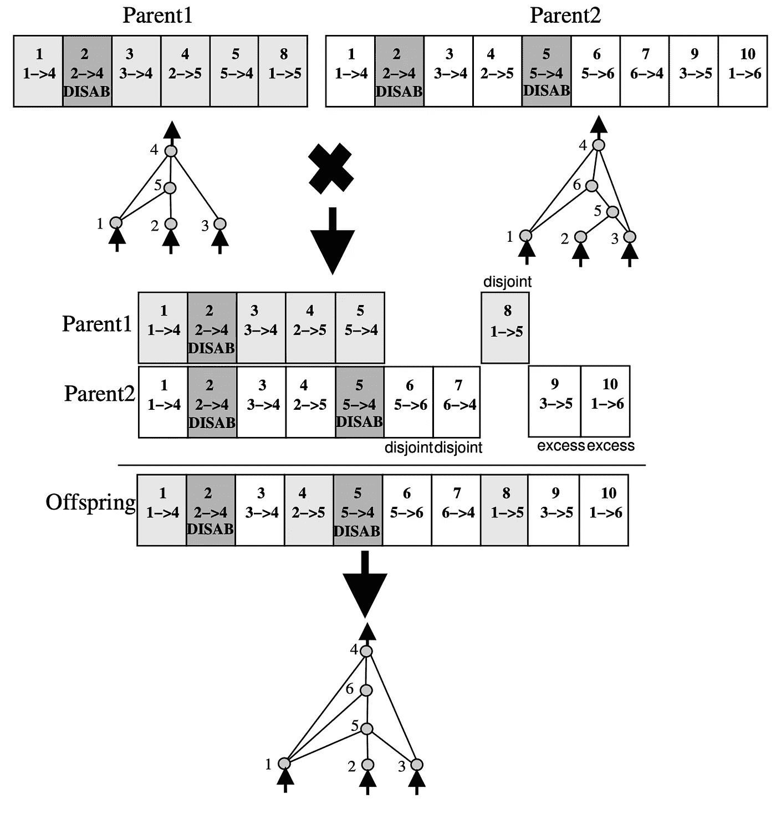

# 论文摘要:“通过进化神经网络拓扑的有效强化学习”

> 原文：<https://medium.com/geekculture/paper-summary-efficient-reinforcement-learning-through-evolving-neural-network-topologies-e11fa08999c2?source=collection_archive---------12----------------------->

## 神经进化的简洁方法

# 摘要:

神经进化是极点平衡游戏中最强的方法。但是最近有一个关于 NE 应该做什么的争论:它可以进化网络拓扑和连接权重吗…