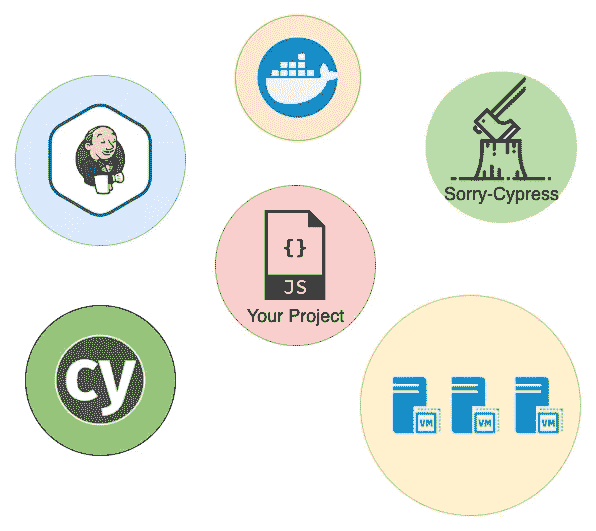
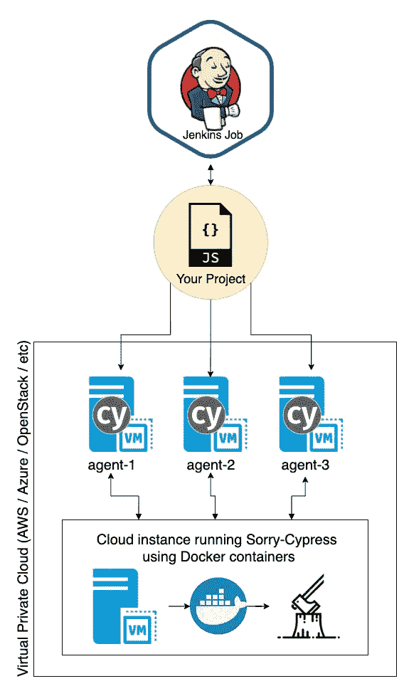

# 用 Jenkins、AWS 和 Sorry-Cypress 并行化 Cypress

> 原文：<https://medium.com/geekculture/parallelizing-cypress-with-jenkins-aws-and-sorry-cypress-8241331fe50f?source=collection_archive---------1----------------------->


对于任何前端项目来说，Cypress.io 都是一个优雅的端到端测试运行程序，并且已经成为行业标准。但是对于许多企业级项目来说，cypress 测试会堆积起来，并且会花费很多时间来运行。这可能会减慢您的 CI/CD 构建，并最终减慢您项目的开发。

如果您使用的是 Jenkins，并且可以访问云计算资源，那么您可以在多个虚拟机上并行运行 cypress。这将大大减少你的柏树运行时间。这篇文章是如何做到这一点的诀窍。

# 你需要什么

*   你的项目，包括柏树测试
*   詹金斯服务器
*   云计算资源(AWS EC2 实例、OpenStack 实例等。)



当我第一次开始尝试这些工具时，我很难理解它们是如何协同工作的。让我们一步一步地设置它。

# 创建您的詹金斯代理

Jenkins 可以跨不同的代理协调任务，因此您需要创建一些虚拟机并将它们添加为 Jenkins 节点。

## 设置您的虚拟机

您需要在您首选的云提供商上启动一些实例。启动一个实例，并以您喜欢的方式(ssh、PuTTY 等。)，请确保在实例上至少安装以下要求:

[节点和 NPM](https://docs.aws.amazon.com/sdk-for-javascript/v2/developer-guide/setting-up-node-on-ec2-instance.html)(Cypress 所要求的，可能是您的项目)
[Java(Jenkins 所要求的)](https://www3.ntu.edu.sg/home/ehchua/programming/howto/JDK_Howto.html)
[Cypress 的要求](https://docs.cypress.io/guides/getting-started/installing-cypress#System-requirements)
您的项目需要运行的任何其他系统要求

我建议设置一个满足您所有需求的实例，然后创建该实例的快照。您可以从该快照启动更多实例，从而非常快速地创建新的 Jenkins 代理。

## 将您的虚拟机作为节点添加到 Jenkins

现在您的虚拟机已经准备好了，将它们作为节点添加到 Jenkins。要快速阅读如何做到这一点，请查看本教程:

[](https://www.jenkins.io/doc/book/using/using-agents/) [## 使用詹金斯代理

### Jenkins 代理可以在物理机、虚拟机、Kubernetes 集群以及 Docker 映像中启动…

www.jenkins.io](https://www.jenkins.io/doc/book/using/using-agents/) 

# 设置对不起-柏树

Cypress.io 的文档解释道，要并行运行 Cypress 测试，您所要做的就是运行命令:

```
cypress run --record --key=abc123 --parallel
```

这暗示了(很少)这需要使用 Cypress.io dashboard 服务。这是一项付费服务，需要将项目代码上传到第三方云服务。如果这对你不起作用，[对不起——柏树](https://docs.sorry-cypress.dev/)来救场了！抱歉——Cypress 允许您在自己的云服务上托管一个 Cypress 仪表板，并使用它来协调并行 Cypress 测试。对于我们正在采用的基于云的方法，以下是一些快速设置步骤:

1.  创建一个新的云实例，专门用于运行 Sorry-Cypress 应用程序套件。请注意，这不一定需要与其他实例相同的样板文件安装。它不会被用作 Jenkins 代理，但是你的 Jenkins 代理和 Sorry-Cypress 实例必须能够通过 http 进行通信。
2.  在您的 sory-Cypress 实例上安装 docker 和 docker-compose。一旦安装完毕，使用 docker-compose 脚本[安装和运行整个 sory-Cypress 应用程序套件就变得轻而易举了。](https://docs.sorry-cypress.dev/guide/dashboard-and-api)

现在，您有了自己的 sorry-cypress 仪表盘，它运行在您自己的云资源上。要检查它，请导航到您的-抱歉-cypress-instance-ip:8080，您将看到您的仪表板。

# 利用柏树

为了让你的项目实际上*使用*对不起 cypress，你需要做一些小的改变。在您的 cypress.json 中，添加一个`sorry-cypress`的`projectId`:

```
// cypress.json:{
  "baseUrl": "http://localhost:3000",
  "projectId": "sorry-cypress",
  ...otherOptions
}
```

您还需要在您的项目中安装 [cy2](https://www.npmjs.com/package/cy2) ，这将有助于将 cypress 导向您的自定义 cypress 仪表板 URL。有关更多详细信息，请参阅完整的 Sorry-Cypress 文档:

[](https://docs.sorry-cypress.dev/) [## 证明文件

### 抱歉，Cypress 是 100%开源项目，如果你喜欢管理自己的基础设施，那就去看看吧…

docs.sorry-cypress.dev](https://docs.sorry-cypress.dev/) 

# 在 Jenkins 中设置并行化

现在所有的部分都准备好了，是时候和 Jenkins 一起编排它们了。假设我们创建了 3 个实例用作 Jenkins 代理，命名为“代理 1”、“代理 2”和“代理 3”。我们告诉 Jenkins 在管道脚本中跨这些代理并行运行 cypress:

您可以看到每个并行阶段都在运行相同的步骤，但是在不同的节点上。让我们来分解一下正在运行的步骤:

*   `npm install --silent` —在代理上安装项目
*   `npm start & npx wait-on http://localhost:3000` —启动项目并等待它在端口 3000 上可用(您的特定项目可能会有所不同)

第三个命令更复杂，所以让我们进一步分解它:

*   `CYPRESS_API_URL=\"http:Sorry-Cypress-Instance-IP:1234/\"` —将 cypress api url 环境变量设置为我们个人的 sorry-cypress 目录 url。当然，使用您的 Sorry-Cypress 实例 IP
*   `cy2` —一个利用`CYPRESS_API_URL`环境变量的`cy`备选方案
*   `run --record --key XXX --parallel`——标准的 cypress 并行化命令——`key`可以是任何东西，抱歉——cypress 实际上没有使用它
*   `--ci-build-id env.BUILD_ID` —所有并行阶段将使用相同的`BUILD_ID`，这允许 Sorry-Cypress director 将不同的并行阶段与相同的构建相关联，并且不会跨节点重复相同的测试

现在，当您的 Jenkins 作业运行时，它将在您定义的任意多个节点上并行运行 cypress 测试。让我们以一种更有条理的方式修改我们所有的作品:



# 结论

Cypress 测试是一个很好的方法来确保你的 UI 如预期的那样运行，但是测试蛋糕需要时间并且减慢你的开发过程。如果你有云资源，使用它们。通过使用 Jenkins 对资源进行精心的编排，您可以大大减少测试时间。

# 更多资源:

[](https://docs.cypress.io/guides/guides/parallelization#Overview) [## 并行化| Cypress 文档

### 如何并行化测试运行如何对测试运行进行分组测试运行分组策略测试的负载平衡如何工作…

docs.cypress.io](https://docs.cypress.io/guides/guides/parallelization#Overview) [](/@adityahbk/cypress-parallelization-on-jenkins-using-sorry-cypress-197a86ad8ed1) [## 使用 sory-Cypress 在 Jenkins 上实现 Cypress 并行化

### 我最喜欢的编写 e2e 测试的方法之一是使用 cypress。

medium.com](/@adityahbk/cypress-parallelization-on-jenkins-using-sorry-cypress-197a86ad8ed1)