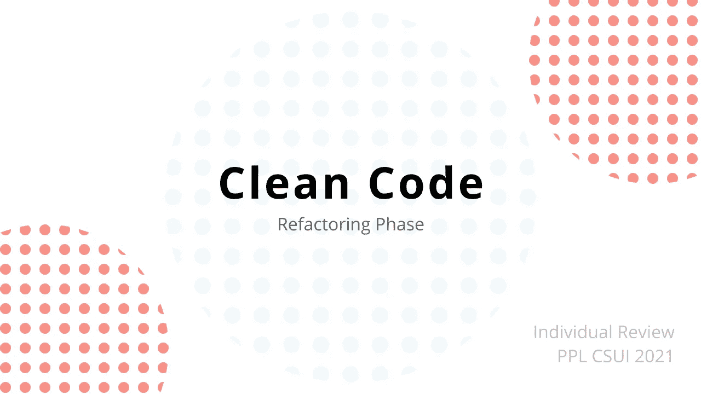

# 通过重构改写一段糟糕的代码

> 原文：<https://medium.com/geekculture/paraphrase-a-bad-code-through-refactoring-1dbee39b9de2?source=collection_archive---------64----------------------->



> 他的文章是为 PPL CSUI 2021 撰写的个人评论的一部分

写代码成为软件工程师的一种习惯。在编写代码时，我经常会查看另一个示例代码。当我不知道代码在做什么时，这很烦人。然后我想，是我的代码惹到别人了吗？

为了减轻我心中的不安全感，我试图在我的开发过程中编写“干净的代码”。我写了一篇关于[干净代码](/geekculture/how-i-clean-my-code-90d1f0ea0175)的文章，你可以看看。文章中提到的东西已经被我实现了。但是，如果代码不够干净怎么办？

来了**重构**拯救你的一天！

> 重构是一个改进代码的系统化过程，不需要创建新的功能来将混乱的代码转化为干净的代码和简单的设计。
> —重构古鲁

根据上面的定义，我们可以简化重构，使用**使代码更干净** **，而不改变它们之前拥有的功能**。

# 我通常如何重构代码

在我目前的软件工程项目(SISIDANG)中，我应该优先交付给定任务的功能，而不是用干净的代码编写它。这是因为我和我的团队在开发过程中使用了敏捷方法。偶尔我会写满“代码味”的代码

例如，下面的代码将名为“place”的属性转换为特定的字符串。

```
def extract_place(place):
    if '.' in place:
        temp1 = place.split('.')
        if temp1[0] == '1':
            temp1[0] = 'A'
        elif temp1[0] == '2':
            temp1[0] = 'B'
        elif temp1[0] == '3':
            temp1[0] = 'C'place = 'Ruang ' + place + ' Gd. ' + temp1[0] + ' lt ' + temp1[1][0]
    elif 'None' in place:
        place = 'to be informed'
    return place
```

代码**包含许多可以**简化**的条件**。除此之外，变量 **temp1** 并不能让我们更好地理解代码。字符串格式可以调整到更好的版本。这是重构阶段的结果。

```
from collections import defaultdict
BUILDINGS = defaultdict(
    lambda: '',
    {
        '1': 'A',
        '2': 'B',
        '3': 'C'
    }
)def extract_place(place):
    res = place
    if '.' in place:
        place_detail = place.split('.')
        res = 'Ruang {} Gd. {} lt {}'.format(
            place, BUILDINGS[place_detail[0]], place_detail[1][0]
        )
    elif 'None' in place:
        res = 'to be informed'
    return res
```

重构的一些关键点

*   创建特定的字典有助于减少不堪重负的条件语句
*   美化字符串格式，使其更易于阅读
*   我通常不会改变任何参数。相反，我把它复制到其他变量，这样参数就保持了整个方法不变
*   变量名更改以增加可读性

这是我在任务实现阶段的一段代码。

```
def set_image_dpi(self, image, dpi=72):
    image_resize = image
    file = tempfile.NamedTemporaryFile(delete=False, suffix='.png')
    filename = file.name
    image_resize.save(filename, dpi=(dpi, dpi))
    return filename
```

上面的代码改变了图像的 DPI，并将它存储在一个临时文件中。需要对代码进行一些小的调整。

```
def set_image_dpi(self, image, dpi=72):
    temp_file = tempfile.NamedTemporaryFile(delete=False, suffix='.png')
    temp_filename = temp_file.name
    image.save(temp_filename, dpi=(dpi, dpi))
    return temp_filename
```

我对代码所做的修改是:

*   移除 image_resize，因为它什么也没做。
*   变量命名更改。当我再次阅读代码时，我被变量 file 和 filename 弄糊涂了。我认为这是一个原始图像文件，尽管它是一个临时文件

## 进行重构的好处

以下几点是我和我的团队从重构中得到的东西:

*   让代码更干净。其他人和我可以很容易地阅读代码
*   降低代码的复杂性
*   更易于维护
*   当需要查看旧代码时，提高生产率

# 结论

进行重构有助于我和其他人更好地理解代码。除此之外，您编写代码的效率会更高。

# 参考

1.  [https://refactoring.guru/refactoring](https://refactoring.guru/refactoring)