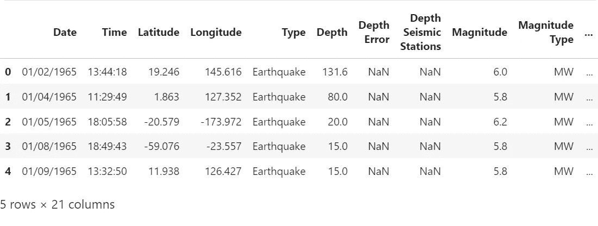
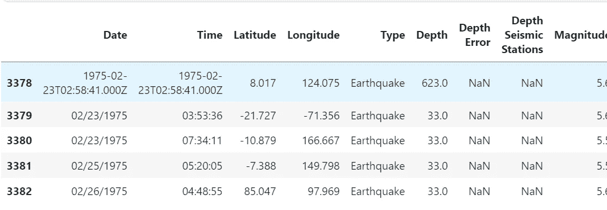
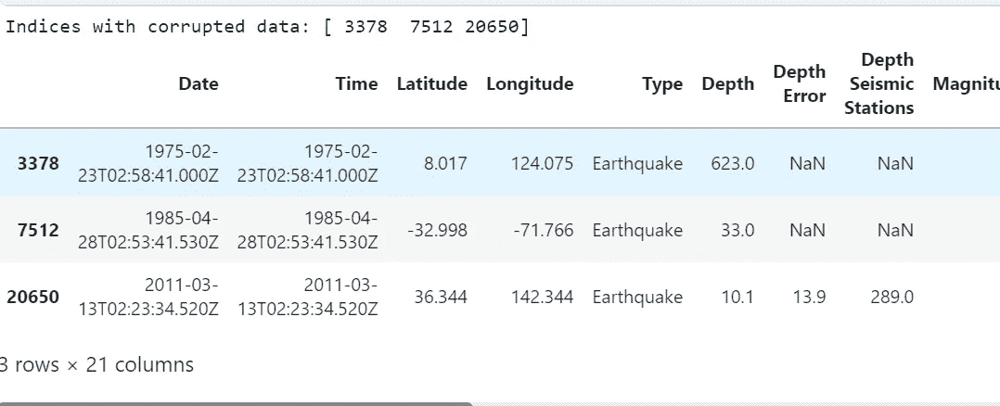
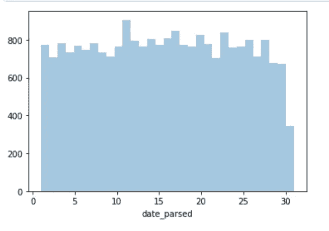

# 如何使用 pandas 解析数据框中的日期？

> 原文：<https://medium.com/geekculture/parsing-dates-effb08eccc71?source=collection_archive---------6----------------------->


Photo by [Kevin Ku](https://unsplash.com/es/@ikukevk?utm_source=medium&utm_medium=referral) on [Unsplash](https://unsplash.com?utm_source=medium&utm_medium=referral)

本文将讨论数据框中的**日期，以及如何处理它们，并在任何项目或用例中有效地使用它们。**

在处理任何**数据分析、机器学习或深度学习**问题时，任何数据集中的**日期列**都是**最重要的功能**之一。如果我们试图**解决时间序列问题**，这是最重要的，因为一切都取决于此。在本文中，我们将看到如何以正确的格式处理**日期，如果数据集中的数据类型**出现错误，将它们转换为**正确的数据类型**。

[**数据集**](https://www.kaggle.com/datasets/usgs/earthquake-database) 取自**美国地质调查局**，它包含了从 1956 年到 2016 年的**地震信息。所涉及的最重要的步骤将主要是**检查日期列的数据类型**、**将其更改为正确的数据类型**，发现是否所有日期的格式都正确，并更改格式不正确的日期，等等。**

下面给出了代码实现。

```
# modules we'll use
import pandas as pd
import numpy as np
import seaborn as sns
import datetime

# read in our data
earthquakes = pd.read_csv("database.csv")

earthquakes.head()
```



First 5 rows of Earthquake dataset (image from Kaggle)

**日期**列为**数据类型**(‘O’表示其属于**对象数据类型**。

## **将日期列转换为日期时间**

**【日期】**栏中的大部分条目遵循相同的格式:**【月/日/四位数年份】**。然而，**索引 3378** 处的条目遵循完全不同的模式。

```
earthquakes[3378:3383]
```



The rows from indices 3378 to 3382

数据被**打错了**或者可能是输入数据的人**试图只对 1 行进行创新**。玩笑归玩笑，其他行也可能发生这种情况，所以让我们用下面的代码来检查一下。

```
date_lengths = earthquakes.Date.str.len()
date_lengths.value_counts()

10    23409
24        3
```

从结果中可以看出，大部分 **(24309)** 行的**日期**列**长度为 10** 即“**月/日/四位数年份**”格式，只有 **3 行**的**长度为 24** 正如我们前面看到的。为了识别长度为 24 的索引，让我们运行下面的代码。

```
indices = np.where([date_lengths == 24])[1]
print('Indices with corrupted data:', indices)
earthquakes.loc[indices]
```



The rows with the wrong Date representation (image from Kaggle)

可以看出，索引 **3378、7512 和 20650** 是**日期打错**的地方。

现在让我们**将错误表示的日期**转换成**正确的日期**格式，并创建一个新的**日期列** ( **date_parsed** )。

```
earthquakes.loc[3378, "Date"] = "02/23/1975"
earthquakes.loc[7512, "Date"] = "04/28/1985"
earthquakes.loc[20650, "Date"] = "03/13/2011"
earthquakes['date_parsed'] = pd.to_datetime(earthquakes['Date'], format = '%m/%d/%Y')
earthquakes.head()
```


Created date column as can be seen above

现在，如果我们重新检查创建的列**的数据类型。**

```
earthquakes.date_parsed.dtypes

datetime64[ns]
```

**date_parsed** 列是一个[**DateTime**](https://pandas.pydata.org/docs/reference/api/pandas.to_datetime.html)**datatype**格式列。

## **选择一个月中的某一天**

创建一个**熊猫系列**来检查任何一个月的某一天。

```
# try to get the day of the month from the date column
day_of_month_earthquakes = earthquakes['date_parsed'].dt.day
```

现在，让我们**只在**柱状图**上绘制一个月中的**天，以尝试并理解特定月份中**地震**的分布情况(考虑到我们一个月中**最多有 31 天**，但不是所有月份)。当然，我们在**之前将**中缺失的值**去掉，以避免图中出现任何破损**。

```
# remove na's
day_of_month_earthquakes = day_of_month_earthquakes.dropna()

# plot the day of the month
sns.distplot(day_of_month_earthquakes, kde=False, bins=31);
```



Daily distribution of earthquakes (Kaggle image)

分布为**均匀分布**且**无不均匀尖峰或骤降**。这表明所有的日子都有相同的概率面临地震。

关于解析日期的文章到此结束，我把它从 [**提到这里**](https://www.kaggle.com/code/alexisbcook/parsing-dates) 。还有 [**这篇关于 **pandas.to_datetime()** 方法的有趣文章**](https://www.educative.io/answers/what-is-the-pandastodatetime-method) 你可以去看看。它在**不同的日期时间**格式上有各种情况(日-月-年小时-分-秒，t **ime 区域感知**处理日期的技术( **utc=True** )，如果指定的日期列是日优先还是年优先，等等。仅举几个例子)。

查看我的其他 [**文章**](/@abhi2652254) ，说 [**嗨**](https://www.linkedin.com/in/obhinaba17/) **。**