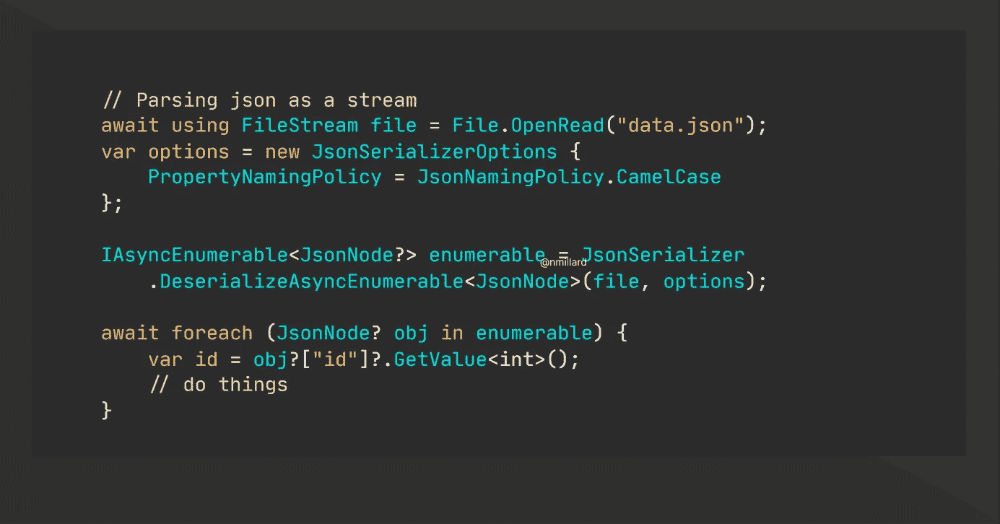

# 中使用流解析 60GB JSON 文件。网

> 原文：<https://medium.com/geekculture/parsing-huge-json-files-using-streams-in-net-d620dace47e2?source=collection_archive---------0----------------------->

## 实用编程建议

## 使用两种系统的示例。Json 和 Newtonsoft。

搜索如何解析一个巨大的 JSON 文件(60GB)并没有得到令人鼓舞的结果。有些答案是完全错误的，误导性的，说你根本不应该做，甚至说这不可能。