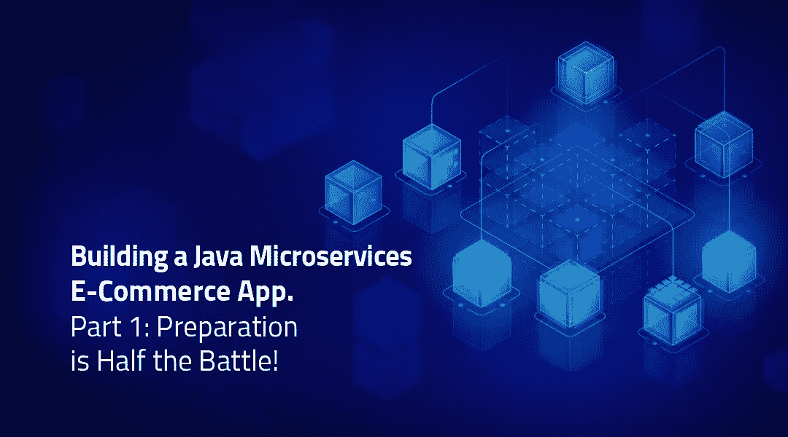

# 第 1 部分:用 OpenJDK 构建云原生 Java 微服务

> 原文：<https://medium.com/geekculture/part-1-building-a-java-microservices-e-commerce-app-587ff6df1bdc?source=collection_archive---------14----------------------->

## 准备是成功的一半！

Source: [BellSoft](https://www.bell-sw.com)

> 近年来，Java 并不总是被认为是云的首选编程语言。与普遍的看法相反，您可以构建和部署生产级企业应用程序…