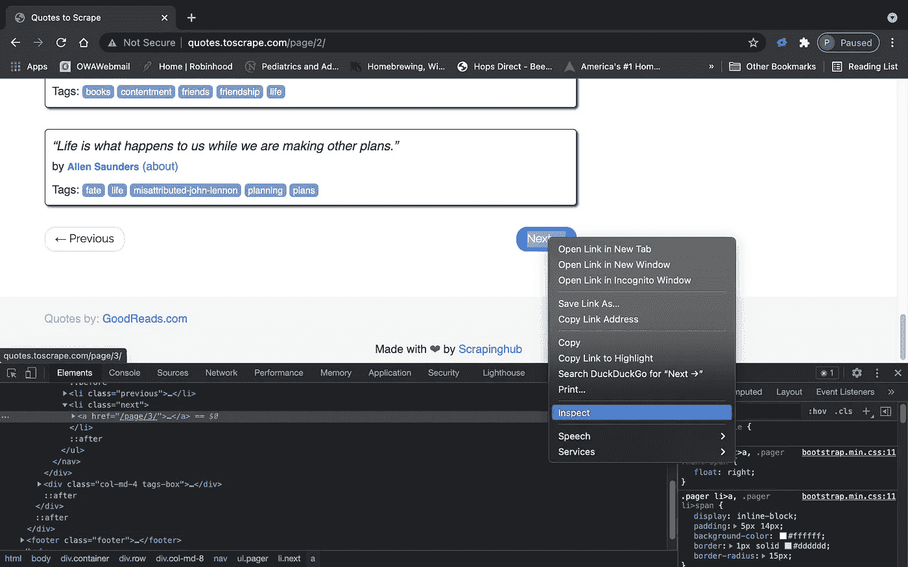
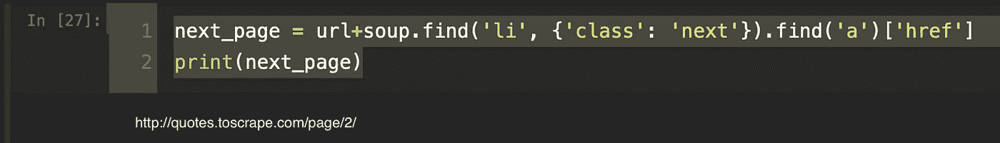
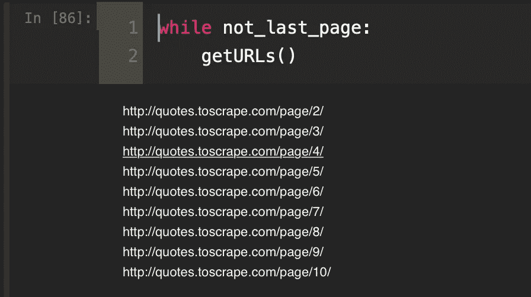
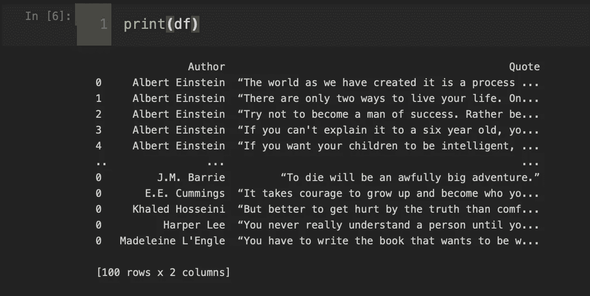

# 第 1 部分:使用 BeautifulSoup 和请求爬行网站

> 原文：<https://medium.com/geekculture/part-1-crawling-a-website-using-beautifulsoup-and-requests-413ffb29dd8e?source=collection_archive---------9----------------------->


Used with permission from Pixabay

你有没有做过一个项目，需要抓取一个子页面数量未知的网站？有哪些选择，我们能以多快的速度编写一个基本脚本来完成这项工作？在这个项目中，我正是这样做的，我从一个开发人员网站上搜索著名的报价，然后用 streamlit 将这些数据重新格式化成一个有用的 web 应用程序。

在这个版本中，我们将和 www.quotes.toscrape.com 一起玩，这是一个专门设计来让开发者学习网络报废的网站。

我们将使用 Requests 和 BeautifulSoup 来展示即使使用一个相对简单的 scrapping 库也可以抓取多个页面。对于更大或更复杂的项目，我建议使用 Scrapy 或 Selenium。

一如既往，我喜欢最小化依赖性。在这里，我将只依靠三个:熊猫，请求和美丽的声音

```
import requests
from bs4 import BeautifulSoup
import pandas as pd
```

这里我们用一个函数 requests.get()导入[请求](https://docs.python-requests.org/en/latest/)来发布 HTML/1.1 请求。如果您想更好地理解 requests 在做什么，我建议您快速浏览一下官方文档。

> " Requests 允许您非常容易地发送 HTTP/1.1 请求。没有必要手动添加查询字符串到你的 URL，或者对你的文章数据进行格式编码。多亏了 [urllib3](https://github.com/urllib3/urllib3) ，保活和 HTTP 连接池是 100%自动的

现在我们要创建一些全局变量来使用。

```
# Globals
url = '[http://quotes.toscrape.com'](http://quotes.toscrape.com')
url_list = [url,]
pages = []
soup_list = []
not_last_page = True
```

这里，我们创建了几个要填充的列表(url_list、pages、soup_list ),并将 not_last_page 设置为 True。我们一会儿就会明白为什么。

3.接下来，我们采取 3 步的方法来解析我们所有的页面。

```
#1: Pull the requests
def pullUrl(func):
    def inner(*args, **kwargs):
        page = requests.get(url_list[-1])
        if page.status_code == 200:
            pages.append(page)
            func(*args, **kwargs)
        else:
            print(f'The url {url} returned a status of {page.status_code}')
    return inner#2: Make some soup
def makeSoup(func):
    def inner(*args, **kwargs):
        soup = BeautifulSoup(pages[-1].content, 'html.parser')
        soup_list.append(soup)
        func(*args, **kwargs)
    return inner#3: Parse the URLs
[@pullUrl](http://twitter.com/pullUrl)
[@makeSoup](http://twitter.com/makeSoup)
def getURLs():
    global not_last_page
    try:
        next_page = url+soup_list[-1].find('li', {'class': 'next'}).find('a')['href']
        print(next_page)
        url_list.append(next_page)
    except:
        not_last_page = False
```

这里发生了一些事情，所以让我们浏览一下代码。首先，我用谷歌 Chrome 的 DevTools 查看了我们正在抓取的网站的 HTML。



请注意,“下一步”按钮位于一个 html 有序列表

第一个函数是一个简单的 pull 请求，它最终将通过使用负索引“[-1]”查找列表中的最后一项来迭代我们的 url_list。为了确保我们收到一个好的请求，我们在。status_code 属性来确保我们收到了 200 状态。请注意，我们将在这里使用 python 解译器来使代码更加 python 化。为了更好地回顾如何使用装饰者，请查看[GeeksForGeeks.org](https://www.geeksforgeeks.org/decorators-in-python/)。

在第二个函数中，我们解析从第一个函数获得的请求返回的每个页面，并将其保存到 soup_list 中。我们再次使用内部函数语法来创建 python 包装器。

在我们的第三个函数中，我们遍历我们的 HTML 模式来提取“下一个”href url，并将其与我们的索引 url 连接起来，并将其附加到我们的 url_list 中。我们准备使用 try:except 通过一个循环来运行它，以捕捉当我们试图解析最终的 web 页面时会出现的属性错误，因为它没有“next”类。当这种情况发生时，我们将 not_last_page 更改为 false 以退出循环。第 1 页的语法和示例输出如下所示。



就是这样。有了这三个导入和我们的三个函数，我们就可以解析所有的 html，在这个例子中最终得到 10 页的引号。



剩下的工作就是取出实际的数据，并将其放入数据帧中。

```
# Start with an empty Data Frame:
quotes_df = pd.DataFrame(columns=['Author', 'Quote'])# Add in the quotes dictionary:
for k,v in quotes.items():
    quotes_df = pd.concat([quotes_df, pd.DataFrame({'Author': k, 'Quote': v})], sort=True)
```



那么，我们取得了什么成就？我们确定了一个站点，它有未知数量的内容页面，我们希望将这些页面整合到一个数据框架中，以便在未来的项目中使用。我们依靠最少数量的依赖，开发了一些功能，我们不仅能够抓取，而且实际上爬行了一个网站。最后，我们利用 Python decorators 使我们的代码更加 Python 化。在本文的第二部分中，我们将获取 web 爬行的输出，并快速开发一个 web 应用程序，以允许用户随机接收报价，或者根据作者姓名专门选择报价。