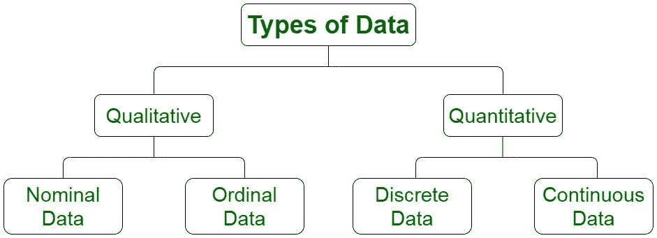

# 第 1 部分:数据科学围绕哪种类型的数据？

> 原文：<https://medium.com/geekculture/part-1-data-science-revolves-around-which-type-of-data-568a896fd3c5?source=collection_archive---------12----------------------->

# 第 1 部分:统计系列

在这个统计学系列中，我们将涵盖数据科学家、业务分析师和数据分析师所需的所有统计学基础。统计学在数据科学领域发挥着重要作用。如果您希望将职业生涯转向数据科学，并且不知道从哪里开始，您可以从这里开始。我会试着每天发表一篇文章，涵盖所有重要的统计学主题。

Photo by [Ruthson Zimmerman](https://unsplash.com/@ruthson_zimmerman?utm_source=unsplash&utm_medium=referral&utm_content=creditCopyText) on [Unsplash](https://unsplash.com/s/photos/statistic?utm_source=unsplash&utm_medium=referral&utm_content=creditCopyText)

所有的统计数字都在玩弄数据。因此，我们需要理解什么是数据。数据的类型是什么，它们之间有什么不同？

**什么是数据？**

作为信息源收集的测量值或观察值称为数据。数据可以用各种各样的方式来表示。

数据示例包括澳大利亚的人口、个人的原籍国、紧急服务每天接到的电话数量、某种产品的销售价格或澳大利亚赢得的板球比赛数量。

## 数据类型:

数据可以分为两类:

## A.分类或定性数据:

涉及有限数量类别的分类或定性数据，或以文字和描述性方式描述的数据，例如，人的性别、区域的密码、餐馆的等级等。定性或分类数据也可以采用数值，但它们不是实际的数字。有时用数值来表示定性数据。例如，我们都用一个星级系统(1 星，2 星，等等)来评价事物。)，但实际上，星星的数量代表的是产品的质量。

此外，分类数据分为两组:

1.  **名义定性数据:**不具有任何自然顺序的定性数据称为名义数据。例如，一个人的**性别可以是男性也可以是女性，但这里既没有男性优于女性，也没有女性优于男性。可变性别的所有类别都处于同一水平。因此**性别**是一个包含名义分类数据的分类变量。其他名义定性数据的例子:州、颜色、名称、国籍等。**
2.  **有序定性数据:**确实具有自然顺序的定性数据称为有序数据。例如，食物的**味道可以分为恶心、倒胃口、中性、美味和可口几类。在这里，这些类别拥有秩序，我们知道好吃比恶心和倒胃口。因此**食物的味道**是一个包含顺序定性数据的分类变量。其他有序定性数据的例子:星级评定、考试排名、经济状况等。**

在训练机器学习模型时，使用 one hot vector 编码和单词嵌入将分类数据转换为数字格式。

## B.数字或定量数据:

数字或定量数据涉及数字，本质上是数值。例如，考试分数、人的年龄、雇员的工资和人的身高都是数字或定量数据。

数字或定量数据可以分为两类:

1.  **离散型数据:**可计数或取一定值的数值型数据称为离散型定量数据。例如，在测试中正确回答问题的出生日期相同的人数、雇员的工资、银河系中的恒星数量等都是包含离散数据的离散变量。
2.  **连续数据:**不能计数和测量的数值型数据称为连续定量数据。例如，一个人的体重、身高等都是包含连续数据的连续变量。

因为每毫秒或更少代表一个不同的年龄，所以年龄是一个连续的变量。但是我们传统上用年来表示年龄，因此年龄是一个离散变量。变量的类型由允许变量取值的范围决定。如果一个变量取某些可以计数的数值(无论是有限的还是无限的)，就称为离散变量。另一方面，如果一个变量不可计数则称为连续变量。

你花时间阅读我的帖子并回复我，这对我意义重大。竖起大拇指，如果你喜欢，点击“关注”。在媒体上关注我，以便在我发布新内容时接收通知。如果你对这篇文章有任何疑问，请写下来。