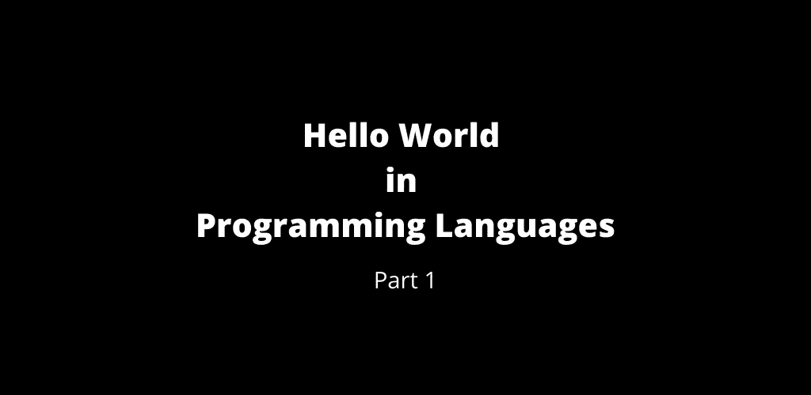

# 第 1 部分:编程语言中的 Hello World。

> 原文：<https://medium.com/geekculture/part-1-hello-world-of-programming-languages-4cf2251cc496?source=collection_archive---------16----------------------->

Hello World — Part 1

这是编程语言 Hello world 的第 1 部分，我在这里编译了如何用各种编程语言编写`Hello World`程序。

# 1C-企业

# 4D

# 4 测试

# 第 8

# ABAP4

# 美国广播公司

# 美国癌症学会(American Cancer Society)

# 开拍！

# 动作脚本(Flash 5)

# 动作脚本(Flash 8)

# 动作脚本(Flash MX)

# 动作脚本 3.0

# 语言

# ADVPL

# Agda

# 阿尔戈尔-60

# 阿尔戈尔-68

# Alpha-Five-Xbasic

# 亚马逊州语言

# 阿姆哈拉语

# 阿米加-E

# 阿摩司

# Andl

# AngelScript

# ‌⁣‌⁣‍⁣⁣⁡⁢·⁠‌‍⁣⁣‍⁡⁡⁡⁡⁡⁡⁡⁡‌⁠⁡⁡⁡⁡‌⁠⁡⁡⁠⁡⁡⁡⁠⁡⁡⁡⁠⁡·⁢‍⁠⁡⁠⁡⁠⁢⁠⁠⁡‌‍⁢‍⁠⁠⁣⁠⁢⁢⁢⁣⁡⁡⁡⁡⁡⁡⁡⁣⁣⁡⁡⁡⁣⁠⁠⁣⁢⁣⁣⁡⁡⁢⁢⁢⁢⁢⁣⁢⁢⁢⁢⁢⁢⁢⁢⁣⁠⁠⁡⁣⁠⁡⁡⁣ansible

# 赌注

# 美国动力会议

# AppleScript

# 阿尔杜伊诺

# 竞技场

# 阿伦德尔

# 啊！

# 阿诺尔德 c

# AsciiDots

# ASP (C#)

# ASP (JavaScript)

# ASP (VBE)

# VBS 语

# ASP。网

# 汇编程序(6502，Apple II)

# 汇编程序(6502，C64)

# 汇编程序(68000，Amiga)

# 装配工(雅达利街 68000 号)

# 汇编程序(68008)

# 汇编程序(8051)

# 汇编程序(ARM、Android)

# 汇编程序(ARM，RISC 操作系统)

# 汇编程序(DG-Nova)

# 汇编程序

# 汇编程序(HP-85)

# 汇编程序(IBM 370)

# 汇编程序(英特尔)

# 汇编程序(安腾)

# 汇编程序

# 汇编程序(MMIX)

# 汇编程序(PA-RISC)

# 汇编程序(PDP-11)

# 汇编程序(PDP-8)

# 汇编程序(PPC，达尔文)

# 汇编程序(SPARC)

# 汇编程序(TAS)

# 汇编程序

# 汇编程序(Win32)

# 汇编程序(X1)

# 汇编程序(X8)

# 汇编程序(z390)

# 汇编程序(Z80 控制台)

# 汇编程序(Z80，CP/M)

# 汇编程序(ZX81)

# 星号

# 声音传输系统(Acoustic Transmission System)

# 自动热键

# AutoIT3

# AviSynth

# AWK

评论你熟悉的`Hello World`程序。

 [## 第 2 部分:编程语言中的 Hello World。

### 查看下面的第 1 部分

manojahi.medium.com](https://manojahi.medium.com/part-2-hello-world-in-programming-languages-a790290004ad) 

干杯！！