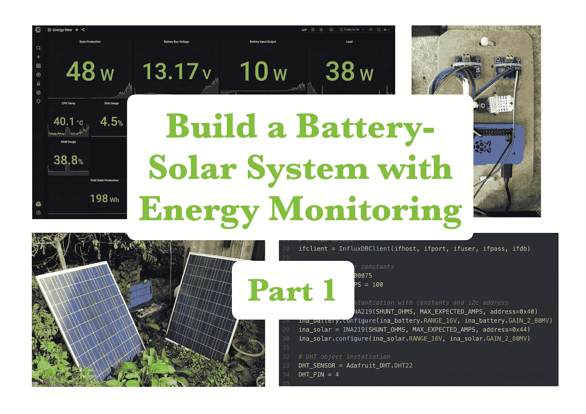

# 第 1 部分简介——用树莓皮构建并监控一个经济实惠的电池太阳能系统

> 原文：<https://medium.com/geekculture/part-1-intro-build-and-monitor-an-affordable-battery-solar-system-with-a-raspberry-pi-f82d94460fdd?source=collection_archive---------4----------------------->

## 由四部分组成的系列。

## 以低于 150 英镑的价格建造一个有能量流监测功能的电池太阳能系统…哦，玩得开心！

Clockwise from top-left corner: Grafana dashboard visualising the energy monitoring output; Raspberry Pi and sensors; Snapshot of Python code; Full battery-solar system with two solar panels © Seb Hulse

# 系列