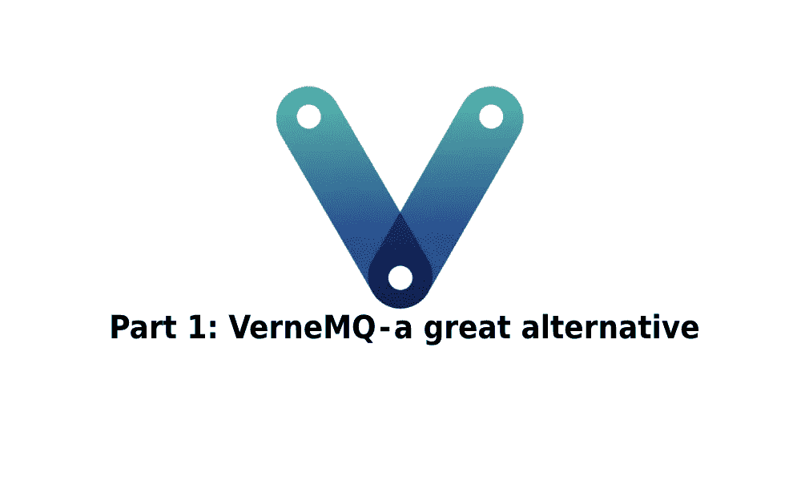
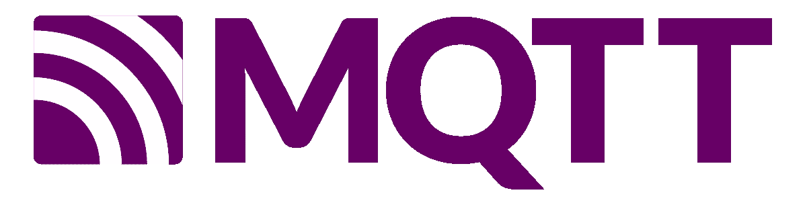
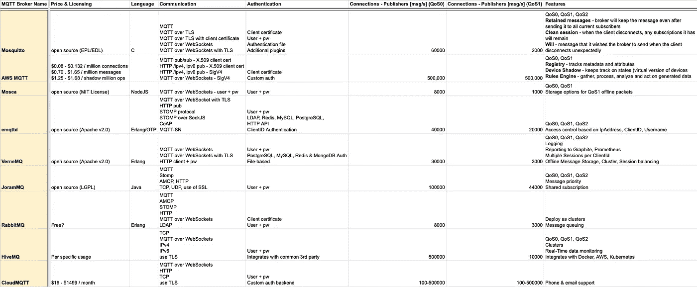
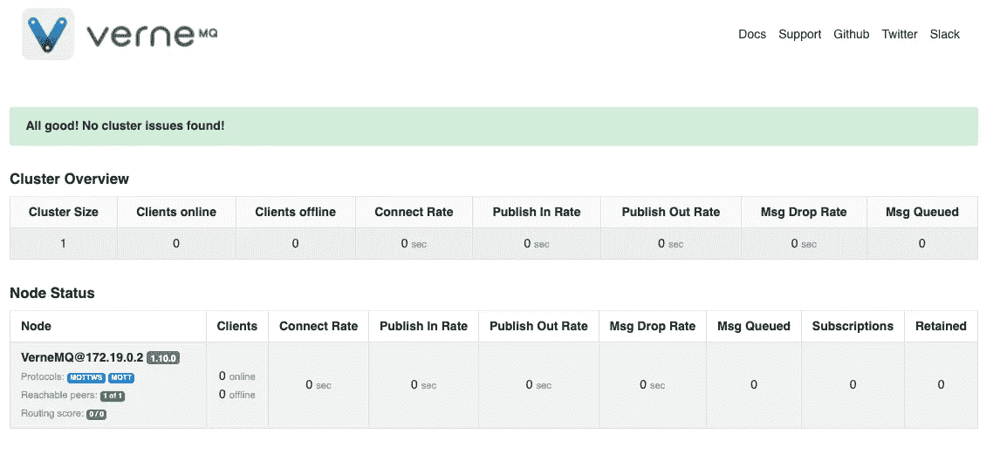

# 第 1 部分:VerneMQ——一个很好的选择

> 原文：<https://medium.com/geekculture/part-1-vernemq-a-great-alternative-9ebf75486e81?source=collection_archive---------5----------------------->



本系列文章由 3 部分组成:
[**第 1 部分:VerneMQ —一个很好的选择**](/geekculture/part-1-vernemq-a-great-alternative-9ebf75486e81?sk=5665e157d748ecc249e93a9ce9697ca2)
[**第 2 部分:VerneMQ —使用 MySQL 数据库和集群设置的 ACL**](https://josipvojak.com/part-2-vernemq-acl-using-mysql-database-and-cluster-setup-288fb3d2eff8?sk=c53c5b550a48eaef1c77dcdc20a4e0e3)
**第 3 部分:VerneMQ—用 Graphite、Prometheus 和 Grafana** (正在进行中的*)监控指标*

*这篇文章是基于对 VerneMQ 的介绍——它的用途，它的特别之处，你为什么会考虑它，以及与其他经纪人的比较。*

# *介绍*

*VerneMQ 是一个 MQTT 发布/订阅消息代理，它实现了标准的 MQTT 协议。它是作为分布式消息代理而构建的，可确保在节点或网络故障的情况下继续运行，并具有简单的横向可伸缩性。*

*它使用无主机集群技术。*

*从一开始，就有 3 件重要的事情需要提及。它具有:*

*   ***无限制的商业重用** —在开放源代码 Apache2 许可下工作。这意味着它对商业修改是完全开放和自由的*
*   ***没有前期投资**——因为它是开源的，你可以想用多久就用多久*
*   ***退出风险**——如果需要从 VerneMQ 切换，您应该能够在任何其他实现 MQTT 规范的代理上运行您的项目*

***使用已经被证实的电信技术***

*VerneMQ 使用了爱立信开发的一项已经得到验证的技术。它利用 OTP，这是一个开放的电信平台，事实上用于在 Ericssons 交换机上运行大约 40%的全球移动数据流量。*

***容易缩放***

*它内置于 Erlang 中，可以连接到 VerneMQ 节点的并发客户端数量完全受底层硬件(CPU 和 RAM)的限制。您可以轻松地向 VerneMQ 集群添加节点。*

***现场重新配置&监控***

*已经有内置可扩展度量系统的集成监控解决方案。VerneMQ 还允许集群范围内的即时实时重新配置。*

# *MQTT 概述*

**

## ***服务质量***

*有三种可能的传输保证方式可供选择— **QoS 0、QoS 1** 和 **QoS 2** 。*

*   ***QoS 0 —一劳永逸** —代理不需要确认客户端收到消息。反之亦然。*
*   ***QoS 1 —至少一次** —代理将在收到后发送确认消息。如果消息没有在特定的时间范围内发送，客户端必须重试该消息。完全相同的情况应该发生在客户端——如果没有发送确认消息，代理将重新传递消息*
*   ***QoS 2 —恰好一次** —第一部分与 QoS 1 相同。第二部分确保就信息的立场达成一致。重点是避免重复路由。*

## ***遗嘱(LWT)***

*这让客户端在连接到代理时提供一个证明。其背后的想法是，如果在某个时间点，客户端意外断开连接(例如断电)，它可以让代理将消息传递给其他客户端。*

## ***清理会话***

*当连接非常昂贵或有限时，此功能特别有用。最初，当客户机连接到代理时，会创建一个新的 MQTT 会话。MQTT 会话实际上由两部分组成——第一部分存储在**客户端**，第二部分存储在**代理端**。*

***客户端会话状态:***

*   *QoS 1 和 QoS 2 消息已发送到服务器，但尚未被完全确认。*
*   *已从服务器收到但尚未完全确认的 QoS 2 消息。*

***服务器端会话状态:***

*   *会话的存在，即使会话状态的其余部分为空。*
*   *客户的订阅。*
*   *QoS 1 和 QoS 2 消息已发送到客户端，但尚未得到完全确认。*
*   *QoS 1 和 QoS 2 消息等待传输到客户端。*
*   *从客户端收到的 QoS 2 消息，但尚未完全确认。*
*   *可选地，QoS 0 消息等待传输到客户端。*

*离线时，代理保持会话，并累积与设备订阅匹配的所有消息。当客户端连接回代理时，所有消息都被传递。*

## ***保留的消息***

*可以发布带有“保留标志”的消息。仅当客户端订阅主题时，保留的消息才会被传递。每个主题只能有一条保留消息。任何新保留的消息都会覆盖以前的消息。*

## ***基于主题的路由***

*主题大多以纯文本形式呈现，如下所示:*

```
*example/first
example/second*
```

*订阅主题的客户端将收到任何**未来**消息和一条**保留**消息(如果存在)。*

*主题通配符:*

```
*example/+/first/#*
```

*   *+是一个单级通配符，忽略层次结构中的一个级别*
*   *#是忽略所有剩余级别的通配符*

## ***消息队列***

*该系统接收、存储和转发消息。它很可能基于(简单的)推送和弹出操作。推送操作在队列前面插入新元素。Pop 操作读取最旧的消息，然后将其删除。*

## ***发布/订阅***

*消息传递模式，客户端向服务器(代理)订阅某个主题。通过向某个主题发布消息，可以在设备和客户机/服务器之间交换消息。发布/订阅模式实际上存在于各种各样的协议上——AMQP、MQTT、JMS、XMP 等等。*

# *功能概述*

*VerneMQ 有很多特性。它实现了 MQTT 3.1、3.1.1 和 5.0 规范。由代理提供并由 VerneMQ 团队实现的一些最有趣的特性如下:*

*   *QoS 0、QoS 1、QoS 2 级别*
*   *基于文件的认证和授权[【文件】](https://vernemq.com/docs/configuration/file-auth.html)*
*   *PostgreSQL、MySQL、Redis & MongoDB 认证和授权[【文档】](https://vernemq.com/docs/configuration/db-auth.html)*
*   *桥式支架[【文档】](https://vernemq.com/docs/configuration/bridge.html)*
*   *用于监控和报告的$SYS 树[【文档】](https://vernemq.com/docs/monitoring/systree.html)*
*   *TLS (SSL)加密[【文档】](https://vernemq.com/docs/configuration/listeners.html)*
*   *Websockets 支持[【文档】](https://vernemq.com/docs/configuration/websockets.html)*
*   *集群支持[【文档】](https://vernemq.com/docs/clustering)*
*   *日志记录(控制台、文件、系统日志)[【文档】](https://vernemq.com/docs/configuration/logging.html)*
*   *汇报给 Graphite [【文档】](https://vernemq.com/docs/monitoring/graphite.html)*
*   *向普罗米修斯公司汇报[【文件】](https://vernemq.com/docs/monitoring/prometheus.html)*
*   *可扩展插件架构[【文档】](https://vernemq.com/docs/plugindevelopment/)*
*   *共享订阅[【文档】](https://vernemq.com/docs/configuration/shared_subscriptions.html)*
*   *每个 ClientId 多个会话[【文档】](https://vernemq.com/docs/configuration/balancing.html)*
*   *会话平衡[【文档】](https://vernemq.com/docs/configuration/balancing.html)*
*   *消息负载调整[【文档】](https://vernemq.com/docs/configuration/options.html)*
*   *消息减载(用于系统保护)[【文档】](https://vernemq.com/docs/configuration/options.html)*
*   *离线消息存储(基于 LevelDB)*
*   *队列可以处理 FIFO 或 LIFO 类型的消息。[【文档】](https://vernemq.com/docs/configuration/hiddenoptions.html)*
*   *代理 v2 协议[【文档】](https://vernemq.com/docs/configuration/listeners.html#proxy-protocol)*
*   *Lua 插件脚本支持[【文档】](https://vernemq.com/docs/plugindevelopment/luaplugins.html)*
*   *Webhooks [【文档】](https://vernemq.com/docs/plugindevelopment/webhookplugins.html)*
*   *HTTP 管理 API [【文档】](https://vernemq.com/docs/http-administration/)*

# *经纪人比较*

**

*Connection estimates are based on results carried out by product owners / 3rd party.*

*尽管有代理提供更多的连接和更好的吞吐量，VerneMQ 给出了三个你可以优先考虑的东西:*

*   *非常容易设置*
*   *大量功能以及与 Graphite、Prometheus 和 Grafana 等优秀工具的集成*
*   *易于扩展的集群*

*设置是多么容易，告诉下面的`docker-compose.yml`文件*

```
*version: "3"
services:
  vernemq:
    image: erlio/docker-vernemq
    container_name: vernemq
    restart: always
    environment:
      DOCKER_VERNEMQ_ALLOW_ANONYMOUS: 'on'
      DOCKER_VERNEMQ_ACCEPT_EULA: 'yes'
    ports:
      - 1883:1883
      - 8888:8888
    expose:
      - 1883*
```

*可以通过执行 docker-compose up -d 来运行 docker 容器。*

*我在上将`ALLOW_ANONYMOUS`标志设置为*，以便每个人都能够订阅和发布到代理，而不需要进行身份验证。**

*您现在应该可以连接到端口 1883 了。尝试连接 MQTT 客户机，比如 mosquitto。*

```
***#mosquitto_sub -h localhost -p 1883 -t "test/topic" -d**
Client (null) sending CONNECT
Client (null) received CONNACK (0)
Client (null) sending SUBSCRIBE (Mid: 1, Topic: test/topic, QoS: 0, Options: 0x00)
Client (null) received SUBACK
Subscribed (mid: 1): 0*
```

*在端口 8888 上也有一个状态页面([http://localhost:8888/status](http://localhost:8888/status))。在这里，您应该能够看到集群大小和集群中的单个节点。*

**

*VerneMQ status page on [http://localhost:8888/status](http://localhost:8888/status)*

# *结论*

*一方面，可能有更好的商业代理，但要么更贵(云)，设置更复杂，要么没有免费许可证。*

*另一方面，如果你想快速测试，这是一个很好的代理。它真的能让你跟上速度。它有很多插件(用于访问控制列表和认证，以及开发你自己的插件的选项)，开箱即用的集成了一些伟大的工具，如 Graphite，Prometheus 和 Grafana。它提供了一个选项，可以使用带有 Kubernetes 的集群来处理副本，从而轻松地对其进行扩展。总的来说，如果你正在寻找 AWS，RabbitMQ，HiveMQ 和 Mosquitto 的替代产品，VerneMQ 应该是你的选择。*

*我计划继续这个系列，创建一个快速教程，介绍如何使用 MySQL 用户名和密码设置带有访问控制列表(ACL)的 VerneMQ。本文的第二部分将重点介绍如何使用 docker swarm 来设置集群。*

*接下来:*

*[**第二部分:VerneMQ —使用 MySQL 数据库的 ACL 和集群设置**](https://josipvojak.com/part-2-vernemq-acl-using-mysql-database-and-cluster-setup-288fb3d2eff8?sk=c53c5b550a48eaef1c77dcdc20a4e0e3)*