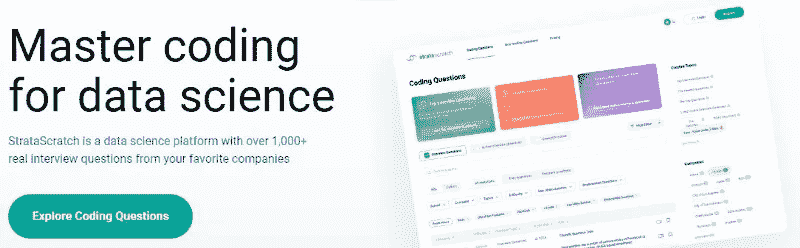
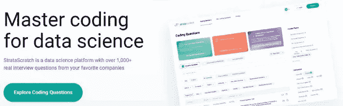
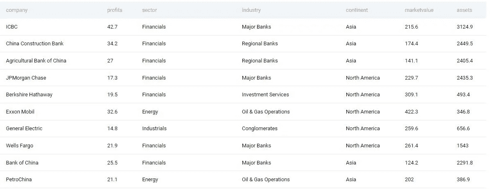
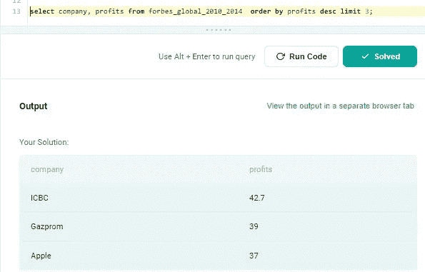

# 第 10 部分:最赚钱的公司

> 原文：<https://medium.com/geekculture/part-10-most-profitable-companies-sql-question-asked-by-forbes-d2fab74e66be?source=collection_archive---------7----------------------->

# 让我们解决基于产品的公司提出的 SQL 问题

这是基于产品的公司在面试中提出的一系列 SQL 问题的第十篇文章。对于本文，我使用 StrataScratch 平台来获取基于产品的公司中被问到的问题。

StataScratch 是一个优秀的平台，适合任何希望开始学习数据科学并提高其 SQL 和 Python 技能的人。这个平台不仅提供编码题，还提供与数据科学相关的非编码题，比如统计、概率等等。我强烈建议你在 StrataScratch 网站上注册一个账户，在文章旁边练习这个问题。我将使用 Postgres SQL 数据库来解决这个问题。



以下是基于产品的公司提出的一系列 Postgres SQL 问题的链接:

[https://agupta 97 . medium . com/list/postgres-interview-problems-asked-in-product-based-com apnies-c 4020531504 b](https://agupta97.medium.com/list/postgres-interview-problems-asked-in-productbased-comapnies-c4020531504b)

如果你从事数据科学工作或者想在数据科学领域开始职业生涯，SQL 是最重要的技能之一。
如果你熟悉 SQL，你将有更好的机会通过数据科学面试或处理日常任务。本文将集中讨论一个问题以及如何解决它。如果你想提高你的 SQL 知识和经验，你必须阅读这篇文章。你提出想法和寻找解决方案的方法无疑会有所改进。



这是**福布斯**在一次采访中提出的中级问题。可以在这里查看问题[。问题名称是**最赚钱的公司。**以下是问题的详细内容:](https://platform.stratascratch.com/coding/10354-most-profitable-companies?code_type=1)

# **最赚钱的公司**

找出全世界最赚钱的 3 家公司。输出结果以及相应的公司名称。按照利润降序排列结果。

> *公司:* ***福布斯*** *，难度:* ***中等*** *，面试问题 id:****10354****，* *表格:* **福布斯 _ 环球 _2010_2014**
> 
> *Table_fields:* **公司**(varchar)**部门**(varchar)**行业**(varchar)**洲**(varchar)**国家**(varchar)**市值**(浮动)**销售额**(浮动)**利润**(浮动)**资产**(浮动)**排名**(浮动)

**福布斯 _ 全球 _2010_2014 表格预览:**



**Some Records from Table forbes_global_2010_2014**

首先，让我们试着理解这个问题。如问题中所述，我们要找出世界上最赚钱的 3 家公司，为此我们需要选择公司和利润字段，并按利润降序排列，然后输出前 3 个记录。

[https://agupta 97 . medium . com/list/lets-explore-postgres-in-deep-e9d 4985 a 1413](https://agupta97.medium.com/list/lets-explore-postgres-in-deep-e9d4985a1413)

**方法:通过**使用选择和排序

首先，**我**首先确定需要回答这个问题的字段。我们需要公司和利润领域。我们只需要输出 3 个最赚钱的公司，因此我们将使用 3 的限制。我们将对“利润”字段中的数据进行降序排列，以便最赚钱的公司出现在起始行中。

```
**select company, profits from forbes_global_2010_2014  order by profits desc limit 3;**
```



Output

感谢你看我的帖子，回复我；这对我意义重大。如果你喜欢它，竖起大拇指，点击“关注”在媒体上关注我，以便在我发布新内容时得到通知。