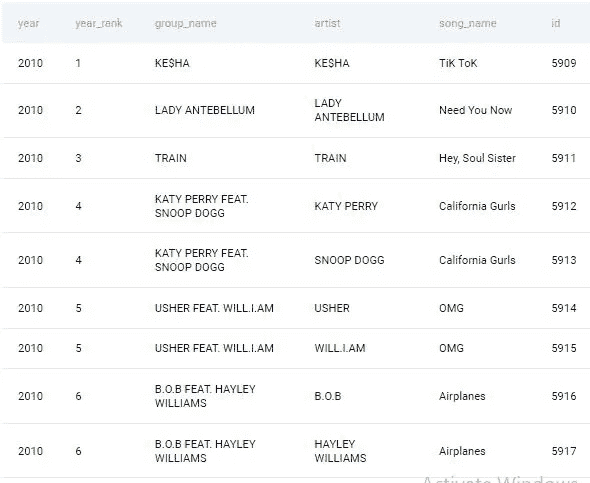
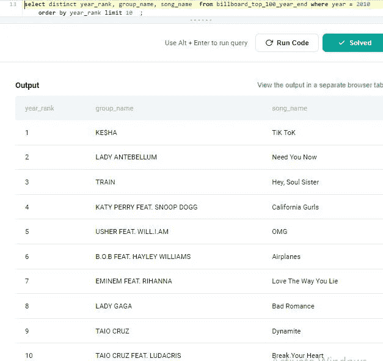

# 第 12 部分:找出 Spotify 提问的排名前 10 的歌曲

> 原文：<https://medium.com/geekculture/part-12-find-the-top-10-ranked-songs-sql-question-asked-by-spotify-96446deec0f4?source=collection_archive---------8----------------------->

# 让我们解决基于产品的公司提出的 SQL 问题

这是基于产品的公司在面试中提出的一系列 SQL 问题的第 12 篇文章。对于本文，我使用 StrataScratch 平台来获取基于产品的公司中被问到的问题。

对于希望过渡到数据科学领域并提高其 SQL 和 Python 技能的人来说，StataScratch 是一个非常棒的平台。该平台不仅提供编码问题，还提供与数据科学领域相关的非编码问题，如统计、概率等。我强烈建议你在 StrataScratch 网站上创建一个帐户，并在文章中练习这个问题。为了解决这个问题，我将使用 Postgres SQL 数据库。

以下是基于产品的公司提出的一系列 Postgres SQL 问题的链接:


[古普塔](https://agupta97.medium.com/?source=post_page-----96446deec0f4--------------------------------)

## 面试问题

[View list](https://agupta97.medium.com/list/stratascratch-postgres-interview-problems-c4020531504b?source=post_page-----96446deec0f4--------------------------------)18 stories

如果你从事数据科学工作或者想在数据科学领域开始职业生涯，SQL 是最重要的技能之一。
如果你熟悉 SQL，你将有更好的机会通过数据科学面试或处理日常任务。本文将集中讨论一个问题以及如何解决它。如果你想提高你的 SQL 知识和经验，你必须阅读这篇文章。你提出想法和寻找解决方案的方法无疑会有所改进。


Unsplash.com

这是 **Spotify** 在一次采访中提出的中级问题。可以在这里 查看问题 [**。问题名称是**查找 2010 年排名前 10 的歌曲。**以下是问题的详细内容:**](https://platform.stratascratch.com/coding/10285-acceptance-rate-by-date?code_type=1)

# 查找 2010 年排名前 10 的歌曲

2010 年排名前 10 的歌曲是什么？输出等级、组名和歌曲名，但不显示同一首歌曲两次。根据 year_rank 以升序对结果进行排序。

> *公司:****Spotify****，难度:* ***中等*** *，面试问题 id:****9650****，* *表格:***billboard _ top _ 100 _ year _ end，**
> 
> *Table _ fields:***year**(int)**year _ rank**(int)**group _ name**(varchar)**artist**(varchar)**song _ name**(varchar)**id**(int)

**表格广告牌预览 _top_100_year_end:**



**Preview of table billboard_top_100_year_end**

本文假设您熟悉 select、from、where、order by 和 limit 子句。如果你想温习一下你的概念，你可以先阅读下面列出的文章，然后回到这里对这个问题有更深入的理解。

[https://agupta 97 . medium . com/list/lets-explore-postgres-in-deep-e9d 4985 a 1413](https://agupta97.medium.com/list/lets-explore-postgres-in-deep-e9d4985a1413)

首先，让我们试着理解这个问题。如问题中所述，我们被要求找出 2010 年排名前 10 的歌曲。

**先来了解数据:**

由于歌曲可以由多个艺术家创作，因此相同的年份等级被分配给具有相同歌曲名称的少数记录，因此对于相同的歌曲名称和年份等级，行是重复的，但是具有不同的艺术家名称和 id 字段。您可以通过查看上表来验证这一点，相同的 year_rank 4 被分配给具有歌曲名称**加州女孩**但具有不同艺术家名称的两个记录。

我们必须按照 year_rank 降序输出 2010 年排名前 10 的不同歌曲。

**方法:**

1.  首先，我们必须选择 2010 年的所有歌曲。
2.  那么就要选择年份，年阶，歌名。因为歌曲不应该重复，所以我们必须在 select 关键字之后使用 distinct 关键字，以便只输出 distinct 歌曲。
3.  然后，使用 order by 子句，我们必须按照年份等级的升序对记录进行排序。
4.  最后，我们将使用 limit 10 子句将输出限制为 10 条记录。

```
**select distinct year_rank, 
                group_name,
                song_name  
                from billboard_top_100_year_end
                where year = 2010 
                order by year_rank 
                limit 10  ;**
```



**Final Output**

实际上，需要将问题分解成更小的问题。在阅读问题两遍后，决定使用哪些列来计算期望的结果。之后，确定计算每个子问题所需的函数，然后尝试连接子问题的解决方案。使用这种方法，你可以快速解决任何问题。接触将提高你开发解决问题的新方法和途径的能力。
感谢你阅读我的帖子并回复我；这对我意义重大。如果你喜欢它，竖起大拇指，点击“关注”在媒体上关注我，以便在我发布新内容时得到通知。