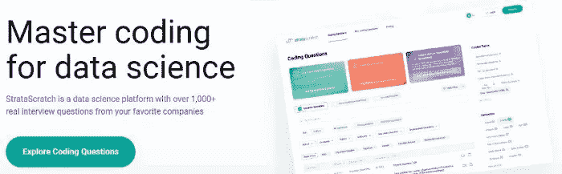
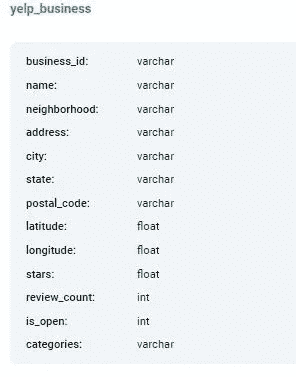
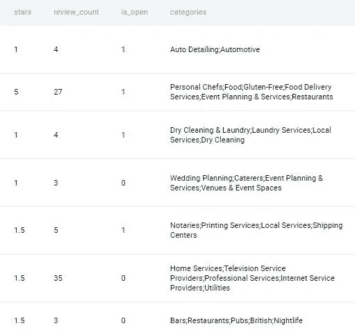
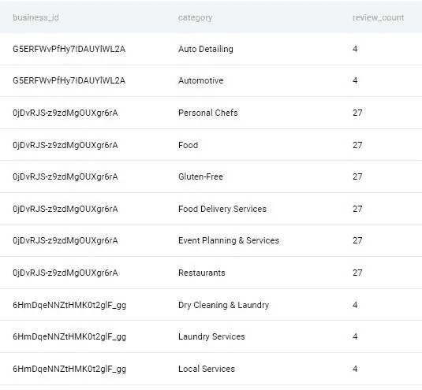
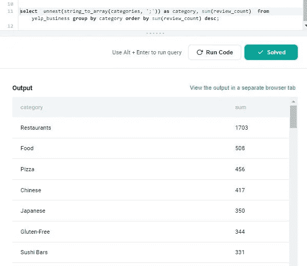

# 第 14 部分:Yelp 提出的 SQL 问题分类综述

> 原文：<https://medium.com/geekculture/part-14-reviews-of-categories-sql-question-asked-by-yelp-48ecd2ba4990?source=collection_archive---------6----------------------->

# 让我们解决基于产品的公司提出的 SQL 问题

这是基于产品的公司在面试中提出的一系列 SQL 问题中的第 14 篇文章。对于本文，我使用 StrataScratch 平台来获取基于产品的公司中被问到的问题。

StataScratch 是一个优秀的平台，适合任何希望开始学习数据科学并提高其 SQL 和 Python 技能的人。这个平台不仅提供编码题，还提供与数据科学相关的非编码题，比如统计、概率等等。我强烈建议你在 StrataScratch 网站上注册一个账户，在文章旁边练习这个问题。我将使用 Postgres SQL 数据库来解决这个问题。


Photo by [JJ Ying](https://unsplash.com/@jjying?utm_source=unsplash&utm_medium=referral&utm_content=creditCopyText) on [Unsplash](https://unsplash.com/s/photos/technology?utm_source=unsplash&utm_medium=referral&utm_content=creditCopyText)

以下是基于产品的公司提出的一系列 Postgres SQL 问题的链接:

[https://agupta 97 . medium . com/list/postgres-interview-problems-asked-in-product-based-com apnies-c 4020531504 b](https://agupta97.medium.com/list/postgres-interview-problems-asked-in-productbased-comapnies-c4020531504b)

如果你从事数据科学工作或者想在数据科学领域开始职业生涯，SQL 是最重要的技能之一。
如果你熟悉 SQL，你将有更好的机会通过数据科学面试或处理日常任务。本文将集中讨论一个问题以及如何解决它。如果你想提高你的 SQL 知识和经验，你必须阅读这篇文章。你提出想法和寻找解决方案的方法无疑会有所改进。



这是 **Yelp** 在一次采访中提出的中级问题。可以在这里 **查看问题 [**。**问题名称为**评论类别。**以下是问题的详细内容:](https://platform.stratascratch.com/coding/10049-reviews-of-categories?code_type=1)**

# 类别审查

根据评论总数查找排名靠前的业务类别。输出类别以及评论总数。按总评论降序排序。

> *公司:****Yelp****，难度:* ***中等*** *，面试问题 id:****10049****，* *表格:* ***yelp_business，***
> 
> *表格 _ 字段:*



**yelp _ business 表的几个字段预览:**



yelp_business table

首先，让我们试图理解这个问题。如问题中所述，我们必须确定每个业务类别的审查总数。在 categories 字段中，您会得到多个值，用分号分隔，这意味着一个企业可以属于多个类别，因此将被视为不同类别的评论数总和。

**进场:**

1.  首先，**我**首先确定需要回答这个问题的字段。我们只需要两个字段 review_counts 和 categories 来输出结果。
2.  由于一个企业属于多个类别，我们需要为单个企业类别形成多个行。我们可以使用 string_to_array()函数来实现这一点，该函数会将类别转换为一个由分号分隔的数组，然后我们将在 string_to_array()之上使用 unnest()来为数组中的每个值形成一行。

```
**select business_id, 
       unnest(string_to_array(categories, ';')) as category,
       review_count  
       from yelp_business;**
```



3.现在，我们可以对上述步骤类别中形成的新列应用 group by 子句，对 review_count 求和，并按照 review_count 和的降序对记录进行排序。下面是最后一个查询:

```
**select  unnest(string_to_array(categories, ';')) as category,    sum(review_count)  
from yelp_business 
group by category 
order by sum(review_count) desc;**
```



感谢你看我的帖子，回复我；这对我意义重大。如果你喜欢它，竖起大拇指，点击“关注”在媒体上关注我，以便在我发布新内容时得到通知。