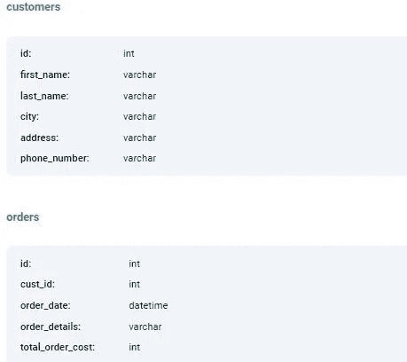
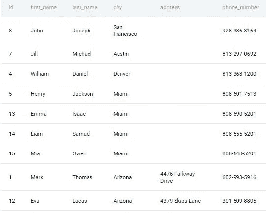
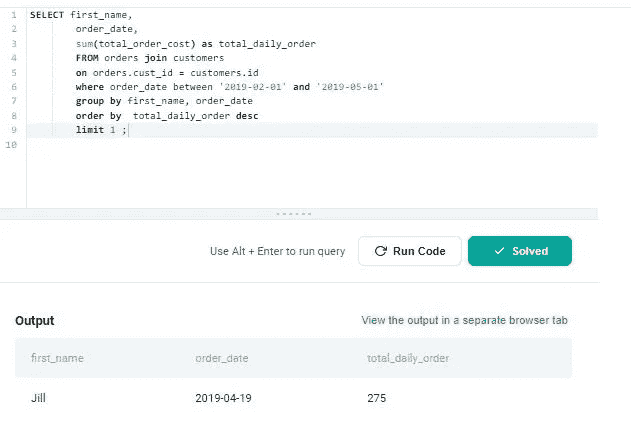

# 第 15 部分:亚马逊提出的最高成本订单 SQL 问题

> 原文：<https://medium.com/geekculture/part-15-highest-cost-orders-sql-question-asked-by-amazon-fd16b68bc9bc?source=collection_archive---------9----------------------->

# 让我们解决基于产品的公司提出的 SQL 问题

这是基于产品的公司在面试中提出的一系列 SQL 问题中的第 15 篇文章。对于本文，我使用 StrataScratch 平台来获取基于产品的公司中被问到的问题。

StataScratch 是一个优秀的平台，适合任何希望开始学习数据科学并提高其 SQL 和 Python 技能的人。这个平台不仅提供编码题，还提供与数据科学相关的非编码题，比如统计、概率等等。我强烈建议你在 StrataScratch 网站上注册一个账户，在文章旁边练习这个问题。我将使用 Postgres SQL 数据库来解决这个问题。


Photo by [Kevin Ku](https://unsplash.com/@ikukevk?utm_source=unsplash&utm_medium=referral&utm_content=creditCopyText) on [Unsplash](https://unsplash.com/s/photos/database?utm_source=unsplash&utm_medium=referral&utm_content=creditCopyText)

以下是基于产品的公司提出的一系列 Postgres SQL 问题的链接:

[https://agupta 97 . medium . com/list/postgres-interview-problems-asked-in-product based-comapnies-c 4020531504 b](https://agupta97.medium.com/list/postgres-interview-problems-asked-in-productbased-comapnies-c4020531504b)如果你从事数据科学工作或想在数据科学领域开始职业生涯，SQL 是最重要的技能之一。
如果你熟悉 SQL，你将有更好的机会通过数据科学面试或处理日常任务。本文将集中讨论一个问题以及如何解决它。如果你想提高你的 SQL 知识和经验，你必须阅读这篇文章。你提出想法和寻找解决方案的方法无疑会有所改进。

这是**亚马逊**在一次采访中提出的中级问题。可以在这里查看问题 [**。**](https://platform.stratascratch.com/coding/9915-highest-cost-orders?code_type=1) 问题名称是**最高成本订单。**以下是问题的详细内容:

# **最高成本订单**

查找 2019-02-01 到 2019-05-01 之间日订单总成本最高的客户。如果客户在某一天有多个订单，则按天计算订单成本。输出顾客的名字、商品的总价格和日期。

为简单起见，您可以假设数据集中的每个名字都是唯一的。

> *公司:* ***亚马逊*** *，难度:* ***中等*** *，面试问题 id:****9915****，* *表格:* **客户，订单*，***

表架构:



**客户表预览:**



**订单表预览:**


首先，让我们试着理解这个问题。如问题中所述，我们必须确定 2019-02-01 至 2019-05-01 单日订单成本最高的客户。如果客户在一天内不止订购一次，则必须考虑这些订单的总数。

**方法:**

1.  首先，我们需要使用联接条件`orders,cust_id = customers.id`合并 customers 和 orders 表，并检索 2019 年 2 月 1 日至 2019 年 5 月 1 日期间的 first_name、order_date 和 totol_order_cost 列。

```
**SELECT first_name,order_date, total_order_cost
        FROM orders join customers 
        on orders.cust_id = customers.id 
        where order_date between '2019-02-01' and '2019-05-01';**
```

2.如问题中所述，数据集中的 first_name 是唯一的，我们需要计算一天的订单总数，因此，我们可以对 first_name 使用 group by，对上述查询使用 totol_cost_order。然后，我们可以按照 total_order_cost 的降序排列行，并将输出限制为 1 条记录，以获得最高成本的订单。

```
**SELECT first_name,
        order_date, 
        sum(total_order_cost) as total_daily_order
        FROM orders join customers 
        on orders.cust_id = customers.id
        where order_date between '2019-02-01' and '2019-05-01' 
        group by first_name, order_date 
        order by  total_daily_order desc
        limit 1 ;**
```



你花时间阅读我的帖子并回复我，这对我意义重大。竖起大拇指，如果你喜欢，点击“关注”。在媒体上关注我，以便在我发布新内容时接收通知。