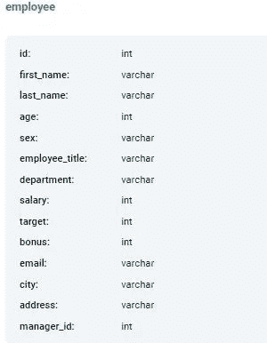
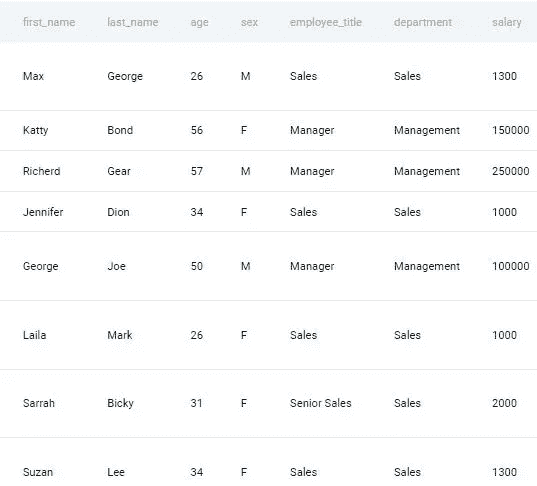
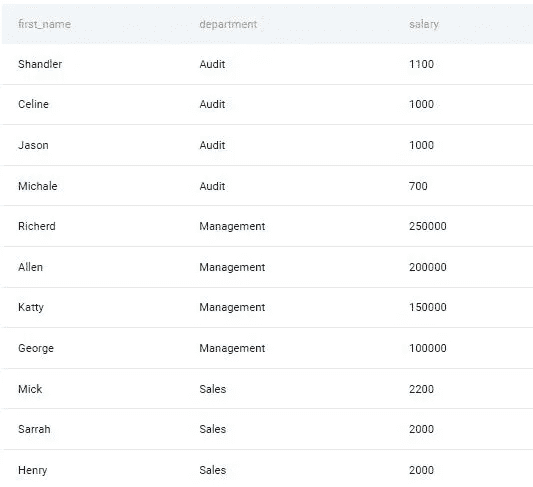
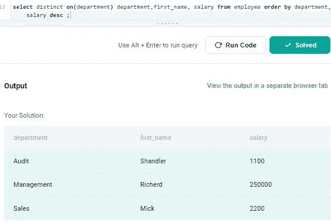
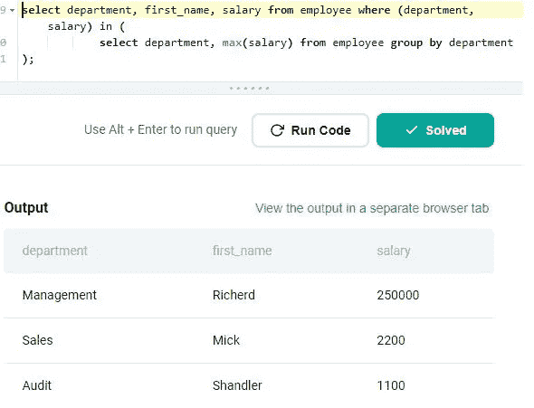

# 第 16 部分:Twitter 询问的部门最高工资

> 原文：<https://medium.com/geekculture/part-16-highest-salary-in-department-asked-by-twitter-7a8ccfb19b1f?source=collection_archive---------14----------------------->

# 让我们解决基于产品的公司提出的 SQL 问题

这是基于产品的公司在面试中提出的一系列 SQL 问题中的第 16 篇文章。对于本文，我使用 StrataScratch 平台来获取基于产品的公司中被问到的问题。

StataScratch 是一个优秀的平台，适合任何希望开始学习数据科学并提高其 SQL 和 Python 技能的人。这个平台不仅提供编码题，还提供与数据科学相关的非编码题，比如统计、概率等等。我强烈建议你在 StrataScratch 网站上注册一个账户，在文章旁边练习这个问题。我将使用 Postgres SQL 数据库来解决这个问题。


以下是基于产品的公司提出的一系列 Postgres SQL 问题的链接:


[古普塔](https://agupta97.medium.com/?source=post_page-----7a8ccfb19b1f--------------------------------)

## 面试问题

[View list](https://agupta97.medium.com/list/stratascratch-postgres-interview-problems-c4020531504b?source=post_page-----7a8ccfb19b1f--------------------------------)18 stories

如果你从事数据科学工作或者想在数据科学领域开始职业生涯，SQL 是最重要的技能之一。
如果你熟悉 SQL，你将有更好的机会通过数据科学面试或处理日常任务。本文将集中讨论一个问题以及如何解决它。如果你想提高你的 SQL 知识和经验，你必须阅读这篇文章。你提出想法和寻找解决方案的方法无疑会有所改进。

这是 **Twitter** 在其一次采访中提出的中级问题。可以在这里查看问题 [**。**](https://platform.stratascratch.com/coding/9897-highest-salary-in-department?code_type=1) 问题名称为**部门最高工资**。下面是问题的细节:

# 部门最高工资

找出每个部门工资最高的员工。输出部门名称、雇员的名字以及相应的薪水。

> *公司:* ***推特*** *，难度:* ***中等*** *，面试问题 id:****9897****，* *表格:* ***员工，***



**员工表预览:**



首先，让我们试着理解这个问题。如问题中所述，我们需要返回部门中收入最高的雇员的名字、部门和薪水字段。

**方法 1:使用 distinct on()**

1.  我们可以按部门升序和工资降序对数据进行排序。

```
**select first_name, department, salary 
       from employee 
       order by department, salary desc ;**
```



2.观察前面的输出。如果我们可以从每个部门组成的组中选择第一行，我们将获得该部门中工资最高的员工的记录。这可以使用 distinct on(col_name)来完成。 **distinct on(col_name)** 为基于 col_name 形成的每个组给出第一行。应该出现在第一行中的内容是使用 order by 子句确定的，因为我们希望为每个部门选择最高的选项，因此，我们按照薪金的降序对行进行了排序。

```
**select distinct on(department) 
        department,first_name, salary 
        from employee 
        order by department, salary desc ;**
```



**方法 2:使用子查询**

1.  我们可以首先使用 group by 找出部门最高工资。

```
**select department, max(salary) 
       from employee 
       group by department;**
```

2.然后使用该查询作为子查询来选择那些部门和薪金与子查询结果匹配的记录。

```
**select department, first_name, salary 
       from employee 
       where (department, salary) in 
           (
            select department, max(salary) 
            from employee 
            group by department
            );**
```



你花时间阅读我的帖子并回复我，这对我意义重大。竖起大拇指，如果你喜欢，点击“关注”。在媒体上关注我，以便在我发布新内容时接收通知。