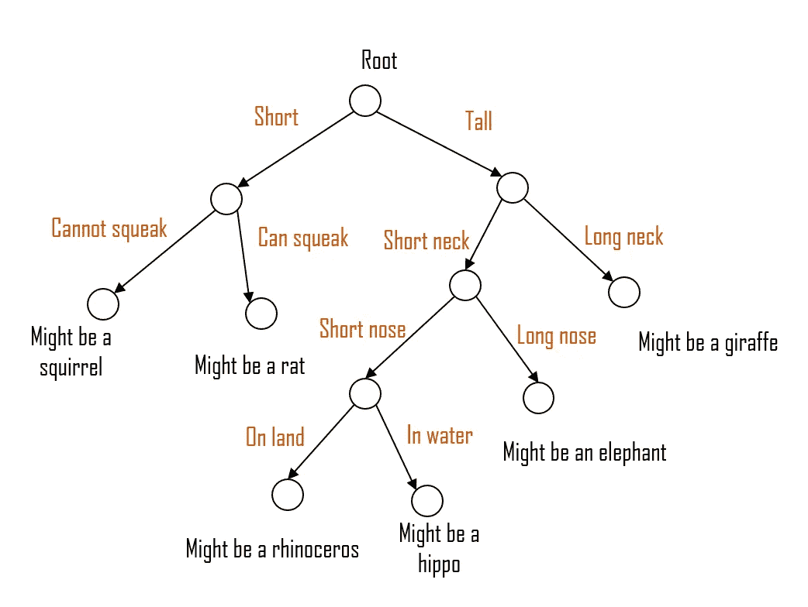

# 第 2 部分:决策树

> 原文：<https://medium.com/geekculture/part-2-decision-trees-899894121249?source=collection_archive---------14----------------------->

决策树是一种决策支持工具，它使用决策及其可能结果的树模型，包括随机事件的结果、资源成本和效用。决策分析使用决策树及其密切相关的影响图作为可视化和分析性决策支持工具，计算竞争备选方案的期望值(或预期效用)。决策树是一种特殊类型的流程图，用于通过绘制各种行动选项及其可能的结果来可视化决策。

决策树通常用于运筹学，尤其是决策分析，以帮助确定更有可能实现目标的策略，但它们也是机器学习中的一种流行工具。Microsoft 决策树算法是一种分类和回归算法，用于离散和连续属性的预测建模。直方图可用于演示 Microsoft 决策树算法如何为离散的可预测列生成树。

使用决策树的目的是创建一个学习模型，通过学习从以前的数据(训练数据)推断出的简单决策规则，该模型可用于预测目标变量的类或值。决策树是一个类似流程图的树结构，其中每个内部节点代表一个属性测试，每个分支代表测试结果，每个结束节点包含一个类标签。决策树可用于非正式讨论或构建算法，以数学方式预测最佳选择。

几乎所有的问题都可以用决策树来解决，它们可能简单也可能复杂。一个减少偏差的决策树通过允许你正确地评估一个决定相对于另一个决定的结果来帮助消除情绪。Mind Tools 网站认为决策树是一种有用的技术，因为它们有助于企业领导人对每一种可能的行动方案相关的风险和回报形成一个平衡的图景。当试图做出重要决策时，企业领导人必须仔细考虑他们的所有选择。公司的成功取决于每个团队成员每时每刻、每季度和每年做出最佳决策。

当然，我们并不试图确定所有可能的事件，或者需要对所分析的主题做出的所有决定。然而，在确定可能的结果时，你的决策树在考虑实际数据时更有帮助。特别是，对于复杂的投资决策，与问题相关的信息的另一种表示，决策树，有助于显示不同的可能结果是如何实现的。决策树不能为管理层提供投资问题的答案；相反，在给定决策相关信息和备选方案的情况下，它有助于管理层确定在特定选择点哪个备选方案将提供最高的预期货币回报。