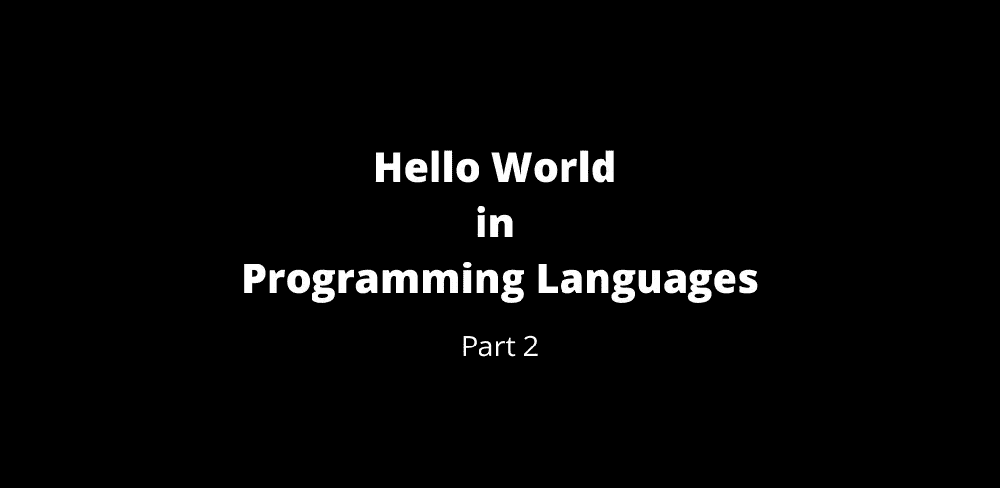

# 第 2 部分:编程语言中的 Hello World。

> 原文：<https://medium.com/geekculture/part-2-hello-world-in-programming-languages-a790290004ad?source=collection_archive---------12----------------------->

Hello World — Part 2

查看下面的第 1 部分

 [## 第 1 部分:编程语言的世界。

### 这是编程语言 Hello world 的第 1 部分，我已经编译了如何用…

manojahi.medium.com](https://manojahi.medium.com/part-1-hello-world-of-programming-languages-4cf2251cc496) 

这是编程语言 Hello World 的第 2 部分。

# B

# （同 balancing）平衡

# BASIC-PICAXE

# 基本的

# 巴托

# 巴特什

# 公元前

# BCPL

# 豆壳

# 牛肉

# Befunge

# 贝塔

# BibTex

# 二元λ演算

# 少量

# 搅拌机

# BlitzMax

# BlitzPlus

# BMC 补救措施

# 嘘

# 脑残

# 光明脚本

# BS2000

# 英国标准管螺纹(British Standard Pipe)

# 佛教手稿

# 嗡嗡声

# C*

# 碳/铝

# C#

# c(阿米加任何地方)

# c(美国国家标准协会)

# c(诅咒)

# c(宝石)

# c(直觉)

# 丙(K&R)

# C (OpenGL)

# c(演示经理)

# C (Windows)

# C (X11 雅典娜)

# C++

# C++(。NET CLI)

# C++ (Epoc)

# C++ (FLTK)

# C++ (Gtk++)

# C++(国际标准化组织)

# C++ (MFC)

# C++ (Qt)

# CA-Easytrieve Plus

# 缓存对象脚本

# CAML 之光

# 鲤鱼

# 卡西欧基础版

# CDuce

# 森图拉

# 锡兰

# 柴书

# 厨师

# 鸡肉

# CICS-COBOL

# 号角

# 干净的

# 快速帆船

# Clojure

# china light and power company ltd 中国照明与动力公司

# CMake

# 商用计算机编程语言

# 眼镜蛇

# 可可粉

# 椰子

# 代码脚本

# 咖啡脚本

# 冷聚变

# 命令脚本

# 普通 Lisp

# 控制台附言

# 语境

# 凉爽的

# CoolBasic

# 偏光镜

# 透明的

# 半铸钢ˌ钢性铸铁(Cast Semi-Steel)

# 库达

# CWEB

# CYBOL

评论你所熟悉的`Hello World`程序。

 [## 第 3 部分:编程语言中的 Hello World

### 编程语言中的 Hello World 第 3 部分

manojahi.medium.com](https://manojahi.medium.com/part-3-hello-world-in-programming-languages-f39f9b6128da) 

干杯！！