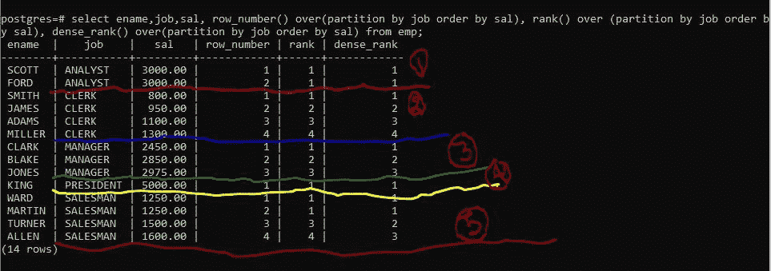
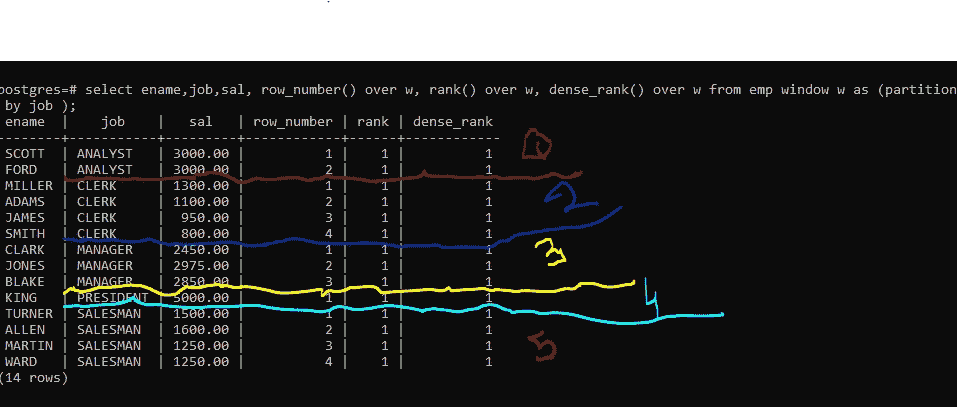
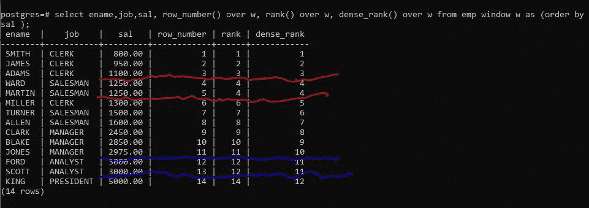
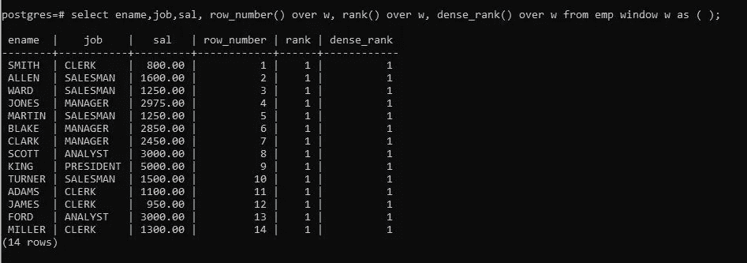

# 第 2 部分:让我们了解一下 Postgres 中 row_number()、rank()和 dense_rank()窗口函数的区别

> 原文：<https://medium.com/geekculture/part-2-lets-know-the-difference-between-row-number-rank-and-dense-rank-window-functions-6ce0067c3bff?source=collection_archive---------9----------------------->

[在上一篇文章中，我们已经了解了窗口功能](http://I appreciate you taking the time. If you enjoy the articles, clap, share, and follow.)。我们在上一篇文章中看到的窗口函数的一个用途是聚合函数和 rank()函数。在那篇文章的续篇中，我们将讨论三个窗口函数，它们的工作方式更相似，只是有一点点不同。


上面提到的这些函数通过()与窗口函数一起工作。对于所有提到的函数，partition by 子句都是可选的。如果没有定义 partition by 子句，它会将整个结果集视为一个分区。所有这三个函数的工作原理都是按照递增顺序给分区中的每一行分配一个**不同的数字。所有这些函数对于每个分区都是从 1 开始的。**

在继续下一步之前，我建议您创建下表并在其中插入一些记录，这样您也可以在本文中并行执行查询。这将提升你的主题概念，并有助于保持更长的时间。

下面是创建一些记录并将其插入表中的代码:

```
CREATE TABLE EMP(
EMPNO INT NOT NULL,
ENAME varchar(10),
JOB varchar(9),
MGR INT,
HIREDATE DATE,
SAL DECIMAL(7, 2),
COMM DECIMAL(7, 2),
DEPTNO INT);INSERT INTO EMP VALUES(7369, 'SMITH',  'CLERK',     7902,'17-DEC-1980',  800, NULL, 20);
INSERT INTO EMP VALUES(7499, 'ALLEN',  'SALESMAN',  7698,'20-FEB-1981', 1600,  300, 30);
INSERT INTO EMP VALUES(7521, 'WARD',   'SALESMAN',  7698,'22-FEB-1981', 1250,  500, 30);
INSERT INTO EMP VALUES(7566, 'JONES',  'MANAGER',   7839,'2-APR-1981',  2975, NULL, 20);
INSERT INTO EMP VALUES(7654, 'MARTIN', 'SALESMAN',  7698,'28-SEP-1981', 1250, 1400, 30);
INSERT INTO EMP VALUES(7698, 'BLAKE',  'MANAGER',   7839,'1-MAY-1981',  2850, NULL, 30);
INSERT INTO EMP VALUES(7782, 'CLARK',  'MANAGER',   7839,'9-JUN-1981',  2450, NULL, 10);
INSERT INTO EMP VALUES(7788, 'SCOTT',  'ANALYST',   7566,'09-DEC-1982', 3000, NULL, 20);INSERT INTO EMP VALUES(7839, 'KING',   'PRESIDENT', NULL,'17-NOV-1981', 5000, NULL, 10);
INSERT INTO EMP VALUES(7844, 'TURNER', 'SALESMAN',  7698,'8-SEP-1981',  1500,    0, 30);
INSERT INTO EMP VALUES(7876, 'ADAMS',  'CLERK',     7788,'12-JAN-1983', 1100, NULL, 20);
INSERT INTO EMP VALUES(7900, 'JAMES',  'CLERK',     7698,'3-DEC-1981',   950, NULL, 30);
INSERT INTO EMP VALUES(7902, 'FORD',   'ANALYST',   7566,'3-DEC-1981',  3000, NULL, 20);
INSERT INTO EMP VALUES(7934, 'MILLER', 'CLERK',     7782,'23-JAN-1982', 1300, NULL, 10);
```

让我们逐一了解这些功能:

1.  **row_number():**

```
**syntax:**
**row_number()over(partition by [field name] order by [field name]**
```

如果您想为单个分区中的每一行分配一个惟一的 ID，您应该使用 **row_number()** 。Partition by 子句是可选的。如果不指定 partition by 子句，整个结果集将作为一个分区处理。与此类似，子句顺序是可选的。在没有 order by 子句的情况下，因为没有提供 order by 条件，所以随机分配行排名。

> 注意:分区中的每一行都有一个唯一的编号，即使定义分区的字段的值与该分区中包含的行的值相似。

让我们使用查询来看看这些函数的功能:

**1)当函数与 over(partition by field _ name order by field _ name)一起使用时:**

分区是在作业列上形成的，因此创建了 5 个分区。在每个分区中，即使`order by` 字段 sal 包含 row_number()函数的相同值，也不会给任何行分配重复值。

**rank()** 如果分区中的行包含相同的 order by 字段值，则为这些行分配相同的值。正如您在分区 1 中看到的，两行都有相同的 sal 值 3000，因此它们都被指定为等级 1。类似地，在分区 5 中，sal 列中的两行具有相同的值 1250，因此分区 5 中的前两行具有相同的值。注意:因为两行被分配了相同的等级 1，所以下一个等级 2 被跳过，因为它应该被分配给具有`ename` martin 的行，但是该行被分配了等级 1，因为它与分区中的第一行具有相同的值。 **Rank()** 如果数字被分配给多行，则跳过该数字，并在序列中创建一个间隔。

**dense_rank()** 和 **rank()** 除了不跳号之外，其他都一样。当单个分区中的两行或多行具有相同的 order 字段值时，dense_rank()也会复制或分配相同的值。但是它没有跳过这个数字。正如您在分区 5 中看到的，前两行具有相同的 sal 值，因此这两行的 dense_rank 都被赋值为 1。则该分区中的下一个 dense_rank 被定义为 2，即数字 2 不会像在 rank()中那样被跳过。

```
select ename,job,sal, row_number() over(partition by job order by  Similarysal), rank() over (partition by job order by sal), dense_rank() over(partition by job order by sal) from emp;
```



**2)当函数与 over(按字段名称划分)一起使用时，给出:**

当省略 order by 字段时， **row_number()** 没有变化。但是 **rank()** 和 **dense_rank()** 被更改。由于您没有指定 order by 字段，因此一个分区中的行是按照分区 by 字段排序的，这是这里的工作。如同在每个分区中，行对于定义分区的作业字段具有相同的值，因此分区中的所有行被分配与 1 相同的**等级和 dense_rank。**

注意:如果您使用同一个窗口来计算多个函数，那么您可以为该窗口指定别名，并且可以在表名之后定义该窗口。

**语法:window window_alias as(按字段名称分区，按字段名称排序)**

```
select ename,job,sal, row_number() over w, rank() over w, dense_rank() over w from emp window w as (partition by job );
```



c

**c)当函数与 over (order by field_name)一起使用时给出:**

如果未定义 partition by 子句，它会将整个结果集视为一个分区。因此，在下面的查询结果集中， **row_number()** 为每一行分配一个不同的 **row_number** 。相似等级和 dense_rank 被分配给 sal 字段具有相同值的那些行。 **rank()和 dense_rank()** 之间的唯一区别是 **rank()** 跳过序列中的下一个数字，这会产生一个间隙，而 **dense_rank(** )不会在序列中产生任何间隙。

```
select ename,job,sal, row_number() over w, rank() over w, dense_rank() over w from emp window w as (order by sal);
```



**d)当函数与 over()一起使用时:**

当 partition by 子句和 order by 子句未定义时，它将整个结果集视为一个分区。因此，在下面的查询结果集中，使用 **row_number()** 为所有行分配不同的 row_number。相似的等级和 dense_rank 被分配给所有行，因为没有定义用于区分各行的标准。

```
select ename,job,sal, row_number() over w, rank() over w, dense_rank() over w from emp window w as (order by sal);
```



在本文中，我们已经了解了 Row Number()、Rank()和 Dense Rank()函数，包括它们的操作方式以及它们之间的区别。

以下是其他关于 Postgres 的文章列表，你可能会觉得有趣和有启发性:

[https://agupta 97 . medium . com/list/lets-explore-postgres-in-deep-e9d 4985 a 1413](https://agupta97.medium.com/list/lets-explore-postgres-in-deep-e9d4985a1413)

请回来查看更多文章。我真诚地希望你会发现这篇文章既有趣又有教育意义。感谢你抽出时间。如果您喜欢这些文章，请鼓掌、分享并关注。