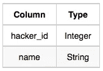
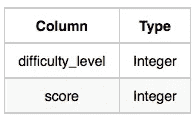
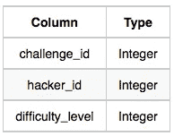
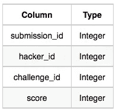
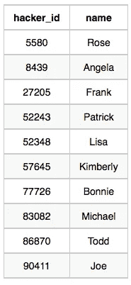
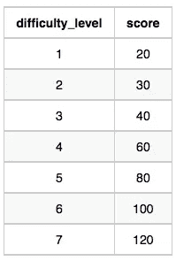
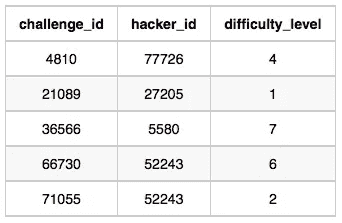
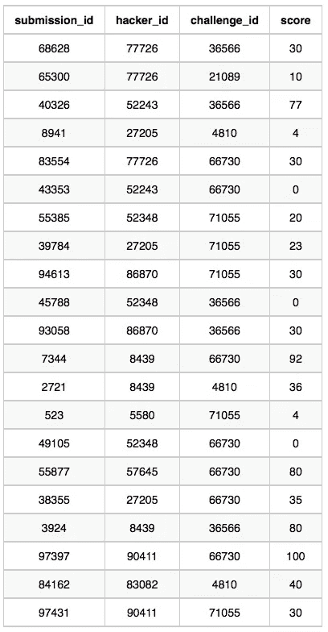

# 主要竞争对手 SQL 问题

> 原文：<https://medium.com/geekculture/part-2-top-competitor-sql-question-404e8220d48a?source=collection_archive---------16----------------------->

## 第 17 部分:SQL 问题

对于任何有兴趣过渡到数据科学领域并磨练其 SQL 和 Python 技能的人来说，HackerRank 是一个优秀的平台。这个平台提供从初级到高级的编码问题。当你成功回答一个问题时，它还会颁发徽章。我强烈建议你注册一个 HackerRank 账户，并在文章中练习这个问题。我将使用 MySql SQL 数据库来解决这个问题。

您可以通过研究基于产品的公司提出的一系列 SQL 问题来提高您的 SQL 问题解决技能。以下是基于产品的企业提出的 Postgres SQL 问题集合的链接:


r .古普塔

## 面试问题

[View list](https://agupta97.medium.com/list/stratascratch-postgres-interview-problems-c4020531504b?source=post_page-----404e8220d48a--------------------------------)18 stories

如果你从事数据科学工作或者想从事数据科学职业，SQL 是一项至关重要的技能。
如果你熟悉 SQL，你将有更好的机会通过数据科学面试或处理日常任务。本文将集中讨论一个问题以及如何解决它。您应该阅读这篇文章来提高您的 SQL 知识和经验。你集思广益和寻求解决方案的方法无疑会提高。


Photo by [Farzad](https://unsplash.com/@euwars?utm_source=unsplash&utm_medium=referral&utm_content=creditCopyText) on [Unsplash](https://unsplash.com/s/photos/technology?utm_source=unsplash&utm_medium=referral&utm_content=creditCopyText)

这是 HackerRank 上问的中级问题。可以在这里 查看问题 [**。问题名称是**顶级竞争对手。**以下是问题的详细内容:**](https://www.hackerrank.com/challenges/full-score/problem)

**问题:顶级竞争对手**

Julia 刚刚完成了一场编码竞赛，她需要您的帮助来组装排行榜！编写一个查询来打印在多个挑战中获得满分的黑客各自的 hacker_id 和姓名。按照黑客获得满分的挑战总数降序排列您的输出。如果多个黑客在相同数量的挑战中获得满分，则按 hacker_id 升序排列。

**输入格式**

下表包含竞赛数据:

*   **黑客:**hacker _ id 是黑客的 id，name 是黑客的名字。



*   **难度:**难度等级是挑战的难度等级，分数是挑战对于难度等级的分数。



*   **挑战:**挑战 _id 是挑战的 id，黑客 _id 是创建挑战的黑客的 id，难度 _ 等级是挑战的难度等级。请注意，此表中显示的 hacker_id 是创建挑战的人的 hacker_id，而不是解决挑战的人的 hacker _ id。



*   **提交:**submission _ id 是提交的 id，hacker_id 是提交的黑客的 id，challenge_id 是提交所属挑战的 id，score 是提交的分数。



**样本输入**

**黑客表:**



**难度表:**



**挑战表:**



**提交表格:**



**样本输出**

```
**90411 Joe**
```

本文假设您熟悉 select、from、where、order by 和 limit 子句。如果你想温习一下你的概念，你可以先阅读下面列出的文章，然后回到这里对这个问题有更深入的理解。

[https://agupta 97 . medium . com/list/lets-explore-postgres-in-deep-e9d 4985 a 1413](https://agupta97.medium.com/list/lets-explore-postgres-in-deep-e9d4985a1413)

**方法:**

1.  **逻辑部分:**

**连接表:**首先，我们需要连接所有给定的具有共同特征的表，即`**(Submissions.challenge_id = Challenges.challenge_id )**`、`**(Challenges.difficulty_level = Difficulty.difficulty_level )**`、
、 `**( Submissions.hacker_id = Hackers.hacker_id).**`

**找到满分的记录:**那么我们需要再加一个条件，黑客得了满分。为此，我们可以增加一个条件，使`Submissions.score` 和`Difficulty.score`相等。

**查找多项挑战满分的记录:**查找那些多项挑战满分的黑客。为此，我们可以根据 `Hackers.hacker_id`和`Hackers.name`对记录进行分组，并在 having 子句中添加条件`count(1) > 1`，因为不能在 where 子句中对聚合函数使用过滤器。

**排序记录:**应用上述条件后，您必须对记录进行排序，以便它们出现在排行榜上。如问题中所述，记录应按黑客参与的挑战数量降序排列。如果不止一名黑客参与了相同的挑战，则记录应按黑客 id 的升序排序。为了实现这种期望的顺序，我们将使用 order by 子句，如下所示:`**order by
count(s.challenge_id) desc , h.hacker_id asc ;**`

2.**编码部分:**我们将首先执行连接，然后过滤记录，最后应用 group by 和 order by 子句，以期望的顺序输出期望的记录。

```
**select  
             s.hacker_id, 
             h.name 
        from 
             Hackers as h, 
             Difficulty as d,
             Challenges as c,
             Submissions as s
        where 
             s.challenge_id = c.challenge_id and
             c.difficulty_level = d.difficulty_level and 
             s.hacker_id = h.hacker_id and 
             s.score  = d.score 
       group by 
             s.hacker_id, h.name 
       having 
             count(s.score) > 1 
       order by 
             count(s.challenge_id) desc , h.hacker_id asc ;**
```

实际上，需要将问题分解成更小的问题。在阅读问题两遍后，决定使用哪些列来计算期望的结果。之后，确定计算每个子问题所需的函数，然后尝试连接子问题的解决方案。使用这种方法，你可以快速解决任何问题。接触将提高你开发解决问题的新方法和途径的能力。
感谢你阅读我的帖子并回复我；这对我意义重大。如果你喜欢它，竖起大拇指，点击“关注”在媒体上关注我，以便在我发布新内容时得到通知。