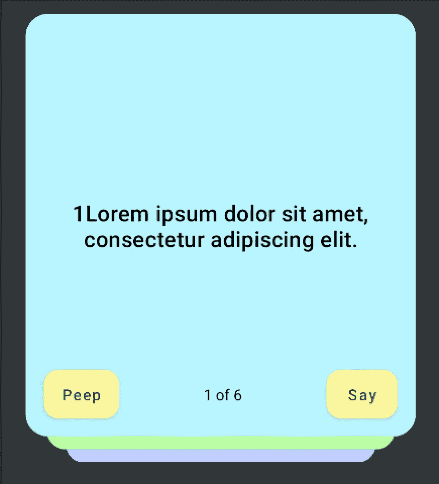
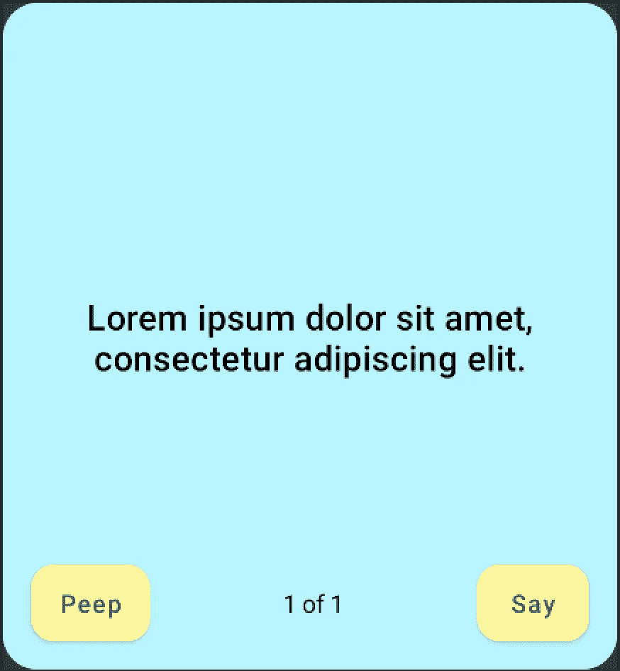
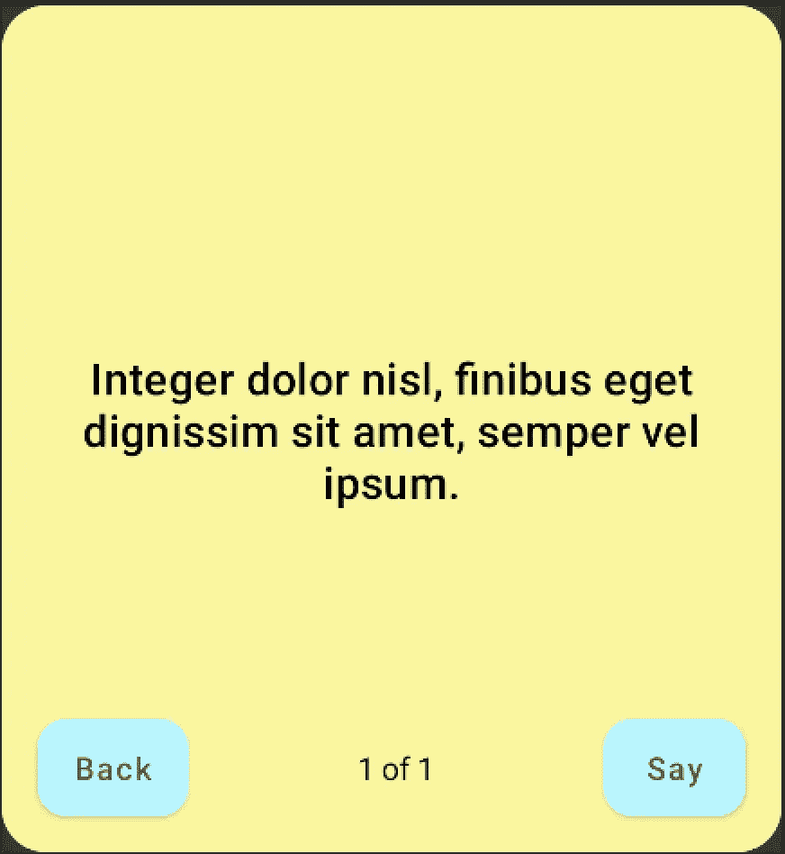
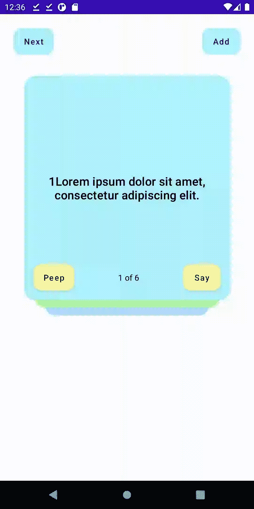

# 第 2 部分，在 Jetpack Compose 中从头开始编写 UI 小部件。

> 原文：<https://medium.com/geekculture/part-2-ui-widgets-from-scratch-in-jetpack-compose-742a3342321b?source=collection_archive---------12----------------------->

## 教程，第 2 部分，共 3 部分(纸牌)

**Figure 1**

在这三部曲的教程中，我将展示如何为我的宠物项目构建复合 UI 小部件([学习卡应用](https://studycardsapp.com) —我的 flash/mem 卡版本)。

在本教程的第一部分中，我展示了如何构建一个 iOS 风格的 ListView 小部件，其中的行(列表项)根据行数和行位置具有不同的形状，在编辑或删除模式下看起来也不同。

在第二部分中，我们将构建另一个 UI 小部件——**卡片组(图 1)。**

我喜欢这个小工具，因为它模仿了现实世界中的一个物体，并提醒了纸质便笺。谁不喜欢便利贴，尤其是那些你不需要杀死一棵树的数字便利贴呢？

我在以前的项目中使用了类似的小部件，但是直到现在我都使用第三方开源库。这一次，我们将从头开始构建卡片组，在下一篇文章中，我们将添加滑动和翻转动画以及拖动手势识别器。此外，我们将重构代码，使其遵循一些**坚实的**原则。

# 先出单卡(表面，脚手架)

首先，让我们在 deck 包中创建一个`*CardView.kt*`文件，并添加一些常量和 enum 来定义卡片的哪一面是可见的。现在，我们可以创建顶级的可堆肥函数— `StudyCardView`。它接受当前边和当前背景颜色以及一个外部修饰符。为了保持这个函数的简单，卡片的*内容*和*底部栏*我们将在单独的可组合函数中定义，然后我们将把它们作为参数传递。

为了在卡片下方添加阴影并创建圆角，我们需要使用一个可组合的*表面*作为根元素。为了将按钮安排在底部，将内容(文本)安排在卡片的中心，我们将使用一个*支架*。

**`**StudyCardView**`直截了当。我们定义了卡片的`shape`和`elevation`。然后，我们根据卡片的正面确定卡片的背景`color`——背面是黄色，正面是一些独特的颜色。*脚手架*取卡的全尺寸并接受底杆和`content`。**

# 内容和底部栏(列、行、文本、分隔符)

通过从顶层函数中提取内容和底部条，我们获得了一些好处:

1.拥有多个实现的灵活性。举个例子——在制作中，我使用一个 Android `WebView`在卡片内部呈现简单的 HTML。但是对于本教程，我们将使用纯文本。

2.我们的顶层函数仍然很短。Jetpack Compose 函数往往会增长并变得混乱，所以我们需要尽力保持它们简短，以遵循常识或一般的良好实践建议！

在`**StudyCardContent()**`函数中，我们只放置了一个*列*，它占据了所有可用的空间并嵌入了居中对齐的*文本*。

`**StudyCardsBottomBar()**`组件发出一个*行*，其中包含两个*按钮*，两个*间隔符*，以及*文本*。我们必须添加*间隔符*来将文本保持在两个按钮之间的卡片中间。卡片的背面总是黄色的，但是按钮变成卡片正面的颜色。此外，该函数接受操作处理程序。右按钮的标题总是`“Say”`，但对于左按钮，它取决于侧边——它是`“Peep”`或`“Back”`。最后，*文本*将显示当前牌的号码和这副牌的总数。

单卡到此为止！

Figure 2

要在预览中查看正面和背面，您需要做的就是添加那些带有`**@Preview**`注释的`**@Composable**`函数。如您所见，这两个函数之间的唯一区别是**侧的**参数。在第一个函数中，我们传递 FRONT_FACE，在第二个函数中传递 BACK_FACE。结果在**图 2** 中。

现在，我们准备收集一些卡片到卡片组中。

# StudyCardDeck(方框、zIndex、刻度、偏移量)

对于新的小部件，在同一个 package-deck 下创建一个新文件`DeckOfCards.kt`。在创建一个可组合的函数之前，让我们准备一个演示数据模型类和一些辅助方法。`StudyCard`对象保存一个索引、正面文本消息、背面文本消息以及两种消息的语言——非常简单。

在颜色数组中，我只保留了三种颜色的卡片。有两种方法可以计算每张卡的比例和偏移量。最上面的卡片有一个刻度 1 和一个底座`*paddingOffset*`。由于`*paddingOffset*`乘以索引加 1，下一张卡将会变小并向下粘贴。

甲板本身是一个*盒子*，占据了全部可用尺寸。并且，它包含在可组合元素`**StudyCardView**` 里面重复了`**visibleCards**`次。换句话说，我们从数据源中取出 3 张卡片，用`**zIndex**` *100* 发出索引为 0 的卡片，下一张卡片的`**zIndex**`是 *99* ，第三张卡片是 *98* 。如此高的数字保证了当我们拖动卡片时，它将位于屏幕上所有元素的上方。

`**StudyCardDeck()**` composable 接受数据源中的`**current**`索引，`**visible**`卡片的数量，以及数据模型的集合，一个`**dataSource**`。请注意，`**current**`应该被定义为一个状态，这样 Jetpack Compose 将为下一个当前卡片重新编写小部件。在里面，我们确定当前索引的可见卡片的数量。我们计算数组中的`colorIndex`、`zIndex`、`*scaleX*`和`*offsetY*`。我们创建`cardModifier`，并将所有这些参数传递给`**StudyCardView()**`、`**StudyCardContent()**`和`**StudyCardBottomBar()**`。

为了预览和测试`**StudyCardDeck()**`、T4，我们需要做一个存根数据收集和**、**、`**@Preview**`函数。让我们把当前的和可见的参数记为状态。然后，让我们将 deck 小部件放置在另一个*脚手架*的内容中，并在顶部栏中添加两个按钮， **Next** 和 **Add** 。下一个按钮将增加`**current**`状态，添加按钮将增加`**visible**`，这样我们就可以用不同数量的卡来测试小部件的行为。

现场预览，你可以在图 3 中间的**底部找到**。

暂时就这样了。

四个可组合的函数和大约 150 行代码来构建这样一个小部件一点也不差！当然，当我们添加动画和手势处理器时，它会变得更加复杂。然而，您可以清楚地看到 Jetpack Compose 的声明性方法非常简洁！通常，基于 RecycleView 的 List/Grid/Deck 小部件的唯一适配器类远远大于 150 行。

Figure 3

图 3 右侧的**是即将发布的文章的预览。我们将添加**滑动**和**翻转**动画和**拖动**手势识别器，并且我们将遵循一些**立体**原则来分离关注点。**

请继续关注，并检查本教程的第一部分[！](https://sergey-nes.medium.com/ui-widgets-from-scratch-in-jetpack-compose-b16a74ca95e5)

> **在 Jetpack 中从头开始编写 UI 小部件**
> 
> [*第 1 部分共 3 部分(一个 iOS 风格的主屏幕列表)*](/nerd-for-tech/ui-widgets-from-scratch-in-jetpack-compose-b16a74ca95e5)
> 
> [*第 2 部分共 3 部分(这副牌)*](https://sergey-nes.medium.com/part-2-ui-widgets-from-scratch-in-jetpack-compose-742a3342321b)
> 
> [第 3 部分，共 3 部分(为这副牌添加动画)](https://sergey-nes.medium.com/part-3-ui-widgets-from-scratch-in-jetpack-compose-4225000de91d)
> 
> ***演示库:***
> 
> [*https://github.com/sergenes/compose-demo*](https://github.com/sergenes/compose-demo)
> 
> ***思维在缀:***
> 
> [*https://developer.android.com/jetpack/compose/mental-model*](https://developer.android.com/jetpack/compose/mental-model)
> 
> ****StudyCards app 帮助记忆东西(我版抽认卡/记忆卡):****
> 
> ***Google Play(测试版，正在开发中):***
> 
> *[*https://play.google.com/store/apps/details?id=com.nes.studycards*](https://play.google.com/store/apps/details?id=com.nes.studycards)*
> 
> ***应用商店:***
> 
> *[*https://apps . apple . com/us/app/study-cards-help-to-memory/id 1436913731*](https://apps.apple.com/us/app/study-cards-help-to-memorize/id1436913731)*
> 
> ***网址:***
> 
> *[*https://studycardsapp.com*](https://studycardsapp.com/)*