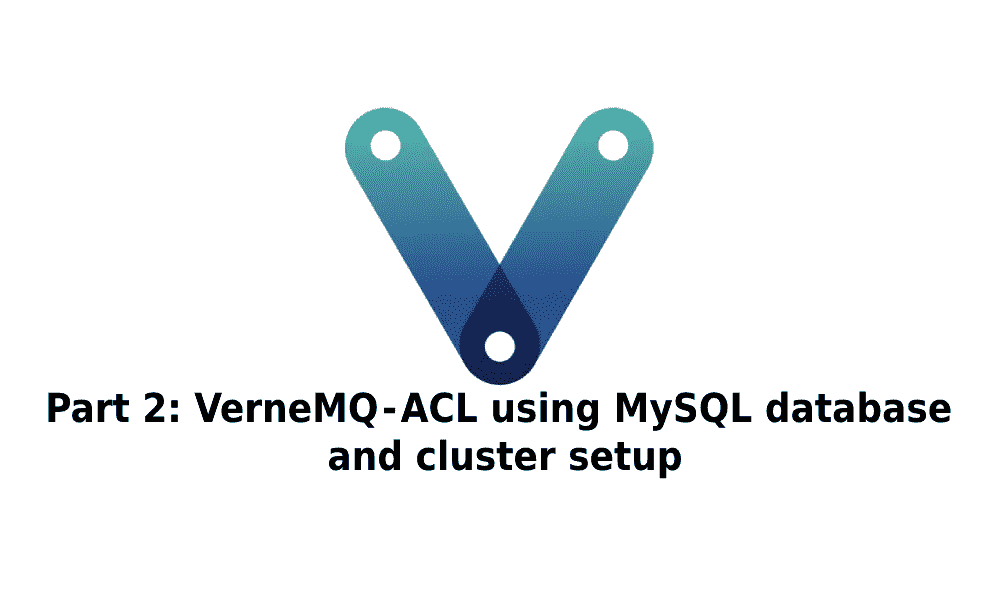

# 第 2 部分:VerneMQ —使用 MySQL 数据库和集群设置的 ACL

> 原文：<https://medium.com/geekculture/part-2-vernemq-acl-using-mysql-database-and-cluster-setup-288fb3d2eff8?source=collection_archive---------9----------------------->



Part 2 of the VerneMQ series — access control list using MySQL and cluster setup

本系列文章由 3 部分组成:

[**第一部分:Verne MQ——一个很好的选择**](/geekculture/part-1-vernemq-a-great-alternative-9ebf75486e81?sk=5665e157d748ecc249e93a9ce9697ca2)

[**第二部分:Verne MQ—使用 MySQL 数据库的 ACL 和集群设置**](https://josipvojak.com/part-2-vernemq-acl-using-mysql-database-and-cluster-setup-288fb3d2eff8?sk=c53c5b550a48eaef1c77dcdc20a4e0e3)

**第 3 部分:Verne MQ——使用 Graphite、Prometheus 和 Grafana** 监控指标(进行中*)*

# *修订本*

*在前一篇文章中:*

*   *我们学习了什么是 MQTT 协议*
*   *在哪里使用*
*   ***VerneMQ** 有多棒*
*   *我们将它与其他竞争对手进行了比较*
*   *我们做了一个简单的本地设置。*

*现在，我们进一步探索两件事:*

1.  *如何通过建立一个 MySQL 数据库来拒绝到代理的不允许的连接,该数据库将被用作 VerneMQ 代理(ACL)的访问控制列表。*
2.  *设置一个**简单集群**——额外的节点相互交织，相互通信，需要时自动同步。*

# *一般设置*

*VerneMQ 支持两种不同选项的授权和认证:*

*   *使用文件进行授权*
*   *使用数据库进行授权*

*这里，我们将只关注使用数据库的**认证。***

## *数据库支持*

*VerneMQ 支持不同的数据库:*

*   *一种数据库系统*
*   *CockroachDB*
*   *关系型数据库*
*   *MongoDB*
*   *雷迪斯*

*我将向您展示如何使用 MySQL 数据库进行身份验证和授权，以及访问控制列表(ACL)。*

# *访问控制表*

*提供每个用户拥有的权限和权利列表。*

*一般来说，ACL 定义了每个用户对特定对象的访问权限。*

*现在，让我们从 MQTT 客户机/代理逻辑的角度来理解这一点。*

*MQTT 交换消息的主要方式是通过主题。你可以在我的上一篇文章中读到更多的主题。*

*例如，一个主题可能具有如下形式:*

```
*a/b/c*
```

*或者…*

```
*a/+/c*
```

*这意味着下一级(**副标题**)“*a*”线程是一个**通配符**——它可以替代一个单词。*

*有效的模式是:*

**账户/账户**

**a/josip/c**

*当发布或订阅一个主题时，区分不同客户端的一般方法是拥有一个唯一的客户端 id。*

*我们可以限制某些客户只能**发布**或**订阅**(写或读)**某些主题**。这就是访问控制列表的价值所在。*

*基本上，你**定义一个客户列表和他们的限制**(这就是你如何控制你的客户——通过定义一个列表，这就是名字的来源)。*

*为了使用数据库进行认证和授权，**必须正确配置数据库，并提供认证数据(用户名、客户端 id、密码、ACL)**。*

## ***通用 ACL***

```
*{
  "pattern": "a/+/c"
}*
```

***模式**是一个 MQTT 主题字符串，它可以包含 MQTT 通配符，还可以包含模板变量%m(挂载点)、%u(用户名)和%c(客户端 ID)，这些变量由提供的 auth 数据替换。*

*通过使用 ACL，我们可以控制**最大 QoS** 、**有效负载大小**，如果允许保留**消息的话**，以及其他一些东西(您可以在文档中阅读更多内容: )*

```
*{
  "pattern": "a/+/c",
  "max_qos": 2,
  "max_payload_size": 128,
  "allowed_retain": true
}*
```

*此外，使用 ACL，我们只允许数据库中的客户端能够使用相应的用户名和密码访问某些资源。*

# *准备*

*在这里，我将尝试解释为了配置 VerneMQ 以利用 MySQL 数据库表作为访问控制列表需要做些什么。这将分为两部分:*

*   ***VerneMQ 配置***
*   ***MySQL 配置***

# *VerneMQ 配置:*

*   *使用 **vmq_diversity 插件**处理数据库驱动程序，因此需要启用它:(vmq_diversity 插件使得使用 Lua 扩展 VerneMQ 成为可能)*

```
*plugins.vmq_diversity = on*
```

*   *由于我们使用数据库授权和身份验证，默认启用的基于文件的身份验证和授权很可能是不需要的，应该禁用:*

```
*plugins.vmq_passwd = off
plugins.vmq_acl = off*
```

*必须设置 *allow_anonymous = off* ，否则 VerneMQ 不会使用数据库插件进行认证和授权。*

*   *要使用数据库进行身份验证和授权，必须正确配置数据库并提供身份验证数据(用户名、客户端 id、密码和 ACLS):*

```
*vmq_diversity.auth_mysql.enabled = on
vmq_diversity.mysql.host = 127.0.0.1
vmq_diversity.mysql.port = 3306
vmq_diversity.mysql.user = vernemq
vmq_diversity.mysql.password = vernemq
vmq_diversity.mysql.database = vernemq_db
vmq_diversity.mysql.password_hash_method = password*
```

# *MySQL 数据库配置*

*   *我们需要创建一个名为 *vernemq_db* 的数据库，用户为 *vernemq* ，密码为 *vernemq* (正如上面的 vernemq 配置中所述——Verne MQ 将使用该配置来尝试连接 MySQL 数据库):*

```
*CREATE USER 'vernemq'@'%' IDENTIFIED BY 'vernemq';
GRANT ALL PRIVILEGES ON *.* TO 'vernemq'@'%' WITH GRANT OPTION;*
```

*对于 MySQL 8.0 以上版本，还需要执行以下操作:*

```
*ALTER USER 'vernemq'@'%' IDENTIFIED WITH mysql_native_password BY 'vernemq';*
```

*切换到已创建的用户( *vernemq* )，并创建一个新的数据库:*

```
*CREATE DATABASE vernemq_db;
USE vernemq_db;*
```

*创建 vmq_auth_acl 表，VerneMQ 代理将使用该表作为访问控制列表。*

```
*CREATE TABLE vmq_auth_acl
(
  mountpoint VARCHAR(10) NOT NULL,
  client_id VARCHAR(128) NOT NULL,
  username VARCHAR(128) NOT NULL,
  password VARCHAR(128),
  publish_acl TEXT,
  subscribe_acl TEXT,
  CONSTRAINT vmq_auth_acl_primary_key PRIMARY KEY (mountpoint, client_id, username)
);*
```

*插入三个客户端:*

```
*INSERT INTO vmq_auth_acl
  (mountpoint, client_id, username,
  password, publish_acl, subscribe_acl)
VALUES
  ('', 'test-client', 'test-user', md5('test-password'),
  '[{"pattern":"a/b/c"},{"pattern":"c/b/#"}]',
  '[{"pattern":"a/b/c"},{"pattern":"c/b/#"}]');INSERT INTO vmq_auth_acl
  (mountpoint, client_id, username,
  password, publish_acl, subscribe_acl)
VALUES
  ('', 'test-client1', 'test-user1', md5('test-password1'),
  '[{"pattern":"a/b/c"},{"pattern":"c/b/#"}]',
  '[{"pattern":"a/b/c"},{"pattern":"c/b/#"}]');INSERT INTO vmq_auth_acl
  (mountpoint, client_id, username,
  password, publish_acl, subscribe_acl)
VALUES
  ('', 'test-client2', 'test-user2', md5('test-password2'),
  '[{"pattern":"a/b/c"},{"pattern":"c/b/#"}]',
  '[{"pattern":"a/b/c"},{"pattern":"c/b/#"}]');*
```

*为了让一切更简单，我决定把事情复杂化(:D)并使用 docker。开个玩笑，我只是继续我在上一篇文章中开始的道路，因为我喜欢保持东西有条理，这有助于我们在不需要的时候轻松地设置或销毁它。*

*所以，让我们从创建一个 *docker 网络*开始，这样我们所有的服务都在同一个网络中运行。姑且称之为'*网络 _ 测试*':*

```
*docker network create network_test*
```

*继续运行一个包含 MySQL 的新 docker 容器，并加入之前创建的网络:*

```
*docker run --name=mysql_test --network=network_test -e MYSQL_ROOT_PASSWORD=root_password -d mysql*
```

*(如果你没有 docker MySQL 镜像，你可能需要先做一个 *docker pull mysql**

*用 *docker ps* 检查集装箱是否运行:*

```
 *|CONTAINER ID| IMAGE | COMMAND | CREATED | STATUS | PORTS | NAMES || 8018aea5a395 | mysql | "docker-entrypoint.s…" | About a minute ago | Up About a minute | 3306/tcp, 33060/tcp | mysql_test |* 
```

*进入 docker 容器:*

```
*docker exec -it mysql_test bash*
```

*进入容器后，登录 MySQL:*

```
*mysql -u root -p*
```

*密码是 root_password(来自容器的环境变量- MYSQL_ROOT_PASSWORD)*

*我们必须创建 vernemq 用户和 vernemq_db 数据库:*

```
*CREATE USER 'vernemq'@'%' IDENTIFIED BY 'vernemq';
GRANT ALL PRIVILEGES ON **.** TO 'vernemq'@'%' WITH GRANT OPTION;*
```

*如果您使用的是 MySQL 版本 8 或更高版本，您可能需要这样做:*

```
*ALTER USER 'vernemq'@'%' IDENTIFIED WITH mysql_native_password BY 'vernemq';*
```

*现在，退出 MySQL 并以 vernemq 用户身份登录*

```
*mysql -u vernemq -p*
```

*(密码是 vernemq)*

*我们现在将创建一个数据库，创建一个表并创建三个用户:*

1.  *创建数据库:*

```
*CREATE DATABASE vernemq_db;USE vernemq_db;*
```

*2.创建表格*

```
*CREATE TABLE vmq_auth_acl
(
  mountpoint VARCHAR(10) NOT NULL,
  client_id VARCHAR(128) NOT NULL,
  username VARCHAR(128) NOT NULL,
  password VARCHAR(128),
  publish_acl TEXT,
  subscribe_acl TEXT,
  CONSTRAINT vmq_auth_acl_primary_key PRIMARY KEY (mountpoint, client_id, username)
);*
```

*3.创建三个测试客户端:*

```
*INSERT INTO vmq_auth_acl
  (mountpoint, client_id, username,
  password, publish_acl, subscribe_acl)
VALUES
  ('', 'test-client', 'test-user', md5('test-password'),
  '[{"pattern":"a/b/c"},{"pattern":"c/b/#"}]',
  '[{"pattern":"a/b/c"},{"pattern":"c/b/#"}]');INSERT INTO vmq_auth_acl
  (mountpoint, client_id, username,
  password, publish_acl, subscribe_acl)
VALUES
  ('', 'test-client1', 'test-user1', md5('test-password1'),
  '[{"pattern":"a/b/c"},{"pattern":"c/b/#"}]',
  '[{"pattern":"a/b/c"},{"pattern":"c/b/#"}]');INSERT INTO vmq_auth_acl
  (mountpoint, client_id, username,
  password, publish_acl, subscribe_acl)
VALUES
  ('', 'test-client2', 'test-user2', md5('test-password2'),
  '[{"pattern":"a/b/c"},{"pattern":"c/b/#"}]',
  '[{"pattern":"a/b/c"},{"pattern":"c/b/#"}]');*
```

*现在，我们已经配置好 MySQL 数据库，VerneMQ 可以使用它进行授权和认证，broker 可以利用新创建的 ACL 来认证用户并管理他们的权限。*

*现在，退出 MySQL & docker 容器(通过键入 exit 并按 enter 键)，创建一个文件 *docker-compose.yml* ，以下是 docker 的配置:*

```
*version: '3.3'
services:
  vernemq_test:
  image: erlio/docker-vernemq
  container_name: vernemq_test
  restart: always
  environment:
    DOCKER_VERNEMQ_ALLOW_ANONYMOUS: 'off'
    DOCKER_VERNEMQ_PLUGINS.vmq_diversity: 'on'
    DOCKER_VERNEMQ_PLUGINS.vmq_passwd: 'off'
    DOCKER_VERNEMQ_PLUGINS.vmq_acl: 'off'
    DOCKER_VERNEMQ_VMQ_DIVERSITY.auth_mysql.enabled: 'on'
    DOCKER_VERNEMQ_VMQ_DIVERSITY.mysql.host: mysql_test
    DOCKER_VERNEMQ_VMQ_DIVERSITY.mysql.port: '3306'
    DOCKER_VERNEMQ_VMQ_DIVERSITY.mysql.user: 'vernemq'
    DOCKER_VERNEMQ_VMQ_DIVERSITY.mysql.password: 'vernemq'
    DOCKER_VERNEMQ_VMQ_DIVERSITY.mysql.database: 'vernemq_db'
    DOCKER_VERNEMQ_VMQ_DIVERSITY.mysql.password_hash_method: 'md5'
    DOCKER_VERNEMQ_ACCEPT_EULA: 'yes'
  ports:
    - '3881:1883'
  expose:
    # Opens port 1883 on the container
    - '1883'
  # Where our data will be persisted
  volumes:
    - /var/lib/
networks:
  default:
    external: true
    name: network_test*
```

*然后跑*

```
*docker-compose up -d*
```

*如果没有重大问题(可以使用*docker inspect<container _ name>，docker ps，docker logs<container _ name>*进行调试)，应该可以启动并运行了。*

*让我们试着测试一下这个场景。如果我们检查上面的 ACL，test-client1、test-client2 和 test-client3 能够在 a/b/c 和 c/b/#上发布和订阅。不知道这有没有用。*

*为此，我将使用 [*mosquitto 客户端*](https://mosquitto.org/)*(**mosquitto _ sub**和 **mosquitto_pub** 命令)。我们可以**连接**或者 **:****

*   ****直接到启动 MQTT 代理的容器**的端口 1883**
*   ****通过 localhost:3881** 因为我们在 *docker-compose.yml* 中定义了端口 3881 被转发到相应容器的端口 1883。**

**让我们先尝试不进行身份验证:**

```
****mosquitto_sub -h localhost -p 3881 -t a/b/c -d**Client (null) sending CONNECT
Client (null) received CONNACK (5)
Connection error: Connection Refused: not authorised.
Client (null) sending DISCONNECT**
```

**我们不能，经纪人用一条信息拒绝了我们—**

***连接被拒绝:未授权*。**

**现在，让我们尝试一下身份验证:**

```
****mosquitto_sub -h localhost -p 3881 -t a/b/c -d -u test-user -i test-client -P test-password**Client test-client sending CONNECT
Client test-client received CONNACK (0)
Client test-client sending SUBSCRIBE (Mid: 1, Topic: a/b/c, QoS: 0, Options: 0x00)
Client test-client received SUBACK
Subscribed (mid: 1): 0**
```

**恭喜你，你可以使用 ACL 订阅主题了！**

# **集群设置**

**VerneMQ 提供了一种非常简单的方法来创建和管理集群。**客户端能够加入任何集群节点(单个 VerneMQ 实例)并从任何其他集群节点接收消息。****

## **状态**

**这里需要注意的一点是，MQTT 代理是一个有状态的应用程序，而 VerneMQ 集群是一个有状态的集群。这意味着群集节点将共享有关连接的客户端和会话的信息，以及有关群集的其他元数据。**

**例如，如果您停止一个集群节点，VerneMQ 集群将知道有一个节点丢失，并将寻找它。**

**如果群集重新联机，它会检测到它；然而，如果它再也没有回来，它会**将其检测为永恒的网络分裂**(可以通过让丢失的节点显式离开来移除)。**

## **如何运行集群？**

**我们不会在这里讨论太多细节——我只会使用 [Docker Swarm](https://docs.docker.com/engine/swarm/) 建立一个最简单的 VerneMQ 集群。Docker swarm 让您轻松设置、扩展、组织和管理 Docker 引擎集群。您可以通过阅读官方文档了解更多信息。**

**要运行 docker swarm 和 VerneMQ 集群，我们必须**创建一个新配置**并**将其保存到文件**(我将其命名为*docker-compose-cluster . yml*)**

```
**version: "3.7"
services:
  vmq0:
    image: vernemq/vernemq
    environment:
      DOCKER_VERNEMQ_SWARM: 1
      DOCKER_VERNEMQ_ACCEPT_EULA: 'yes'
  vmq:
    image: vernemq/vernemq
    depends_on:
      - vmq0
    environment:
      DOCKER_VERNEMQ_SWARM: 1
      DOCKER_VERNEMQ_DISCOVERY_NODE: vmq0
      DOCKER_VERNEMQ_ACCEPT_EULA: 'yes'
    deploy:
      replicas: 2**
```

**这里重要的一点是，您必须有一个**发现节点**，这样其他节点才能加入集群。**

**我们将 **vmq0** 定义为一个发现节点，并且我们将创建两个额外的节点来加入集群，使得集群中总共有 3 个节点。**

**让我们用以下方式运行:**

```
****docker stack deploy -c docker-compose-cluster.yml vernemq_cluster**Creating network vernemq_cluster_default
Creating service vernemq_cluster_vmq0
Creating service vernemq_cluster_vmq**
```

**如果您因没有现有的 docker 群组而出错，您可以使用以下命令创建一个:**

```
**docker swarm init**
```

**再试一次。**

**如果您想查看集群的状态，让我们来了解一下。**

1.  **用 docker ps 找出 vmq0 节点的名称。我的是:**

```
**vernemq_cluster_vmq0.1.qnt26xrcfl6xuyifmr3ng91io**
```

1.  **奔跑**

```
****docker exec** vernemq_cluster_vmq0.1.qnt26xrcfl6xuyifmr3ng91io **vmq-admin cluster show**+------------------+---------+
| Node             | Running |
+------------------+---------+
| VerneMQ@10.0.2.3 | true    |
+------------------+---------+
| VerneMQ@10.0.2.4 | true    |
+------------------+---------+
| VerneMQ@10.0.2.7 | true    |
+------------------+---------+**
```

**三个节点都在运行。**

# **结论**

**我们学习了如何使用 MySQL 建立访问控制列表，以及如何使用 VerneMQ 代理运行集群。虽然一开始可能会有点吓人，尤其是如果您不熟悉术语 **MQTT、broker、ACL、cluster 和 docker** 的话，但是一旦您对文档和概念更加熟悉，就很容易理解和复制了。**

**虽然 VerneMQ 记录了一些事情，但我并不总是能在他们的官方文档中找到答案 — **这就是我想记录这一点并提供运行服务**的不同方式的主要原因(使用 *docker run，docker-compose 文件，在容器内使用 docker bash，从外部执行命令等等*)。**

**您几乎总是可以只使用一种方式，或者根本不需要使用 docker(尽管我发现这更难以理解)。**

****

**你喜欢这篇文章吗？**

**给它鼓掌(你可以做 50 次！).这有助于其他人找到文章，也有助于作者承认他做得很好！让我们看看那些掌声！**