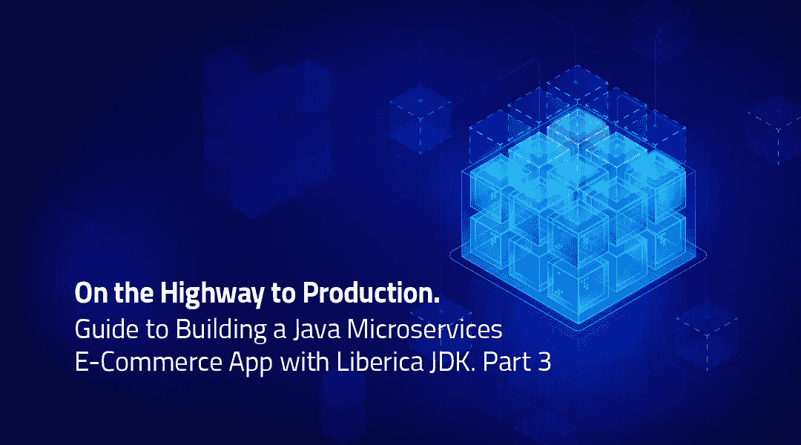

# 第 3 部分:用 OpenJDK 构建云原生 Java 微服务

> 原文：<https://medium.com/geekculture/part-3-building-cloud-native-java-microservices-with-openjdk-91d1da14fd7b?source=collection_archive---------14----------------------->

通过使用 AWS 云的自定义域、HTTPS、日志记录和监控将 Java 微服务引入生产

Source: [BellSoft](https://bell-sw.com/)

> 近年来，Java 并不总是被认为是云的首选编程语言。与普遍的看法相反，您可以构建和部署…