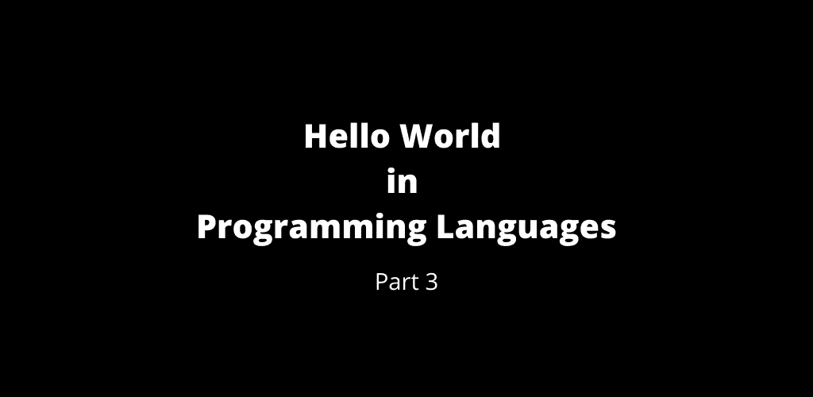

# 第 3 部分:编程语言中的 Hello World

> 原文：<https://medium.com/geekculture/part-3-hello-world-in-programming-languages-f39f9b6128da?source=collection_archive---------23----------------------->

Hello World — Part 3

 [## 第 2 部分:编程语言中的 Hello World。

### 查看下面的第 1 部分

manojahi.medium.com](https://manojahi.medium.com/part-2-hello-world-in-programming-languages-a790290004ad) 

# D

# D4

# 达夫尼

# 深色碱性

# 镖

# 数据库

# Dataflex

# 数据库

# 哥伦比亚特区

# 民法博士

# 德尔斐

# 方言

# 分米

# DoctorofModernLanguages 现代语言博士

# 天龙星座

# 迪伦

# 发电机

# E

# easm

# 狂喜

# 狂喜的

# 埃菲尔

# 热忱

# ELENA 3.0

# ELENA 4.0

# 长生不老药

# 埃利奥特

# 榆树

# 表情代码

# 表情符号

# EOS 2

# 占线小时

# ERRE

# 希腊语字母的第七字

# 欣快

# 前夕

# F#

# F

# 猎鹰

# 错误的

# 菲力克斯(男子名)

# 茴香

# 铁闪石

# 费特朗

# 锉工

# fjlnir

# 燃烧的雷声

# 焦点的

# 集中

# 向外

# FORTRAN 语言

# Fortran77

# Fortran90

# 福特拉涅夫

# 堡垒

# 游离碱

# 弗林克

评论你所熟悉的`Hello World`程序。

 [## 第 4 部分:编程语言中的 Hello World

### 编程语言中的 Hello World 第 4 部分

manojahi.medium.com](https://manojahi.medium.com/part-4-hello-world-in-programming-languages-9dc57548b2f2) 

干杯！！