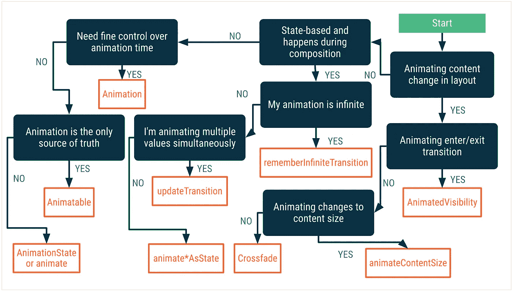
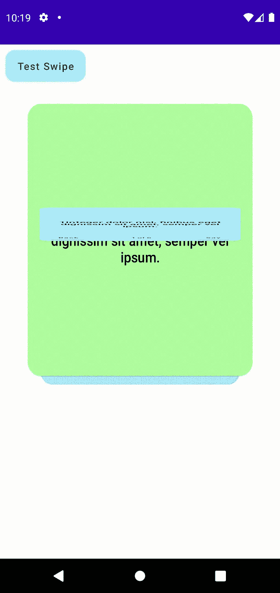
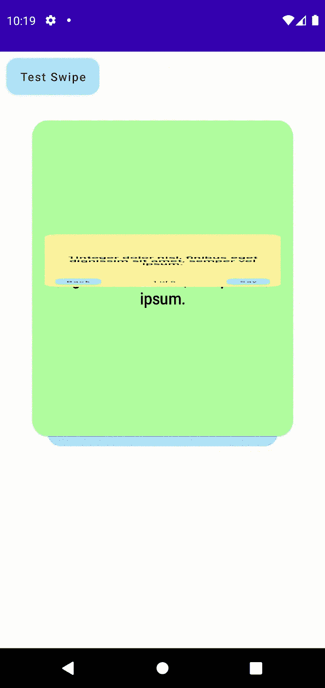
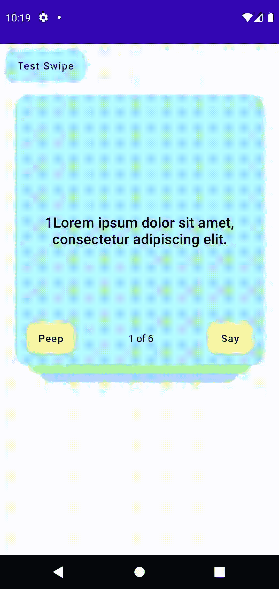
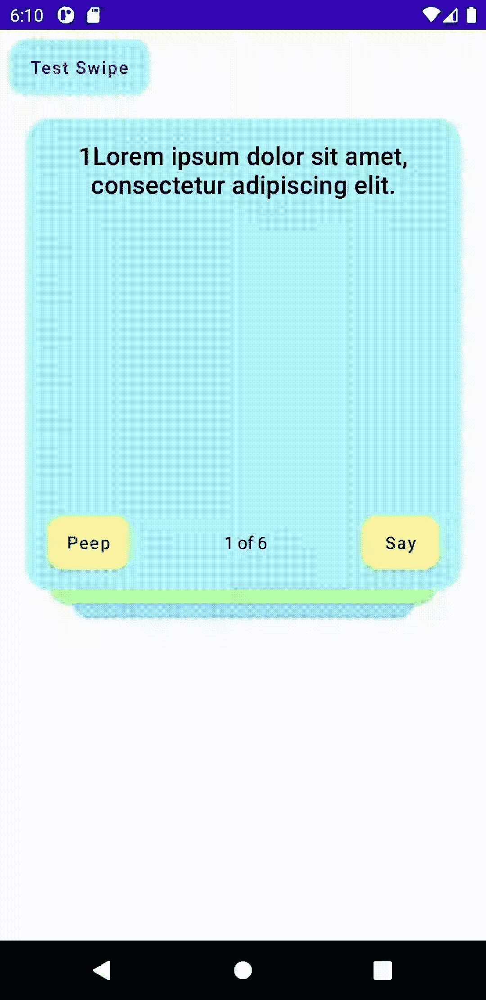

# 第 3 部分，在 Jetpack Compose 中从头开始编写 UI 小部件。

> 原文：<https://medium.com/geekculture/part-3-ui-widgets-from-scratch-in-jetpack-compose-4225000de91d?source=collection_archive---------13----------------------->

## 教程，第 3 部分，共 3 部分(向纸牌添加动画)

StudyCards app — remember answer to any question

在这三部曲的教程中，我将展示如何为我的宠物项目([学习卡应用](https://studycardsapp.com/)——我的 flash/mem 卡版本)构建复合 UI 小部件。

在本教程的第一部分中，我展示了如何构建一个 iOS 风格的 ListView 小部件，其中的行(列表项)具有不同的形状，这取决于行数和行位置，并且在编辑或删除模式下看起来不同。

在[第二部分](/@sergey-nes/part-2-ui-widgets-from-scratch-in-jetpack-compose-742a3342321b)中，我们正在构建扑克牌小部件。

在**第三部分**——我们将添加状态驱动的**滑动**和**翻转**动画以及**拖动**手势识别器。此外，我们将对这个小部件应用关注点分离原则。保持小部件的代码小，并让单独的类负责动画、用户动作和其他事件。

首先，让我们定义我们的小部件应该做什么以及它应该如何表现:

1.  用户应该能够从卡片组的顶部拖动卡片，并且卡片应该位于屏幕上所有 UI 元素的上方；
2.  如果用户将卡片掉落，卡片应该从屏幕上滑出或回到初始位置，这取决于用户将卡片掉落在屏幕上的位置；
3.  每当用户从屏幕上刷出卡片时，卡片组应该推动并在顶部显示下一张卡片；
4.  我们应该能够以编程方式从屏幕上刷出最上面的牌(对于播放所有牌模式)；
5.  当用户按下 Peep 或 back 按钮时，顶部的卡应该翻转到后面和前面；
6.  当用户拖动顶部的卡片时，我们应该将其余的卡片推到顶部，向上一个位置。

当然，我们将尽可能多地使用动画来完成这些过渡！为了实现流畅和可理解的用户体验，动画在现代移动应用中是必不可少的。

我在 Jetpack Compose 文档中找到了一个有用的图表，可以帮助您决定哪种动画最适合您的情况。
对于翻转动画，我选择`animate*AsAState`，因为我将同时制作多个值的动画，我的动画不是无限的，它是基于状态的，并且制作内容变化的动画。对于滑动动画，我们将使用`Animatable`。`Animatable`是一个值保存器，当值通过`animateTo()`方法改变时，它可以将值动画化。

via:[https://developer.android.com/jetpack/compose/animation](https://developer.android.com/jetpack/compose/animation)

# 翻转卡片动画(animateFloatState、animationSpec、tween)

让我们从翻转卡片动画开始。创建这种效果的一种方法是将卡片(卡片的可组合表面 a 根容器)的`*scaleY*`(高度)从 100%减少到 10%，然后替换内容并将`*scaleY*`增加回 100%，参见**图 2** 和 **3** 。
我们知道，为了让动画播放，在 Jetpack Compose 中，我们必须强制它对每一个动画帧进行重组。为了实现这一点，我们需要为 X 和 Y 标度值声明两个状态变量，由可组合的`*animationFloatState()*`函数修改(第 12 行和第 20 行)。此外，我们需要第三个状态变量`*flipState*`，以在每次改变动画状态时触发动画。最初，`flipState`设置为 FRONT_SIDE，这是空闲状态。用 FLIP_BACK 值更新`flipState`将触发动画。当动画结束时，`flipState`会转换到另一个空闲状态 BACK_FRONT。要将卡片翻到正面，我们需要用 FLIP_FRONT 值更新`flipState`。

在下面的代码中，您可以看到我在可组合的`Init()`函数中初始化了那些`lateinit`变量。而且，因为我们记住了`flipState`，所以当我们调用`flipToBack()`或`flipToFront()`函数时，Jetpack Compose 将重组 UI。如前所述，这些函数用 FLIP_BACK 或 FLIP_FRONT 值更新`flipState`。此外，您可以看到 X 刻度从 100%到 80%。当 Y 轴缩放动画达到第一个目标点— 10%时，通过将`flipState`值设置为 BACK_SIDE 或 FRONT_SIDE 来触发动画的第二部分，以翻转到前面。

Fugures 2,3,4

它并不完美——我们可以通过在替换边时添加淡入淡出效果来改进这个动画。此外，为了使它更真实，我们可以添加一个视角，并保持卡片的近边比远边长。然而，我没有找到用当前的 Compose API 实现这一点的方法。尽管如此，在正常速度下，即使这个简单的动画看起来也很不错！

# 刷卡动画(Animatable，animateTo，snapTo，finiteAnimationSpec)

对于滑动效果，我们将使用偏移动画。我们可以试验不同的动画规格，但是现在，让我们使用与翻转效果相同的`tween`规格。我们记住卡片在容器中的 x 和 y 偏移量，并在每次修改`cardDragOffset`的值时让 Jetpack Compose 重组小部件并翻译卡片。但是，我们不会直接改变偏移量。我们将偏移量记为一个`Animatable`状态，并将使用`*animateTo()*`和`*snapTo()*` *来翻译视图。*注意`*animateTo()*`和`*snapTo()*`是暂停函数，只能从协程上下文中调用。

`targetValueByState()`帮助确定动画应该平移卡片的当前目标位置。目标始终在 ***的东面*** ，从屏幕中出来，为刷卡状态(玩完所有牌模式)。`swipeDirection()`功能根据最后的偏移值(用户放卡的地方)确定拖动状态下的滑动方向。如果当前偏离屏幕中心的距离超过阈值，则卡应该平移到****东******南*** 或 ***西*** 。否则，卡应该返回到初始位置。*

******

*Figure 5*

# *卡片位置经理*

*最后一个动画有助于管理该副牌中所有牌的位置。它记住每张牌的初始`scale`和`offset`，可以更新它们的位置，可以计算并返回初始值。*

# *甲板视图模型*

*现在，让我们通过创建视图`Model`数据类将一些面板的属性从面板中分离出来，并将所有面板相关的事件分组到`Events`数据类中。
在数据模型中，我们会保留:
-数据源中当前卡片的一个索引；
-数据源本身；
-可见牌的数量；
-屏幕尺寸；
-一些帮助功能决定了可见卡片的颜色；
-每种状态下可见牌的数量。*

# *甲板事件模型*

*包括动画和动作处理程序在内的所有事件都分组在这个类中。此外，我决定保留自定义修改器，负责为每张卡片创建修改器对象，并将动画与修改器对象连接起来。这里最重要的部分在`(idx == topCardIndex)`分支。换句话说，这是顶卡的修改器。
当`flipCard.scaleX`或`flipCard.scaleY`改变时，该卡的刻度也会改变。
卡片的偏移量或位置取决于`cardSwipe`对象中的值。
在`pointerInput` lambda 中，我们实现了处理两个事件`onDrag`和`onDragEnd`的`detectDragGesture`。*

*`**OnDrag**`用户拖动卡片时，事件发生多次。它调用`cardSwipe.draggingCard`并将新的偏移值作为参数传递。在这个函数中，我们使用`snapTo()`立即用从`OnDrag`事件计算的新值更新`cardDragOffset`动画值。这迫使合成框架为这个特定的 UI 元素运行重组，并将其移动到新的位置。*

*当`**onDragEnd**`发生时，我们用拖动选项作为第二个参数的值来触发`cardSwipe.animateToTarget()`。如你所知，`cardDragOffset`是`cardSwipe`对象的内部状态变量，所以我们总是知道最后一张卡片的位置，因此我们可以计算出用户将卡片放在屏幕的哪个部分，并据此决定卡片应该放在哪里，是离开屏幕的西、东、南还是北，或者如果用户没有将卡片拖离屏幕中心太远，卡片应该返回到初始状态。参见`CardSwipeAnimation`中的第 37 行`swipeDirection()`功能。*

*现在我们已经定义了所有的元素，我们需要稍微修改一下本教程第二部分[的`DeckOfCards`小部件。我们扩展了`CardFlipState enum`中的状态数，添加了 enum 来控制滑动动画，将所有动画的动画时间定义为`350`毫秒。](https://sergey-nes.medium.com/part-2-ui-widgets-from-scratch-in-jetpack-compose-742a3342321b)*

*首先，我们需要初始化所有的动画对象。记住，`init()`方法是可组合的。它们都定义或记住状态，所以当状态被动画改变时，这个小部件的重组将从第 19 行开始。*

*可组合的`StudyCardDeck`几乎没变。同一个盒子作为一个根容器为每张可见的牌重复分块。但是，现在，我们从模型和事件对象中获得的所有值。此外，我们将所有事件分派给处理程序，并通过从`events.cardsSwipeAnimation`对象调用`backToInitialState()`方法来初始化 UI。*

*最后，在预览中，我们记住了调用暂停函数的`topCardIndex`和`coroutineScope`的状态。然后，我们定义两个数据模型对象来描述`DeckOfCards`的行为，并将视图与动画和手势处理程序链接起来。此外，为了测试外部事件，让我们在屏幕顶部添加一个按钮，该按钮将触发 cardSwipe 动画，将顶部的卡片从屏幕上刷出，并更新`topCardIndex`以重新组合卡片组，与`nextHandler` lambda 手动刷出卡片组的方式相同。*

*看**图 6** 看现场预览运行。*

******

*figure 6*

# *我们学到了什么？*

*Jetpack Compose 提供了强大且可扩展的 API，使得实现各种动画变得容易。大多数动画 API 都是可组合的函数。此外，compose 提供了各种 API 来帮助您检测用户交互生成的手势。这些 API 涵盖了广泛的用例。其中一些是高级的和简单的，旨在涵盖最常用的手势，例如，检测点击的可点击修饰符。其他是较低级别的 API，旨在检测点击、拖动、滚动、滑动和多点触摸手势更复杂，但提供更大的灵活性。我们还了解到，我们可以将@Composable 注释用于 UI 发出函数和实用函数。*

*如果我们想创建一个包含所有可重用部件的库，我们可以将接口的契约方法声明为可组合的。*

# *收场白*

*声明式方法和 Jetpack Compose 并不是解决这些错误的最终方法。你可以很容易地循环递归地改变状态，或者相反，在错误的线程/协程范围内改变状态，所以即使状态改变了，也不会触发重组。然而，当你真正改变你的思维方式时:*

> *"根据状态规划你的目标，而不是规划实现目标的步骤！"*

*您会发现 Jetpack compose 可以加快开发过程，您会发现您编写的代码更少，样板文件更少，因此，您会创建更少的 bug。*

*我对 Android 的 UI 开发感到乐观，我期待着`Jetpack Compose version 1`。此外，很少有令人兴奋的项目使用 Jetpack Compose 用于非 UI 目的，checkout [Mosaic](https://github.com/JakeWharton/mosaic#Usage) 和 [Compose for Web](https://blog.jetbrains.com/kotlin/2021/05/technology-preview-jetpack-compose-for-web/) 项目。*

*我想知道 Compose 在未来几年将如何发展？谷歌会让 Compose 与 Jetpack 和 AndroidX monorepo 脱钩吗？*

*PS:也许我会使用 SwiftUI 为我的 iOS 版 StudyCards 应用程序重新创建 DeckOfCard 小部件——将 Compose/Kotlin 和 SwiftUI/Swift 代码放在一起并进行比较应该很好！*

> ***在 Jetpack 中从头开始编写 UI 小部件***
> 
> *[*第 1 部分共 3 部分(一个 iOS 风格的主屏幕列表)*](/nerd-for-tech/ui-widgets-from-scratch-in-jetpack-compose-b16a74ca95e5)*
> 
> *[*第 2 部分共 3 部分(这副牌)*](https://sergey-nes.medium.com/part-2-ui-widgets-from-scratch-in-jetpack-compose-742a3342321b)*
> 
> *[第 3 部分，共 3 部分(为这副牌添加动画)](https://sergey-nes.medium.com/part-3-ui-widgets-from-scratch-in-jetpack-compose-4225000de91d)*
> 
> ****演示库:****
> 
> *【https://github.com/sergenes/compose-demo*T21**
> 
> ****思维在缀:****
> 
> *[*https://developer.android.com/jetpack/compose/mental-model*](https://developer.android.com/jetpack/compose/mental-model)*
> 
> ****StudyCards app 帮助记忆东西(我版抽认卡/记忆卡):****
> 
> ***Google Play(测试版，正在开发中):***
> 
> *[*https://play.google.com/store/apps/details?id = com . nes . study cards*](https://play.google.com/store/apps/details?id=com.nes.studycards)*
> 
> ***Appstore:***
> 
> *[*https://apps . apple . com/us/app/study-cards-help-to-memory/id 1436913731*](https://apps.apple.com/us/app/study-cards-help-to-memorize/id1436913731)*
> 
> ***网址:***
> 
> *[*https://studycardsapp.com*](https://studycardsapp.com/)*