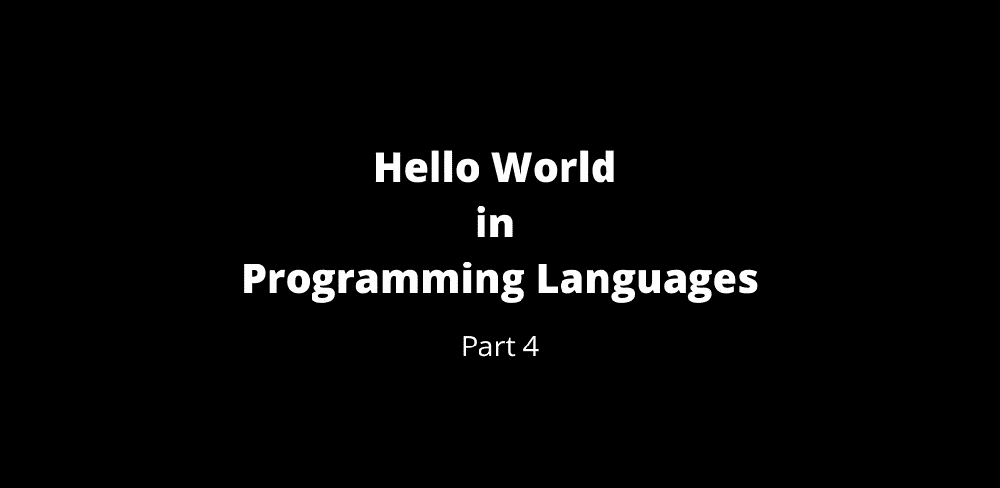

# 第 4 部分:编程语言中的 Hello World

> 原文：<https://medium.com/geekculture/part-4-hello-world-in-programming-languages-9dc57548b2f2?source=collection_archive---------24----------------------->

Hello World — Part 4

 [## 第 3 部分:编程语言中的 Hello World

### 编程语言中的 Hello World 第 3 部分

manojahi.medium.com](https://manojahi.medium.com/part-3-hello-world-in-programming-languages-f39f9b6128da) 

# g 代码

# 甘巴斯

# GameMonkey 脚本

# 热内罗·BDL

# 妖怪

# 绅士-简单

# 绅士

# GLBasic

# 生长调节血清三肽

# 去

# 兼勤杂工作的办事员

# GoogleGadgets

# 戈苏

# 留声机

# 重力

# 综合费率上涨附加费

# 绝妙的

# 狡猾

# GynkoSoft

# 砍

# 避难所

# 哈斯克尔

# 有

# 哈克斯

# HDX

# 霍利克

# 胡恩

# HP-41C

# HP-48

# HQ9+

# 超文本标记语言

# Hubot

# HyperTalk

# IBM 高管

# IBM-Exec2

# 卜内门

# ICL·SCL

# 图标

# （同 induecourse）在适当时候

# 国际日期变更线

# 伊德里斯

# Imba

# 通知

# Informix 4GL

# 安格尔·ABF

# 安装脚本

# 插入

# 木卫一

# Iptscrae

评论你所熟悉的`Hello World`程序。

 [## 第 5 部分:编程语言中的 Hello World

### 编程语言中的 Hello World 第 5 部分

manojahi.medium.com](https://manojahi.medium.com/part-5-hello-world-in-programming-languages-5014995454f8) 

干杯！！