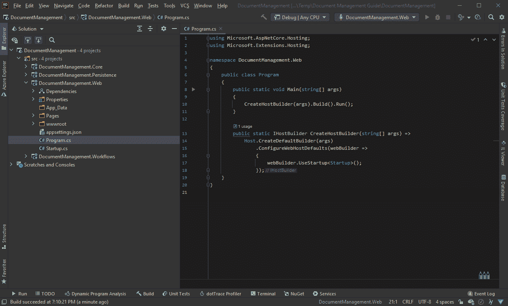

# 构建工作流驱动的第 4 部分。使用 Elsa 2 的. NET 应用程序

> 原文：<https://medium.com/geekculture/part-4-of-building-workflow-driven-net-applications-with-elsa-2-d6699a6a247e?source=collection_archive---------4----------------------->

## 设置持久性和文件上传


在[上一部分](https://sipkeschoorstra.medium.com/part-3-of-building-workflow-driven-net-applications-with-elsa-2-ea930acb3fe2)中，我们学习了如何配置 Elsa 来提供来自 JSON 文件的工作流。

在这一部分，我们将回到手头的演示应用程序，实现文档上传屏幕。这篇文章几乎没有什么是专门针对 Elsa 的，但它将为下一部分调用工作流提供一个良好的起点。

让我们开始吧。

除了存储上传的文件以便通过工作流进行处理之外，我们还希望存储一些关于这些文件的元数据。因此，我们将引入一个名为`Document`的领域模型。

为了存储文档实体，我们需要一个数据库。我们已经为 Elsa 使用了一个 SQLite 数据库，所以使用相同的数据库可能是有意义的。这就是我们将要做的。

这部分的计划如下:

*   实现文件上传屏幕。
*   实现文档域模型。
*   实现数据库持久性。
*   使用存储实现本地文件存储。网

一旦我们了解了这个基本的管道，在下一部分中，我们将会看到一些好的东西，在下一部分中，我们将执行处理上传文件的工作流。

# 文件上传屏幕

为了实现文件上传功能，我们将重用主页(在`Index.cshtml`和`Index.cshtml.cs`中实现)

## Index.cshtml

让我们从用以下内容替换`Index.cshtml`的全部内容开始:

Index.cshtml

这将显示一个简单的表单，只有两个字段和一个提交按钮。然而，在编译之前，我们接下来需要更新`Index.cshtml.cs`文件。

## index . cs

打开`Index.cshtml.cs`,将其内容一次性替换为以下内容:

Index.cshtml.cs

这里有几件值得注意的事情:

*   该类依赖于两个尚未定义的服务:`IDocumentTypeStore`和`IDocumentService`。
*   在 GET 上，我们选择一个由`IDocumentTypeStore`提供的可用*文档类型*的列表，这是对尚未实现的数据访问的抽象。
*   在 POST 中，我们打开上传文件的流并调用`IDocumentService`服务上的`SaveDocumentAsync`。
*   然后我们重定向到一个叫做`"FileReceived"`的页面。

## FileReceived.cshtml

该页面向用户显示一条简单的消息，表明文档已成功接收，并显示生成的文档 ID。

在`Pages`文件夹中创建该文件，内容如下:

创建如下所示的“代码隐藏”文件:

在这里，我们将简单地接收文档 ID，从数据库中加载它，并返回一个 HTTP 404-Not Found 响应，以防提供未知的 ID。未来的更新可能会实际显示文档的详细信息，比如它的状态，可能还会显示上传文件的下载链接。但是对于本教程来说，我们不需要这些。

一旦我们实现了缺失的模型、服务和数据访问，该页面将允许用户选择文档类型、文件并提交表单。

接下来让我们解决缺失的模型、服务和数据访问。

# 领域模型

领域模型和服务将主要由`DocumentManagement.Core`项目提供和实现。我说“大部分”，因为一些抽象，尽管由核心项目提供，将在`DocumentManagement.Persistence`中实现，正如我们将看到的。

## 文件

创建一个名为`Models`的新文件夹，并创建一个名为`Document`的新类，如下所示:

## 文档状态

在同一文件夹中，创建一个名为`DocumentStatus`的枚举，如下所示:

## 文档类型

在同一个文件夹中，创建以下类:

# 域服务

域服务将提供抽象和一些具体的实现来处理持久化文档和存储文件。其中一些抽象在核心项目中实现，而其他的在其他地方实现，比如`IDocumentStore`的实现。

> 这里设置的架构是我自己对洋葱架构的松散解释。重要的部分是我们将基础设施方面，如数据访问和 IO 从业务领域层中分离出来。

## IDocumentStore

创建一个名为 Services 的新文件夹，并添加以下 C#接口:

文档存储服务只有两个职责:

*   将`Document`实体保存到数据库。
*   通过 ID 从数据库加载`Document`实体。

## IDocumentTypeStore

用下面的代码创建`IDocumentTypeStore`接口:

文档类型存储也有两个职责，即:

*   列出所有文档类型
*   通过 ID 获取单个文档类型

我们不会实现文档类型管理，所以不需要添加写操作。相反，我们将设置 EF Core，用一组默认的文档类型作为数据库的种子。

## ISystemClock &系统时钟

这个接口抽象了对`DateTime.UtcNow`的访问，它被认为是域的外部资源，这意味着我们应该将其抽象掉。当一个人想要写一些单元测试时，这也是有帮助的，允许我们提供一个接口的模拟实现。

创建`ISystemClock.cs`文件并添加以下内容:

在同一文件夹中创建具体的实现:

## IFileStorage &文件存储

文件存储服务负责将文件存储在某个地方。实现将依赖于 Storage.NET 抽象，因此我们的领域逻辑不直接依赖于具体的实现。相反，应该由我们的主机应用程序来配置文件访问。

创建如下`IFileStorage`接口:

文件存储服务负责将数据流写入指定的目标(由文件名指定)，并从给定的文件名读取数据流。这由实现来处理。

按如下方式创建实现:

注意，我们依赖`DocumentStorageOptions`为我们提供一个工厂方法来创建一个`IBlobStorage`实例。

`IBlobStorage`接口由[Storage.Net](https://github.com/aloneguid/storage)包提供，请务必安装:

```
dotnet add DocumentManagement/src/DocumentManagement.Core/DocumentManagement.Core.csproj package Storage.Net
```

我们还需要安装微软的[。扩展选项](https://www.nuget.org/packages/Microsoft.Extensions.Options/6.0.0-preview.6.21352.12)包以便使用`IOptions`:

```
dotnet add DocumentManagement/src/DocumentManagement.Core/DocumentManagement.Core.csproj package [Microsoft.Extensions.Options](https://www.nuget.org/packages/Microsoft.Extensions.Options/6.0.0-preview.6.21352.12)
```

## 文档存储选项

创建一个名为 Options 的新文件夹，并添加以下类:

稍后我们将从`Startup`开始配置这些选项。

## IDocumentService & DocumentService

文档服务只有两个职责:

*   在磁盘上存储一个给定的文件流，创建一个文档实体，并将它存储在数据库中。
*   发布一个名为`NewDocumentReceived`的域事件

按如下方式创建接口:

并使用以下代码创建实现:

`IMediator`接口是 MediatR 包提供的，我们来安装一下:

```
dotnet add DocumentManagement/src/DocumentManagement.Core/DocumentManagement.Core.csproj package MediatR
```

## 接收的新文档

每次创建新文档时，文档服务都会发布“收到新文档”事件。

这允许应用程序执行某些任务。例如，我们可能想给某人发送一封关于新文档的电子邮件以供审阅。

> 正如本系列的介绍部分所概述的，我们将使用工作流来实现这一点，但是通过使用这种中介模式，我们也可以简单地实现一个处理程序并做一些有趣的事情。这一切的美化是可扩展性，而不必污染核心领域库。相反，我们可以实现单独的类库，作为插入系统的“模块”。

创建一个名为`Events`的新文件夹，并添加以下类:

## IsExternalInit

由于我们在一个. NET 标准项目中使用了一个名为“records”的 [C# 9 特性，您可能会看到一个如下所示的编译器错误:](https://devblogs.microsoft.com/dotnet/c-9-0-on-the-record/)

*预定义类型'系统。必须定义或导入“runtime . compiler services . isexternalInit ”,才能声明仅限 init 的 setter。*

要解决这个问题，我们必须遵循提供的建议并定义`IsExternalInit`。为此，在`DocumentManagement.Core`项目文件夹的根目录下创建以下文件:

## 注册域服务

在我们继续构建持久层之前，让我们首先创建一个扩展方法，以便于向服务容器注册我们的域服务。

创建一个名为 Extensions 的新文件夹，并添加以下类:

稍后，在我们完成持久层之后，我们将从 web 项目的`Startup`类中调用`AddDomainServices`。

# 坚持

我们将在`DocumentManagement.Persistence`项目中实现持久层。

更具体地说，我们将使用[实体框架核心](https://docs.microsoft.com/en-us/ef/core/)。

我们要做的是:

*   定义一个数据库上下文类。
*   定义一个设计时数据库上下文工厂类(用于生成迁移)。
*   生成迁移。
*   执行`IDocumentStore`和`IDocumentTypeStore`
*   实施托管服务，在应用程序启动时自动运行迁移。
*   提供一个扩展方法，向服务容器注册 EF 核心和域服务。

在使用 EF Core(及其 SQLite provider)和托管服务之前，我们需要首先安装以下软件包:

*   微软。实体框架工作核心设计
*   微软。EntityFrameworkCore.Sqlite
*   微软。扩展.托管.抽象

```
dotnet add DocumentManagement/src/DocumentManagement.Persistence/DocumentManagement.Persistence.csproj package Microsoft.EntityFrameworkCore.Designdotnet add DocumentManagement/src/DocumentManagement.Persistence/DocumentManagement.Persistence.csproj package Microsoft.EntityFrameworkCore.Sqlitedotnet add DocumentManagement/src/DocumentManagement.Persistence/DocumentManagement.Persistence.csproj package Microsoft.Extensions.Hosting.Abstractions
```

我们还将添加一个对`DocumentManagement.Core`的项目引用，因为我们将实现几个接口:

```
dotnet add DocumentManagement/src/DocumentManagement.Persistence/DocumentManagement.Persistence.csproj reference DocumentManagement/src/DocumentManagement.Core/DocumentManagement.Core.csproj
```

在持久性项目的根目录下创建一个新的`DocumentDbContext`类:

请注意，我们用 3 种文档类型植入数据库:

*   "变更请求"
*   "离开请求"
*   “身份验证”

> 我们可以潜在地添加额外的文档类型，并将它们与工作流相关联，而不必接触任何应用程序代码来引入新的文档类型。

## 文档数据库上下文设计工厂

为了让`dotnet ef`工具生成迁移，我们应该实现一个 DB context 工厂类，工具可以用它来实例化 DB context 的新实例。

让我们继续创建下面的类:

## 生成迁移

现在我们已经有了 DB 上下文和工厂，让我们通过执行以下命令来生成迁移(确保从项目所在的目录运行该命令):

```
dotnet ef migrations add Initial
```

> 确保文档管理。持续性项目目标`*net5.0*` : `*<TargetFramework>net5.0</TargetFramework>*`

应用迁移

迁移就绪后，我们现在可以使用`dotnet ef`工具手动应用迁移，这样就可以了。事实上，在使用生产数据库时，这可能是最明智的做法。

但是在应用程序开发期间，尤其是在编写教程时，在应用程序启动时自动运行迁移会更方便。更不用说它也很酷！

为此，让我们创建一个托管服务来为我们解决这个问题。

创建一个名为`HostedServices`的新文件夹，并添加以下类:

托管服务不仅是实现后台作业的好方法，而且非常适合执行使用`async/await`的应用程序启动代码，就像以编程方式应用迁移一样。以这种方式使用时，迁移将在应用程序准备好开始处理请求之前执行。

## 实现存储(又名存储库)

接下来让我们实现`IDocumentStore`和`IDocumentTypeStore`接口。

创建一个名为`Services`的新文件夹，并添加以下两个类:

这里没什么特别的。这些类是一些 EF 核心操作的简单包装器。有趣的部分可能是我们正在注入一个数据库上下文*工厂*，而不是直接注入一个实际的数据库上下文。虽然这两种选择都可行，但我更喜欢工厂策略，以便尽可能保持 DB 上下文的短暂性，从而大大简化包含后台任务的异步应用程序(此处未显示)。

> 一个可以考虑的改进是通过在服务器端而不是客户端执行一个 upsert 操作，使`*EFCoreDocumentStore*`类的`*SaveAsync*`方法成为线程安全的。现在，如果两个线程试图同时保存一个具有相同 ID 的文档对象，很有可能在数据库中得到两个记录。
> 
> 要做服务器端的 upsert 操作，你可以考虑使用第三方软件包，比如 [EFCore。BulkExtensions](https://github.com/borisdj/EFCore.BulkExtensions) ， [FlexLabs。向上插入](https://github.com/artiomchi/FlexLabs.Upsert)或[实体框架扩展](https://entityframework-extensions.net/)。

## 注册持久性服务

现在，让我们创建一个扩展方法，以便于向服务容器注册我们的持久性服务。

创建一个名为`Extensions`的新文件夹，并添加以下类:

当被调用时，它将负责注册 EF 核心、我们的商店实现，当然还有我们的迁移运行器。

# 启动

我们已经做了所有的工作，现在剩下的就是调用注册域和持久性服务的两个扩展方法，并配置前面介绍的文件存储选项。

将以下私有方法添加到`Startup`类的底部:

```
private void AddDomainServices(IServiceCollection services)
{
    services.AddDomainServices();

    // Configure Storage for DocumentStorage.
    services.Configure<DocumentStorageOptions>(options => options.BlobStorageFactory = () => StorageFactory.Blobs.DirectoryFiles(Path.Combine(Environment.ContentRootPath, "App_Data/Uploads")));
}private void AddPersistenceServices(IServiceCollection services, string dbConnectionString)
{
    services.AddDomainPersistence(dbConnectionString);
}
```

然后在我们调用`AddworkflowServices`的那一行之后调用这些方法:

```
// Domain services.
AddDomainServices(services);// Persistence.
AddPersistenceServices(services, dbConnectionString);
```

# 尝试一下

此时，我们应该能够运行应用程序，上传文件，并确认文件已保存且文档记录已创建，如下面的屏幕记录所示。



# 然后

这一部分不一定引入任何与 Elsa 相关的新内容，但是我们确实建立了一个相当不错的基础，现在我们可以在这个基础上开始挂接自定义逻辑来处理上传的文档。通过发布“收到新文档”域事件，这变得很容易。

在[的下一部分](https://sipkeschoorstra.medium.com/part-5-of-building-workflow-driven-net-applications-with-elsa-2-8c1f36f7b720)中，我们将通过在`DocumentManagement.Workflows`项目中实现一个处理程序来很好地利用这个事件，这个处理程序将依次调用与文档类型相关联的适当的工作流(如果有的话)。