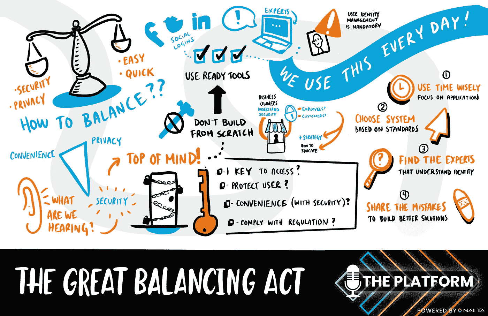

# 第 4 部分:伟大的平衡之举

> 原文：<https://medium.com/geekculture/part-4-the-great-balancing-act-1b6e71fa66c0?source=collection_archive---------30----------------------->

## 在认证和授权领域，便利性、隐私性和安全性之间是否存在权衡？

在前几期中，我谈到了身份验证、购买或构建身份验证，以及身份管理系统的未来。在播客系列的最后一集，我们将谈论伟大的平衡行为。