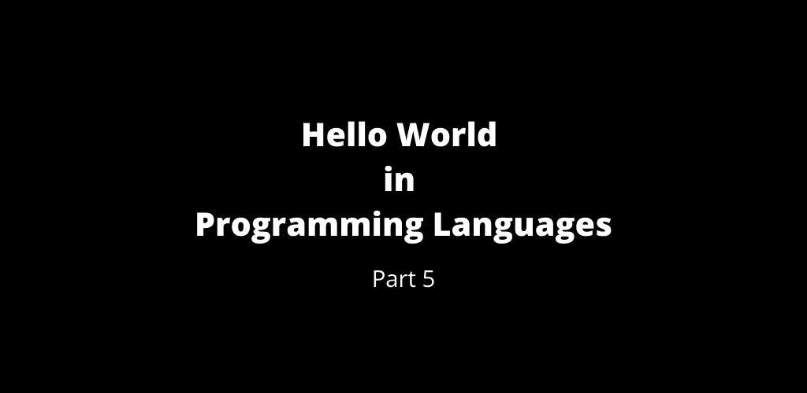

# 第 5 部分:编程语言中的 Hello World

> 原文：<https://medium.com/geekculture/part-5-hello-world-in-programming-languages-5014995454f8?source=collection_archive---------22----------------------->

Hello World — Part 5

 [## 第 4 部分:编程语言中的 Hello World

### 编程语言中的 Hello World 第 4 部分

manojahi.medium.com](https://manojahi.medium.com/part-4-hello-world-in-programming-languages-9dc57548b2f2) 

# J

# 翡翠

# 杰克

# 珍妮特

# 伊阿宋

# Java 语言(一种计算机语言，尤用于创建网站)

# Java(移动)

# Java (Servlet)

# Java (Swing)

# Java 服务器页面

# Java Script 语言

# 作业控制语言

# 系以脚带

# 约尔夫

# JSFuck

# 司法脚本

# 朱莉娅

# K

# K3

# K4

# K5

# 小猫

# Kix

# 科特林

# Kylix

# 勒夫

# L

# 套索

# 乳液

# 拉美裔美国居民

# 自由基础

# 莉莉

# 莉莉庞德

# 监狱

# LIMS 基础

# 术语

# 利诺特

# 利萨克

# Lisp-Emacs

# LiveCode

# LLVM

# 标志；徽标

# 徽标(图形)

# LOLCODE

# 萝莉

# 埃及白睡莲

# Lotus Note 公式

# 莲花文字

# 溶血磷脂酰胆碱

# LS-DYNA

# 链路支持层

# 左上臂

评论你所熟悉的`Hello World`程序。

 [## 第 6 部分:编程语言中的 Hello World

### 编程语言中的 Hello World 第 6 部分

manojahi.medium.com](https://manojahi.medium.com/part-6-hello-world-in-programming-languages-31861a8299af) 

干杯！！