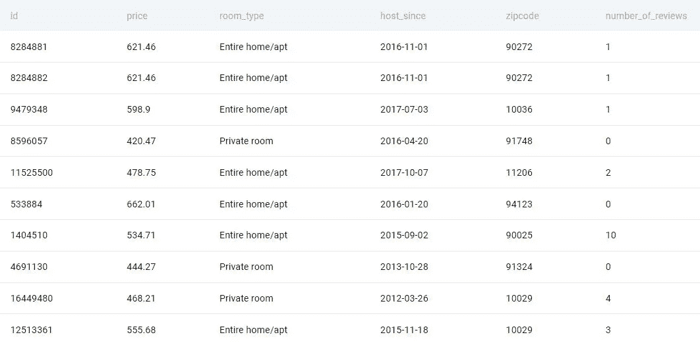
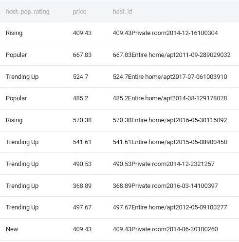
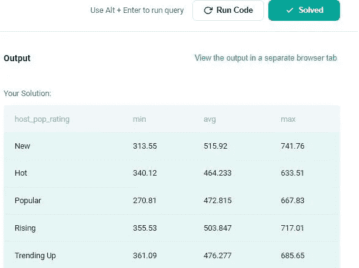

# 第五部分:Airbnb 询问的主机人气租赁价格

> 原文：<https://medium.com/geekculture/part-5-host-popularity-rental-prices-asked-by-airbnb-23587406a726?source=collection_archive---------13----------------------->

## 让我们解决基于产品的公司提出的 SQL 问题

如果你对 SQL 有扎实的掌握，你将有更大的机会通过数据科学面试。在本文中，我们将讨论一个单一的主题以及如何解决它。如果您想更好地掌握和体验 SQL，您必须阅读这篇文章。你提出想法和寻求解决方案的方法无疑会进步。


这是基于产品的公司在采访中询问的一系列 SQL 问题中的第五篇文章。对于本文，我使用 StrataScratch 平台来获取基于产品的公司中被问到的问题。我将使用 Postgres SQL 数据库来解决这个问题。

以下是基于产品的公司提出的一系列 Postgres SQL 问题的链接:


古普塔

## 面试问题

[View list](https://agupta97.medium.com/list/stratascratch-postgres-interview-problems-c4020531504b?source=post_page-----23587406a726--------------------------------)18 stories

这是脸书/梅塔在一次采访中提出的难题。可以在这里查看问题[。问题名称是**最高能耗**。以下是问题的详细内容:](https://platform.stratascratch.com/coding/10064-highest-energy-consumption?code_type=1)

# 主机人气租赁价格

用户会给你一张出租房产搜索表。该表由搜索结果组成，并为搜索者输出主机信息。找出每台主机受欢迎程度的最低、平均和最高租赁价格。主持人人气评分定义如下:0 评论:新增 1 至 5 评论:上升 6 至 15 评论:趋势上升 16 至 40 评论:人气超过 40 评论:热门

提示:表中的`id`列指的是搜索 ID。您需要通过连接价格、房间类型、host_since、邮政编码和评论数量来创建自己的 host_id。

输出主机受欢迎程度评级及其最低、平均和最高租赁价格。

> 面试问题日期:【2018 年 2 月，公司: **Airbnb** ，难度:**硬**，面试问题 ID: 9632 **，**表格: **airbnb_host_searches，**
> 
> table _ fields:**id**(int)**价格**(float)**属性 _ 类型**(varchar)**房间 _ 类型**(varchar)**便利设施**(varchar)**住宿**(int)**浴室(**int)**床 _ 类型**(varchar)**取消 _ 政策**(varchar)**清洁 _ 费用**

****Airbnb _ host _ searches 表预览(只显示几列):****

****

****方法:****

****第一步:**首先，我们必须为主机的受欢迎程度评级创建一个名为 host_pop_rating 的列，该列将包含基于问题中所述的 number_of_reviews 字段的不同值。为此，我们将使用 case 语句为 host_pop_rating 字段指定一个不同的名称。然后，我们还将通过连接价格、房间类型、host_since、邮政编码和评论数量来创建 host_id**

```
**select 
    (case** 
        when number_of_reviews = 0 then 'New'
        when number_of_reviews between 1 and 5 then 'Rising'
        when number_of_reviews between 6 and 15 then 'Trending Up'
        when number_of_reviews between 16 and 40 then 'Popular'
        when number_of_reviews > 40 then 'Hot'
     **end) as host_pop_rating,**
  **  price ,**
    concat(price, room_type, host_since, zipcode, number_of_reviews) **as host_id**
    **from airbnb_host_searches 
    group by host_id, host_pop_rating,price;**
```

****

****第 2 步:**我们将使用上面的查询作为通用表表达式(cte)，并将其命名为 cte。现在，我们将选择 host_pop_rating 和 group on host_pop_rating，以找到每个评级的最低、平均和最高价格。**

```
**with cte as 
(**select 
    (case 
        when number_of_reviews = 0 then 'New'
        when number_of_reviews between 1 and 5 then 'Rising'
        when number_of_reviews between 6 and 15 then 'Trending Up'
        when number_of_reviews between 16 and 40 then 'Popular'
        when number_of_reviews > 40 then 'Hot'
     end) as host_pop_rating,
    price ,
    concat(price, room_type, host_since, zipcode, number_of_reviews) as host_id
    from airbnb_host_searches 
    group by host_id, host_pop_rating,price
**)
select host_pop_rating, 
min(price), avg(price), max(price)
from cte
group by  host_pop_rating;**
```

****

**实际上，需要将问题分解成更小的问题。在阅读问题两遍后，决定使用哪些列来计算期望的结果。之后，确定计算每个子问题所需的函数，然后尝试连接子问题的解决方案。使用这种方法，你可以快速解决任何问题。接触将提高你开发解决问题的新方法和途径的能力。
感谢你阅读我的帖子并回复我；这对我意义重大。如果你喜欢它，竖起大拇指，点击“关注”在媒体上关注我，以便在我发布新内容时得到通知。**